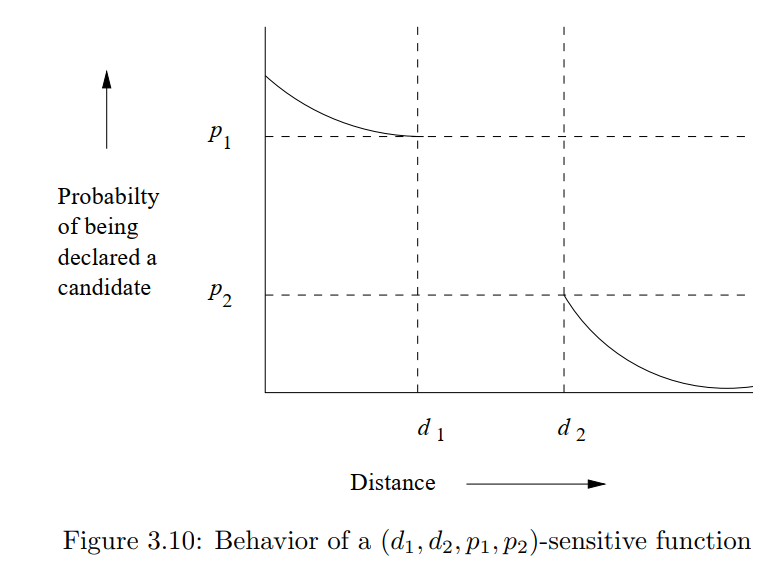
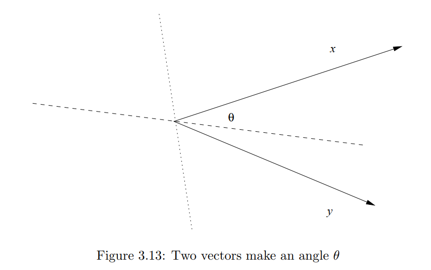
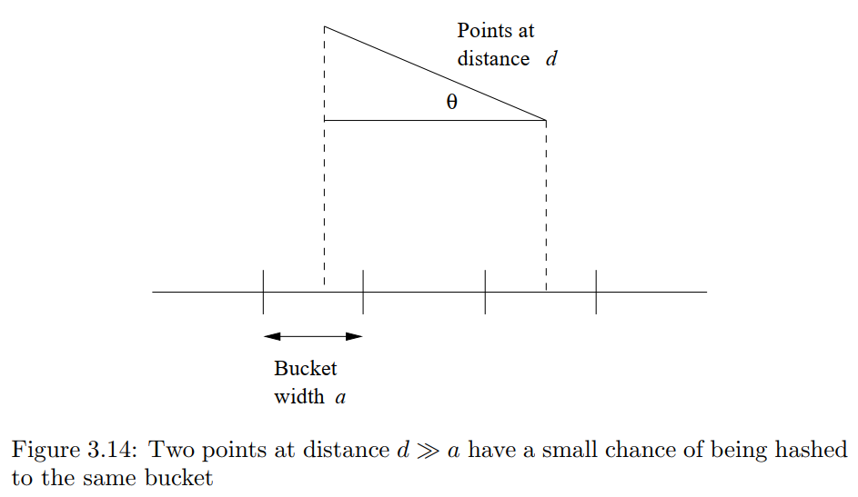
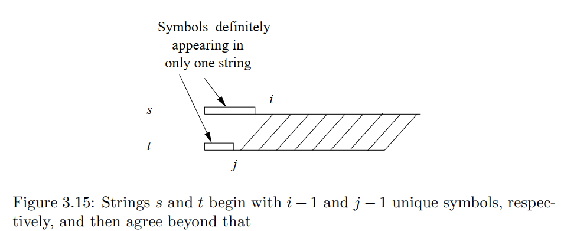
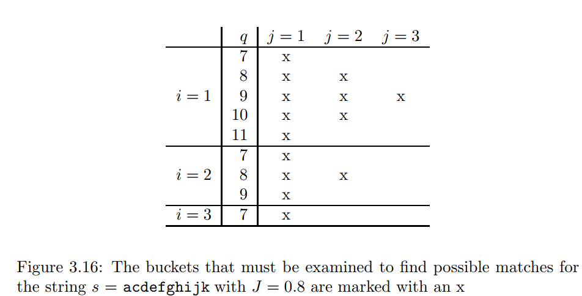

## 3.5 距离测量

我们现在稍作停顿，研究一下距离度量的一般概念。Jaccard 相似度是衡量集合接近程度的一种方法，尽管它实际上不是一种距离度量。也就是说，集合越接近，Jaccard 相似度越高。实际上，1 减去 Jaccard 相似度才是一种距离度量，我们称之为 Jaccard 距离。

然而，Jaccard 距离并不是唯一有意义的接近度量。在本节中，我们将研究其他一些有应用价值的距离度量。然后，在第 3.6 节中，我们将看到这些距离度量中的一些也有一种局部敏感哈希（LSH）技术，使我们能够在不比较所有点的情况下关注附近的点。当我们在第 7 章研究聚类时，还会出现距离度量的其他应用。

### 3.5.1 定义

假设我们有一组点，称为一个空间。这个空间上的距离度量是一个函数 d(x, y)，它以空间中的两个点作为参数并产生一个实数，并满足以下公理：

1、d(x, y) ≥ 0（没有负距离）。

2、当且仅当 x = y 时，d(x, y) = 0（距离是正数，除了点到自身的距离）。

3、d(x, y) = d(y, x)（距离是对称的）。

4、d(x, y) ≤ d(x, z) + d(z, y)（三角不等式）。

三角不等式是最复杂的条件。直观上，它表示从 x 到 y 的旅行，如果被迫经过某个特定的第三点 z，我们不会获得任何好处。三角不等式公理使得所有距离度量的行为就像距离描述了从一个点到另一个点的最短路径的长度。

### 3.5.2 欧几里得距离

最熟悉的距离度量是我们通常认为的“距离”。n 维欧几里得空间是一个点由 n 个实数向量组成的空间。在这个空间中，常规的距离度量，我们称之为 L2 范数，定义如下：

$$ d([x_1, x_2, \ldots, x_n], [y_1, y_2, \ldots, y_n]) = \sqrt{\sum_{i=1}^{n} (x_i - y_i)^2} $$

也就是说，我们对每个维度的距离进行平方，求和，然后取正平方根。

很容易验证，欧几里得距离满足距离度量的前三个要求。两个点之间的欧几里得距离不能为负，因为正平方根是有意的。由于所有实数的平方都是非负的，任何 $x_i ≠ y_i$ 的情况都会使距离严格为正。另一方面，如果对所有 i 都有 $x_i = y_i$，那么距离显然为 0。对称性是因为 $(x_i - y_i)^2 = (y_i - x_i)^2$。三角不等式需要大量的代数验证。然而，它被广泛理解为欧几里得空间的一个性质：三角形任意两边的长度之和不小于第三边的长度。

在欧几里得空间中，还有其他一些距离度量。对于任何常数 r，我们可以定义 Lr 范数作为距离度量 d，定义如下：

$$ d([x_1, x_2, \ldots, x_n], [y_1, y_2, \ldots, y_n]) = \left( \sum_{i=1}^{n} |x_i - y_i|^r \right)^{1/r} $$

当 r = 2 时，就是我们之前提到的 $L_2$ 范数。另一种常见的距离度量是 $L_1$ 范数，或称为*曼哈顿距离*。在这种情况下，两点之间的距离是每个维度上差值的绝对值之和。之所以称为“曼哈顿距离”，是因为它类似于在像曼哈顿这样的城市中沿着网格线行走的距离。

另一种有趣的距离度量是 $L_∞$ 范数，它是 $L_r$ 范数在 r 趋近于无穷大时的极限。当 r 越来越大时，只有差值最大的维度才重要，因此，$L_∞$ 范数形式上定义为所有维度 i 中 $|x_i - y_i|$ 的最大值。

**示例 3.13**

考虑二维欧几里得空间（通常的平面）和点 (2, 7) 和 (6, 4)。L2 范数给出的距离是：

$$ \sqrt{(2 - 6)^2 + (7 - 4)^2} = \sqrt{4^2 + 3^2} = 5 $$

$L_1$ 范数给出的距离是：

$$ |2 - 6| + |7 - 4| = 4 + 3 = 7 $$

$L_∞$ 范数给出的距离是：

$$ \max(|2 - 6|, |7 - 4|) = \max(4, 3) = 4 $$

### 3.5.3 Jaccard 距离

如本节开头所述，我们通过 $d(x, y) = 1 - SIM(x, y)$ 来定义集合的 Jaccard 距离。也就是说，Jaccard 距离是 1 减去集合 x 和 y 的交集与并集大小的比值。我们必须验证这个函数是一个距离度量。

1、d(x, y) 是非负的，因为交集的大小不能超过并集的大小。

2、当且仅当 x = y 时，d(x, y) = 0，因为 $x ∪ x = x ∩ x = x$。然而，如果 $x ≠ y$，那么 $x ∩ y$ 的大小严格小于$x ∪ y$ 的大小，因此 d(x, y) 是严格正的。

3、d(x, y) = d(y, x)，因为并集和交集都是对称的；即 $x ∪ y = y ∪ x$ 和 $x ∩ y = y ∩ x$。

4、对于三角不等式，回想第 3.3.3 节中提到的，$SIM(x, y)$ 是一个随机 minhash 函数将 x 和 y 映射到相同值的概率。因此，Jaccard 距离 d(x, y) 是一个随机 minhash 函数不将 x 和 y 映射到相同值的概率。因此，我们可以将条件 $d(x, y) ≤ d(x, z) + d(z, y)$ 转换为以下陈述：如果 h 是一个随机 minhash 函数，那么 $h(x) ≠ h(y)$ 的概率不大于 $h(x) ≠ h(z)$ 和 $h(z) ≠ h(y)$ 的概率之和。然而，这个陈述是正确的，因为每当 $h(x) ≠ h(y)$ 时，h(x) 和 h(y) 中至少有一个必须与 h(z) 不同。它们不可能都是 h(z)，因为那样的话 h(x) 和 h(y) 就会相同。

### 3.5.4 Cosine 距离

余弦距离在具有维度的空间中是有意义的，包括欧几里得空间和欧几里得空间的离散版本，例如点是具有整数分量或布尔（0 或 1）分量的向量的空间。在这样的空间中，点可以被认为是方向。我们不区分一个向量和该向量的倍数。然后，两个点之间的余弦距离是这些点的向量所形成的角度。无论空间有多少维度，这个角度都在 0 到 180 度之间。

我们可以通过首先计算角度的余弦，然后应用反余弦函数将其转换为 0-180 度范围内的角度来计算余弦距离。给定两个向量 x 和 y，它们之间角度的余弦是 x 和 y 的点积除以 x 和 y 的 L2 范数（即它们到原点的欧几里得距离）。回想一下，向量 $[x1, x2, ..., xn] 和 [y1, y2, ..., yn]$ 的点积是 $∑(xi * yi)$。

示例 3.14
设我们的两个向量为 $x = [1, 2, -1]$ 和 $y = [2, 1, 1]$。点积 x.y 是 $1 × 2 + 2 × 1 + (-1) × 1 = 3$。两个向量的 $L_2$ 范数都是 $\sqrt6$。例如，x 的 L2 范数是 $\sqrt{(1^2 + 2^2 + (-1)^2)} = \sqrt6$。因此，x 和 y 之间角度的余弦是 $3/(\sqrt6 * \sqrt6)$ 或 1/2。余弦为 1/2 的角度是 60 度，所以这是 x 和 y 之间的余弦距离。

我们必须证明余弦距离确实是一个距离度量。我们已经定义了它的值在 0 到 180 的范围内，因此不可能有负距离。只有当两个向量方向相同时，它们之间的角度才为 0。对称性是显而易见的：x 和 y 之间的角度与 y 和 x 之间的角度相同。三角不等式最好通过物理推理来论证。从 x 旋转到 y 的一种方法是先旋转到 z，然后再旋转到 y。这两次旋转的总和不能小于直接从 x 旋转到 y 的旋转。

>注意，为了满足第二个公理，我们必须将彼此成倍数关系的向量（例如 [1, 2] 和 [3, 6]）视为相同的方向，因为它们确实是相同的方向。如果我们将它们视为不同的向量，我们会给它们的距离赋值为 0，从而违反了只有 d(x, x) 为 0 的条件。

### 3.5.5 Edit 距离

这种距离在点是字符串时是有意义的。字符串 $x = x_1x_2...x_n$ 和 $y = y_1y_2...y_m$ 之间的距离是将 x 转换为 y 所需的最少单字符插入和删除次数。

**示例 3.15**

字符串 x = abcde 和 y = acfdeg 之间的编辑距离是 3。将 x 转换为 y 的步骤如下：

1、删除 b。

2、在 c 后插入 f。

3、在 e 后插入 g。

没有比三个插入和/或删除更少的操作可以将 x 转换为 y。因此，d(x, y) = 3。

另一种定义和计算编辑距离 d(x, y) 的方法是计算 x 和 y 的最长公共子序列（LCS）。x 和 y 的 LCS 是通过删除 x 和 y 的位置构造的字符串，并且它是可以通过这种方式构造的最长字符串。编辑距离 d(x, y) 可以计算为 x 的长度加上 y 的长度减去它们的 LCS 的两倍长度。

**示例 3.16**

示例 3.15 中的字符串 x = abcde 和 y = acfdeg 有一个唯一的 LCS，即 acde。我们可以确定它是最长的，因为它包含了 x 和 y 中出现的每个符号。幸运的是，这些公共符号在两个字符串中以相同的顺序出现，因此我们可以在 LCS 中使用它们。注意，x 的长度是 5，y 的长度是 6，它们的 LCS 的长度是 4。因此，编辑距离是 5 + 6 - 2 × 4 = 3，这与示例 3.15 中的直接计算一致。

另一个例子，考虑 x = aba 和 y = bab。它们的编辑距离是 2。例如，我们可以通过删除第一个 a 然后在末尾插入 b 将 x 转换为 y。有两个 LCS：ab 和 ba。每个都可以通过从每个字符串中删除一个符号获得。对于同一对字符串的多个 LCS，所有 LCS 的长度必须相同。因此，我们可以计算编辑距离为 3 + 3 - 2 × 2 = 2。

编辑距离是一个距离度量。显然，编辑距离不能为负，只有两个相同的字符串的编辑距离为 0。要看到编辑距离是对称的，请注意插入和删除的序列可以反转，每个插入变成删除，反之亦然。三角不等式也很简单。将字符串 s 转换为字符串 t 的一种方法是将 s 转换为某个字符串 u，然后将 u 转换为 t。因此，从 s 到 u 的编辑次数加上从 u 到 t 的编辑次数不能少于将 s 转换为 t 所需的最少编辑次数。

>**非欧几里得空间**
>
>注意，本节中介绍的几种距离度量不是欧几里得空间。当我们在第 7 章研究聚类时，我们会发现欧几里得空间的一个重要性质是欧几里得空间中的点的平均值总是存在并且是空间中的一个点。然而，考虑我们为其定义 Jaccard 距离的集合空间，“两个集合的平均值”的概念没有意义。同样，字符串空间中，我们可以使用编辑距离，但不能取字符串的“平均值”。
>
>向量空间，我们建议使用余弦距离，可能是也可能不是欧几里得空间。如果向量的分量可以是任何实数，那么空间是欧几里得的。然而，如果我们将分量限制为整数，那么空间就不是欧几里得的。注意，例如，我们不能在具有两个整数分量的向量空间中找到向量 [1, 2] 和 [3, 1] 的平均值，尽管如果我们将它们视为二维欧几里得空间的成员，那么我们可以说它们的平均值是 [2.0, 1.5]。

### 3.5.6 Hamming 距离

给定一个向量空间，我们定义两个向量之间的汉明距离为它们在多少个分量上不同。显然，汉明距离是一个距离度量。汉明距离显然不能为负，如果为零，则向量是相同的。距离不依赖于我们首先考虑哪两个向量。三角不等式也应该是显而易见的。如果 x 和 z 在 m 个分量上不同，而 z 和 y 在 n 个分量上不同，那么 x 和 y 在不超过 m + n 个分量上不同。汉明距离最常用于向量是布尔值的情况；它们仅由 0 和 1 组成。然而，原则上，向量可以有来自任何集合的分量。

**示例 3.17**

向量 10101 和 11110 之间的汉明距离是 3。也就是说，这些向量在第二、第四和第五个分量上不同，而在第一和第三个分量上相同。

### 3.5.7 练习

**练习 3.5.1**

在非负整数空间中，以下哪些函数是距离度量？如果是，请证明；如果不是，请证明它不满足一个或多个公理。 

(a) max(x, y) = x 和 y 中较大的一个。 

(b) diff(x, y) = |x − y|（x 和 y 之间差值的绝对值）。 

(c) sum(x, y) = x + y。

**练习 3.5.2**

找到点 (5, 6, 7) 和 (8, 2, 4) 之间的 L1 和 L2 距离。

**练习 3.5.3**

证明如果 i 和 j 是任何正整数，并且 i < j，那么任意两点之间的 Li 范数大于 Lj 范数。

**练习 3.5.4**

找到以下集合对之间的 Jaccard 距离：

 (a) {1, 2, 3, 4} 和 {2, 3, 4, 5}。
 
  (b) {1, 2, 3} 和 {4, 5, 6}。

**练习 3.5.5**

计算以下每对向量之间的角度的余弦。 (a) (3, −1, 2) 和 (−2, 3, 1)。 (b) (1, 2, 3) 和 (2, 4, 6)。 (c) (5, 0, −4) 和 (−1, −6, 2)。 (d) (0, 1, 1, 0, 1, 1) 和 (0, 0, 1, 0, 0, 0)。

**练习 3.5.6**

证明任意两个长度相同的 0 和 1 向量之间的余弦距离最多为 90 度。

**练习 3.5.7**

找到以下字符串对之间的编辑距离（仅使用插入和删除）。 

(a) abcdef 和 bdaefc。 

(b) abccdabc 和 acbdcab。

 (c) abcdef 和 baedfc。

**练习 3.5.8**

有许多其他的编辑距离概念。例如，我们可以允许除了插入和删除之外的以下操作： 

i. 变异，将一个符号替换为另一个符号。注意，变异总是可以通过一个插入和一个删除来完成，但如果我们允许变异，那么在计算编辑距离时，这个变化只算 1，而不是 2。 

ii. 置换，交换两个相邻符号的位置。像变异一样，我们可以通过一个插入和一个删除来模拟置换，但在这里我们只算 1。 如果编辑距离定义为将一个字符串转换为另一个字符串所需的插入、删除、变异和置换的次数，请重复练习 3.5.7。

**练习 3.5.9**

证明练习 3.5.8 中讨论的编辑距离确实是一个距离度量。

**练习 3.5.10**

找到以下每对向量之间的汉明距离：000000、110011、010101 和 011100。

## 3.6 局部敏感函数理论

LSH 技术在第 3.4 节中开发，是一类函数（minhash 函数）的一个例子，这些函数可以通过带状技术组合起来，以在低距离对和高距离对之间进行强区分。图 3.8 中 S 曲线的陡峭程度反映了我们在候选对中避免误报和漏报的效果。

现在，我们将探索除 minhash 函数之外的其他函数族，这些函数可以有效地产生候选对。这些函数可以应用于集合空间和 Jaccard 距离，或其他空间和/或其他距离度量。我们需要满足以下三个条件：

1、它们必须更有可能使接近的对成为候选对，而不是远离的对。在第 3.6.1 节中，我们将对此概念进行精确定义。

2、它们必须是统计独立的，即可以通过独立事件的乘积法则来估计两个或多个函数给出某个响应的概率。

3、它们必须在两个方面高效：

    (a) 它们必须能够在远少于查看所有对的时间内识别候选对。例如，minhash 函数具有这种能力，因为我们可以在与数据大小成比例的时间内将集合散列到 minhash 值，而不是数据中集合数量的平方。由于具有共同值的集合被放置在同一个桶中，我们实际上在远少于集合对数的时间内生成了单个 minhash 函数的候选对。
    (b) 它们必须能够组合以构建更好地避免误报和漏报的函数，并且组合函数的时间也必须远少于对数。例如，第 3.4.1 节的带状技术使用单个 minhash 函数，这些函数满足条件 3a，但本身不具有我们想要的 S 曲线行为，并从多个 minhash 函数中生成具有 S 曲线形状的组合函数。

我们的第一步是一般性地定义“局部敏感函数”。然后，我们将看到这一思想如何应用于多个应用中。最后，我们讨论如何将理论应用于具有余弦距离或欧几里得距离度量的任意数据。

### 3.6.1 局部敏感函数

在本节中，我们将考虑一种函数，这种函数接受两个项目并决定这些项目是否应该成为候选对。在许多情况下，函数 f 将“散列”项目，并且决定将基于结果是否相等。因为使用 f(x) = f(y) 表示 f(x, y) 是“是的；使 x 和 y 成为候选对”很方便，所以我们将使用 f(x) = f(y) 作为这种含义的简写。我们还使用 f(x) ≠ f(y) 表示“除非其他函数得出我们应该这样做的结论，否则不要使 x 和 y 成为候选对”。

这种形式的函数集合将被称为函数族。例如，基于特征矩阵的可能排列的每个 minhash 函数形成一个函数族。

设 d1 < d2 是根据某种距离度量 d 的两个距离。如果对于 F 中的每个 f，函数族 F 被称为 (d1, d2, p1, p2)-敏感的，则满足以下条件：

1 如果 $d(x, y) ≤ d_1$，则 $f(x) = f(y)$ 的概率至少为 p1。

2 如果 $d(x, y) ≥ d_2$，则 $f(x) = f(y)$ 的概率至多为 p2。

图 3.10 说明了我们对 $(d_1, d_2, p_1, p_2)$-敏感函数族中的给定函数声明两个项目为候选对的概率的期望。注意，我们没有说明当项目之间的距离严格在 d1 和 d2 之间时会发生什么，但我们可以将 d1 和 d2 调整得尽可能接近。代价是通常 p1 和 p2 也接近。正如我们将看到的，可以在保持 d1 和 d2 固定的同时将 p1 和 p2 分开。

### 3.6.2 Locality-Sensitive Families for Jaccard Distance

目前，我们只有一种方法来找到局部敏感函数族：使用 minhash 函数族，并假设距离度量是 Jaccard 距离。和以前一样，我们解释 minhash 函数 h 使 x 和 y 成为候选对当且仅当 $h(x) = h(y)$。

* 对于任何 $d_1$ 和 $d_2$，其中 $0 ≤ d_1 < d_2 ≤ 1$，minhash 函数族是 $(d_1, d_2, 1−d_1, 1−d_2)$-敏感函数族。

原因是如果 $d(x, y) ≤ d_1$，其中 d 是 Jaccard 距离，那么 $SIM(x, y) = 1 − d(x, y) ≥ 1 − d_1$。但我们知道 x 和 y 的 Jaccard 相似度等于 minhash 函数将 x 和 y 散列到相同值的概率。类似的论点适用于 $d_2$ 或任何距离。

**示例 3.18**

我们可以设 d1 = 0.3 和 d2 = 0.6。然后我们可以断言 minhash 函数族是 (0.3, 0.6, 0.7, 0.4)-敏感函数族。也就是说，如果 x 和 y 之间的 Jaccard 距离最多为 0.3（即 SIM(x, y) ≥ 0.7），那么 minhash 函数将 x 和 y 发送到相同值的概率至少为 0.7；如果 x 和 y 之间的 Jaccard 距离至少为 0.6（即 SIM(x, y) ≤ 0.4），那么 x 和 y 被发送到相同值的概率至多为 0.4。注意，我们可以用另一个 d1 和 d2 的选择做出相同的断言；只需要 d1 < d2。

### 3.6.3 Amplifying a Locality-Sensitive Family

假设我们有一个 $(d_1, d_2, p_1, p_2)$-敏感函数族 F。我们可以通过对 F 进行 AND 构造来构建一个新的函数族 F'，定义如下。F' 的每个成员由 F 的 r 个成员组成，对于某个固定的 r。如果 f 是 F' 中的成员，并且 f 是由 F 的成员集合 ${f_1, f_2, ..., f_r}$ 构建的，我们说 $f(x) = f(y)$ 当且仅当对于所有 $i = 1, 2, ..., r，f_i(x) = f_i(y)$。注意，这种构造反映了单个带中的 r 行的效果：如果带中的每一行都说 x 和 y 相等（因此根据该行是候选对），则带使 x 和 y 成为候选对。

由于 F 的成员是独立选择的以构建 F' 的成员，我们可以断言 F' 是一个 (d1, d2, (p1)^r, (p2)^r)-敏感函数族。也就是说，对于任何 p，如果 p 是 F 的成员将 (x, y) 声明为候选对的概率，那么 F' 的成员将其声明为候选对的概率是 p^r。

还有另一种构造，我们称之为 OR 构造，它将 $(d_1, d_2, p_1, p_2)$-敏感函数族 F 转换为 $(d_1, d_2, 1 - (1 - p_1)^b, 1 - (1 - p_2)^b)$-敏感函数族 F'。F' 的每个成员 f 是由 F 的 b 个成员构建的，例如 $f_1, f_2, ..., f_b$。我们定义 f(x) = f(y) 当且仅当对于一个或多个 i，$f_i(x) = f_i(y)$。OR 构造反映了组合多个带的效果：如果任何一个带使 x 和 y 成为候选对，则 x 和 y 成为候选对。

如果 p 是 F 的成员将 (x, y) 声明为候选对的概率，那么 1 - p 是它不会这样声明的概率。$(1 - p)^b 是 f_1, f_2, ..., f_b$ 中没有一个将 (x, y) 声明为候选对的概率，而 $1 - (1 - p)^b$ 是至少一个 fi 将 (x, y) 声明为候选对的概率，因此 f 将 (x, y) 声明为候选对的概率。

注意，AND 构造降低了所有概率，但如果我们明智地选择 F 和 r，我们可以使小概率 p2 非常接近 0，而较高的概率 p1 保持显著远离 0。同样，OR 构造使所有概率上升，但通过明智地选择 F 和 b，我们可以使较大的概率接近 1，而较小的概率保持远离 1。我们可以按任意顺序级联 AND 和 OR 构造，使低概率接近 0，高概率接近 1。当然，我们使用的构造越多，选择的 r 和 b 值越高，我们被迫使用的原始函数族的函数数量就越多。因此，最终函数族越好，应用该函数族的时间就越长。

**示例 3.19**

假设我们从一个函数族 F 开始。我们使用 r = 4 的 AND 构造生成一个函数族 F1。然后我们对 F1 应用 b = 4 的 OR 构造生成第三个函数族 F2。注意，F2 的每个成员都是由 F 的 16 个成员构建的，这种情况类似于从 16 个 minhash 函数开始，并将它们视为四个带，每个带有四行。4 路 AND 函数将任何概率 p 转换为 $p^4$。当我们随后应用 4 路 OR 构造时，该概率进一步转换为 $1 - (1 - p^4)^4$。图 3.11 中显示了这种转换的一些值。该函数是一个 S 曲线，先保持低值，然后急剧上升（尽管不是太陡峭；斜率从未超过 2），然后在高值处趋于平稳。像任何 S 曲线一样，它有一个不动点，即应用 S 曲线函数时保持不变的 p 值。在这种情况下，不动点是 $p = 1 - (1 - p^4)^4$ 的值。我们可以看到不动点在 0.7 和 0.8 之间。低于该值，概率会降低，高于该值，概率会增加。因此，如果我们选择一个高于不动点的高概率和一个低于不动点的低概率，我们将实现所需的效果，即低概率降低，高概率增加。

|p| $1 - (1 - p^4)^4$ |
|-----|----|
|0.2 |0.0064|
|0.3 |0.0320|
|0.4 |0.0985|
|0.5 |0.2275|
|0.6 |0.4260|
|0.7 |0.6666|
|0.8 |0.8785|
|0.9 |0.9860|

图 3.11：4 路 AND 构造后接 4 路 OR 构造的效果

假设 F 是 minhash 函数，被视为 (0.2, 0.6, 0.8, 0.4)-敏感函数族。然后 F2，即通过 4 路 AND 和 4 路 OR 构造生成的函数族，是 (0.2, 0.6, 0.8785, 0.0985)-敏感函数族，如图 3.11 中 0.8 和 0.4 的行所示。通过将 F 替换为 F2，我们降低了误报率和漏报率，代价是应用函数所需的时间增加了 16 倍。

|p| $1 - (1 - p^4)^4$ |
|-----|----|
|0.1 |0.0140|
|0.2 |0.1215|
|0.3 |0.3334|
|0.4 |0.5740|
|0.5 |0.7725|
|0.6 |0.9015|
|0.7 |0.9680|
|0.8 |0.9936|

图 3.12：4 路 OR 构造后接 4 路 AND 构造的效果

**示例 3.20**

以相同的代价，我们可以应用 4 路 OR 构造，然后是 4 路 AND 构造。图 3.12 给出了这种构造所暗示的概率转换。例如，假设 F 是 
$$(0.2, 0.6, 0.8, 0.4)-敏感函数族$$。

然后构造的函数族是 (0.2, 0.6, 0.9936, 0.5740)-敏感函数族。这种选择不一定是最好的。尽管较高的概率已经接近 1，但较低的概率也提高了，增加了误报的数量。

**示例 3.21**

我们可以按需要级联构造。例如，我们可以在 minhash 函数族上使用示例 3.19 的构造，然后在生成的函数族上使用示例 3.20 的构造。构造的函数族将具有每个由 256 个 minhash 函数构建的函数。例如，它将 (0.2, 0.8, 0.8, 0.2)-敏感函数族转换为 (0.2, 0.8, 0.9991285, 0.0000004)-敏感函数族。

### 3.6.4 Exercises for Section 3.6 . 

**练习 3.6.1：**

从 minhash 函数族开始，应用以下构造对概率的影响是什么？ (a) 2 路 AND 构造，然后是 3 路 OR 构造。 (b) 3 路 OR 构造，然后是 2 路 AND 构造。 (c) 2 路 AND 构造，然后是 2 路 OR 构造，然后是 2 路 AND 构造。 (d) 2 路 OR 构造，然后是 2 路 AND 构造，然后是 2 路 OR 构造，然后是 2 路 AND 构造。

**练习 3.6.2：**

找到练习 3.6.1 中构造的每个函数的不动点。

**练习 3.6.3：**

任何概率 p 的函数，例如图 3.11 中的函数，其斜率由该函数的导数给出。最大斜率是导数最大的位置。找到给定图 3.11 和图 3.12 的 S 曲线的最大斜率的 p 值。这些最大斜率的值是多少？

**练习 3.6.4：**

将练习 3.6.3 推广为 r 和 b 的函数，找到由 minhash 函数定义的函数族的最大斜率点和该斜率的值： 

(a) r 路 AND 构造，然后是 b 路 OR 构造。 

(b) b 路 OR 构造，然后是 r 路 AND 构造。

## 3.7 其他距离度量的LSH家族

并不能保证每种距离度量都有局部敏感的哈希函数家族。到目前为止，我们只看到了 Jaccard 距离的这种家族。在本节中，我们将展示如何构建汉明距离、余弦距离和普通欧几里得距离的局部敏感函数家族。

### 3.7.1 汉明距离的LSH家族

构建汉明距离的局部敏感函数家族相当简单。假设我们有一个 d 维向量空间，h(x, y) 表示向量 x 和 y 之间的汉明距离。如果我们取向量的任意一个位置，例如第 i 个位置，我们可以定义函数 $f_i(x)$ 为向量 x 的第 i 位。然后，当且仅当向量 x 和 y 在第 i 位上相同时，$f_i(x) = f_i(y)$。那么，对于随机选择的 i，$f_i(x) = f_i(y)$ 的概率正好是 $1 - h(x, y)/d$；即 x 和 y 在相同位置上相同的比例。

这种情况几乎与我们在 minhashing 中遇到的情况完全相同。因此，由函数 ${f_1, f_2, ..., f_d}$ 组成的家族 F 是一个 $(d_1, d_2, 1 - d_1/d, 1 - d_2/d)$-敏感哈希函数家族，对于任何 $d_1 < d_2$。这个家族与 minhash 函数家族之间只有两个区别：

1 虽然 Jaccard 距离从 0 到 1 变化，但 d 维向量空间上的汉明距离从 0 到 d 变化。因此，有必要通过除以 d 来缩放距离，将它们转换为概率。

2 虽然 minhash 函数本质上有无限供应，但汉明距离的家族 F 的大小只有 d。

第一个点无关紧要；它只需要我们在适当的时候除以 d。第二点更为严重。如果 d 相对较小，那么我们在使用 AND 和 OR 构造组合函数的数量上受到限制，从而限制了我们使 S 曲线陡峭的程度。

### 3.7.2 随机超平面和余弦距离

回想第 3.5.4 节，两个向量之间的余弦距离是向量之间的角度。例如，我们在图 3.13 中看到两个向量 x 和 y 之间形成一个角度 θ。注意，这些向量可能在多维空间中，但它们总是定义一个平面，并且角度在这个平面中测量。图 3.13 是包含 x 和 y 的平面的“俯视图”。

假设我们选择一个通过原点的超平面。这个超平面在 x 和 y 的平面中相交于一条直线。图 3.13 提示了两种可能的超平面，一种是虚线相交，另一种是点线相交。要选择一个随机超平面，我们实际上选择超平面的法向量，例如 v。然后超平面是与 v 的点积为 0 的点集。

首先，考虑一个法向量 v，它垂直于投影为图 3.13 中虚线的超平面；即 x 和 y 在超平面的不同侧。那么点积 v.x 和 v.y 将具有不同的符号。例如，如果我们假设 v 是一个投影到 x 和 y 的平面上在虚线上的向量，那么 v.x 是正的，而 v.y 是负的。相反，法向量 v 可能延伸到相反的方向，在虚线下方。在这种情况下，v.x 是负的，v.y 是正的，但符号仍然不同。

另一方面，随机选择的向量 v 可能垂直于图 3.13 中点线的超平面。在这种情况下，v.x 和 v.y 都具有相同的符号。如果 v 的投影向右延伸，那么两个点积都是正的，而如果 v 向左延伸，那么两个点积都是负的。

随机选择的向量垂直于看起来像虚线而不是点线的超平面的概率是多少？对于随机超平面与 x 和 y 的平面的交线的所有角度都是等可能的。因此，超平面看起来像虚线的概率是 θ/180，否则看起来像点线。

因此，我们的局部敏感函数家族 F 中的每个哈希函数 f 都是由随机选择的向量 vf 构建的。给定两个向量 x 和 y，当且仅当点积 $v_f.x 和 v_f.y$ 具有相同的符号时，$f(x) = f(y)$。然后 F 是余弦距离的局部敏感函数家族。参数本质上与第 3.6.2 节中描述的 Jaccard 距离家族相同，只是距离的尺度是 0-180 而不是 0-1。也就是说，F 是一个 $$(d_1, d_2, (180 - d_1)/180, (180 - d_2)/180)-敏感哈希函数家族$$。从这个基础上，我们可以像对 minhash 基于的家族一样放大这个家族。

### 3.7.3 Sketches

选择所有可能向量中的一个随机向量，实际上如果我们将选择限制为分量为 +1 和 -1 的向量，它就足够随机了。任何向量 x 与分量为 +1 和 -1 的向量 v 的点积是通过将 x 的分量相加，其中 v 是 +1，然后减去 x 的其他分量（即 v 是 -1 的那些分量）来形成的。

如果我们选择一组随机向量，例如 $v_1, v_2, ..., v_n$，那么我们可以通过计算 $v_1.x, v_2.x, ..., v_n.x$ 然后将任何正值替换为 +1，将任何负值替换为 -1 来应用于任意向量 x。结果称为 x 的 sketch。你可以任意处理 0，例如，通过随机选择 +1 或 -1 的结果。由于零点积的概率很小，这种选择基本上没有影响。

**示例 3.22**

假设我们的空间由 4 维向量组成，我们选择三个随机向量：$v_1 = [+1, -1, +1, +1]，v_2 = [-1, +1, -1, +1]，和 v_3 = [+1, +1, -1, -1]$。对于向量 x = [3, 4, 5, 6]，sketch 是 [+1, +1, -1]。也就是说，$v_1.x = 3 - 4 + 5 + 6 = 10$。由于结果是正的，sketch 的第一个分量是 +1。同样，$v_2.x = 2 和 v_3.x = -4$，所以 sketch 的第二个分量是 +1，第三个分量是 -1。

考虑向量 y = [4, 3, 2, 1]。我们可以类似地计算它的 sketch 为 [+1, -1, +1]。由于 x 和 y 的 sketch 在 1/3 的位置上相同，我们估计它们之间的角度为 120 度。也就是说，随机选择的超平面看起来像图 3.13 中的虚线的概率是点线的两倍。

上述结论实际上是错误的。我们可以计算 x 和 y 之间角度的余弦为 x.y，即 $$6 × 1 + 5 × 2 + 4 × 3 + 3 × 4 = 40$$，除以两个向量的大小。这些大小是 $$\sqrt{6^2 + 5^2 + 4^2 + 3^2} = 9.274$$ 和 $$\sqrt{1^2 + 2^2 + 3^2 + 4^2} = 5.477$$。因此，x 和 y 之间角度的余弦是 0.7875，这个角度约为 38 度。然而，如果你查看所有 16 个长度为 4 的分量为 +1 和 -1 的向量，你会发现只有四个向量与 x 和 y 的点积具有不同的符号，即 v2, v3 及其补数 [+1, -1, +1, -1] 和 [-1, -1, +1, +1]。因此，如果我们选择所有这 16 个向量来形成一个 sketch，角度的估计将是 180/4 = 45 度。

### 3.7.4 LSH Families for Euclidean Distance

现在，让我们转向欧几里得距离（第 3.5.2 节），看看我们是否可以为这种距离开发一个局部敏感的哈希函数家族。我们将从二维欧几里得空间开始。我们的家族 F 中的每个哈希函数 f 都将与这个空间中的一条随机选择的直线相关联。选择一个常数 a 并将直线分成长度为 a 的段，如图 3.14 所示，其中“随机”直线被定向为水平。直线的段是函数 f 将点散列到的桶。

一个点被散列到其投影到直线上的位置所在的桶。如果两点之间的距离 d 与 a 相比很小，那么两点散列到同一个桶的概率很大，因此哈希函数 f 将声明这两点相等。例如，如果 d = a/2，那么两点落在同一个桶中的概率至少为 50%。实际上，如果随机选择的直线与连接两点的直线之间的角度 θ 很大，那么两点落在同一个桶中的概率更大。例如，如果 θ 是 90 度，那么两点肯定会落在同一个桶中。

然而，假设 d 大于 a。为了使两点落在同一个桶中有任何机会，我们需要 d cos θ ≤ a。图 3.14 的示意图说明了为什么这个要求成立。注意，即使 d cos θ ≪ a，两点落在同一个桶中也不是确定的。然而，我们可以保证以下几点。如果 d ≥ 2a，那么两点落在同一个桶中的概率不超过 1/3。原因是要使 cos θ 小于 1/2，我们需要 θ 在 60 到 90 度之间。如果 θ 在 0 到 60 度之间，那么 cos θ 大于 1/2。但由于 θ 是平面中两条随机选择的直线之间的较小角度，θ 在 0 到 60 度之间的概率是 60 到 90 度之间的两倍。

我们得出结论，刚才描述的家族 F 形成了一个 (a/2, 2a, 1/2, 1/3)-敏感哈希函数家族。也就是说，对于距离最多为 a/2 的点，两点落在同一个桶中的概率至少为 1/2，而对于距离至少为 2a 的点，两点落在同一个桶中的概率最多为 1/3。我们可以像讨论的其他局部敏感哈希函数例子一样放大这个家族。

### 3.7.5 More LSH Families for Euclidean Spaces

第 3.7.4 节中开发的哈希函数家族有一些不令人满意的地方。首先，该技术仅描述了二维欧几里得空间。如果我们的数据是多维空间中的点，会发生什么？其次，对于 Jaccard 和余弦距离，我们能够为任何 d1 和 d2 构建局部敏感函数家族，只要 d1 < d2。在第 3.7.4 节中，我们似乎需要更强的条件 d1 < 4d2。

然而，我们声称，对于任何 d1 < d2 和任何维数，都存在一个局部敏感的哈希函数家族。该家族的哈希函数仍然来自通过空间的随机直线和分割直线的桶大小 a。我们仍然通过将点投影到直线上来对点进行哈希。假设 d1 < d2，我们可能不知道两个距离为 d1 的点散列到同一个桶的概率 p1，但我们可以确定它大于两个距离为 d2 的点散列到同一个桶的概率 p2。原因是随着距离的缩小，这个概率肯定会增加。因此，即使我们不能轻易计算 p1 和 p2，我们知道对于任何 d1 < d2 和任何给定的维数，都存在一个 (d1, d2, p1, p2)-敏感哈希函数家族。

使用第 3.6.3 节的放大技术，我们可以调整这两个概率以围绕我们喜欢的任何特定值，并且可以使它们相距多远。当然，我们希望概率相距越远，我们必须使用的 F 中基本哈希函数的数量就越多。

### 3.7.6 练习

练习 3.7.1：

假设我们为长度为六的向量构建了六个局部敏感函数的基本家族。对于向量 000000、110011、010101 和 011100 的每对，哪些函数使它们成为候选对？

练习 3.7.2：

让我们使用以下四个“随机”向量计算 sketches： 

v1 = [+1, +1, +1, −1] v2 = [+1, +1, −1, +1] 

v3 = [+1, −1, +1, +1] v4 = [−1, +1, +1, +1] 

计算以下向量的 sketches。

 (a) [2, 3, 4, 5] 
 
 (b) [−2, 3, −4, 5] 
 
 (c) [2, −3, 4, −5] 对于每对，根据 sketches 估计它们之间的角度是多少？真实角度是多少？

练习 3.7.3：

假设我们使用长度为 4 的所有 16 个分量为 +1 或 −1 的向量来形成 sketches。计算练习 3.7.2 中三个向量的 sketches。每对之间的角度估计与真实角度相比如何？

练习 3.7.4：

假设我们使用练习 3.7.2 中的四个向量形成 sketches。 

(a) 什么是使向量 [a, b, c, d] 的 sketch 为 [+1, +1, +1, +1] 的约束条件？

 (b) 考虑两个向量 [a, b, c, d] 和 [e, f, g, h]。使这两个向量的 sketches 相同的条件是什么？

练习 3.7.5：

假设我们有三维欧几里得空间中的点： p1 = (1, 2, 3) p2 = (0, 2, 4) p3 = (4, 3, 2) 考虑由三个轴定义的三个哈希函数（使我们的计算非常简单）。假设桶的长度为 a，一个桶是区间 [0, a)（即满足 0 ≤ x < a 的点集），下一个是 [a, 2a)，上一个是 [−a, 0)，依此类推。 

(a) 对于每条直线，假设 a = 1，将每个点分配到桶中。 

(b) 重复 (a)，假设 a = 2。 

(c) 对于 a = 1 和 a = 2 的情况，候选对是什么？ 

(d) 对于每对点，a 的哪些值会使该对成为候选对？

## 3.8 局部敏感哈希的应用

在本节中，我们将探讨 LSH 在实践中的三个应用示例。在每种情况下，我们学到的技术都必须进行修改以满足问题的某些约束。我们涵盖的三个主题是：

1 实体解析：这个术语指的是匹配指向同一现实世界实体的数据记录，例如同一个人。这里解决的主要问题是记录的相似性并不完全符合理论所建立的相似集合或相似向量模型。

2 匹配指纹：可以将指纹表示为集合。然而，我们将探索一种不同的局部敏感哈希函数家族，而不是通过 minhashing 获得的那种。

3 匹配新闻文章：在这里，我们考虑一种不同的 shingling 概念，重点关注在线报纸网页中的核心文章，忽略所有多余的材料，如广告和报纸特定的材料。

### 3.8.1 实体解析

通常会有多个可用的数据集，并且知道它们指向一些相同的实体。例如，几个不同的书目来源提供关于许多相同书籍或论文的信息。在一般情况下，我们有描述某种类型实体的记录，例如人或书籍。这些记录可能都具有相同的格式，或者它们可能具有不同的格式，包含不同种类的信息。

即使字段应该相同，关于实体的信息也可能会有所不同，原因有很多。例如，由于拼写错误、缺少中间名、使用昵称等原因，名字在不同记录中可能会有所不同。例如，“Bob S. Jomes”和“Robert Jones Jr.”可能是同一个人，也可能不是。如果记录来自不同来源，字段也可能不同。一个来源的记录可能有一个“年龄”字段，而另一个来源没有。第二个来源可能有一个“出生日期”字段，或者它可能根本没有关于出生日期的信息。

### 3.8.2 实体解析示例

我们将研究一个如何使用 LSH 处理实体解析问题的真实示例。公司 A 受公司 B 的委托为 B 招揽客户。只要客户保持订阅，B 每年都会向 A 支付费用。后来他们发生争执，对 A 提供给 B 的客户数量产生了分歧。每个公司都有大约 1,000,000 条记录，其中一些描述了同一个人；这些是 A 提供给 B 的客户。记录具有不同的数据字段，但不幸的是，这些字段中没有一个是“这是 A 提供给 B 的客户”。因此，问题是匹配两个集合中的记录，以查看一对是否代表同一个人。

每条记录都有字段记录人的姓名、地址和电话号码。然而，由于许多原因，这些字段中的值可能会有所不同。不仅有第 3.8.1 节中提到的拼写错误和其他命名差异，还有其他可能的分歧。例如，客户可能会将他们的家庭电话提供给 A，而将他们的手机提供给 B。或者他们可能会搬家，并告诉 B 但不告诉 A（因为他们不再需要与 A 的关系）。有时电话号码的区号会更改。

识别记录的策略涉及对三个字段的差异进行评分：姓名、地址和电话。为了创建描述两个记录（一个来自 A，一个来自 B）描述同一个人的可能性的分数，每个字段分配 100 分，因此在所有三个字段中完全匹配的记录得分为 300。然而，对于每个字段中的不匹配会有扣分。作为第一近似，使用了编辑距离（第 3.5.5 节），但随着距离的增加，惩罚呈二次增长。然后，在适当情况下使用某些公开可用的表格来减少惩罚。例如，“Bill”和“William”被视为仅相差一个字母，尽管它们的编辑距离是 5。

然而，评分所有一万亿对记录是不可行的。因此，使用了一个简单的 LSH 来关注可能的候选对象。使用了三个“哈希函数”。第一个仅在记录具有相同名称时将记录发送到同一个桶；第二个对相同地址执行相同操作，第三个对电话号码执行相同操作。实际上，没有进行哈希；而是按名称对记录进行排序，因此具有相同名称的记录会连续出现，并根据名称、地址和电话的整体相似性进行评分。然后按地址对记录进行排序，并对具有相同地址的记录进行评分。最后，第三次按电话对记录进行排序，并对具有相同电话的记录进行评分。

这种方法会遗漏真正代表同一个人的记录对，但三个字段中没有一个完全匹配。由于目标是在法庭上证明这些人是同一个人，因此法官不太可能接受这样的记录对为足够相似。

### 3.8.3 验证记录匹配

剩下的任务是确定多高的分数表示两个记录确实代表同一个人。在当前示例中，有一种简单的方法可以做出这个决定，并且该技术可以应用于许多类似的情况。决定查看记录的创建日期，并假设 90 天是从 A 购买服务到在 B 注册的绝对最大延迟。因此，随机选择的两个记录之间的拟议匹配，仅受 B 记录日期在 A 记录日期之后 0 到 90 天之间的约束，平均延迟为 45 天。

发现得分为 300 的记录对的平均延迟为 10 天。如果假设 300 分的记录对肯定是正确的匹配，那么可以查看具有任何给定分数 s 的记录对池，并计算这些记录对的平均延迟。假设平均延迟为 x，得分为 s 的记录对中真正匹配的比例为 f。那么 x = 10f + 45(1 - f)，或 x = 45 - 35f。求解 f，我们发现得分为 s 的记录对中真正匹配的比例为 (45 - x)/35。

只要满足以下条件，就可以使用相同的技巧：

1 有一个评分系统用于评估两个记录代表同一实体的可能性，并且

2 有一些字段未用于评分，我们可以从中得出一个度量，该度量在真实对和虚假对之间的平均差异。

例如，假设在我们的运行示例中，A 和 B 都记录了一个“身高”字段。我们可以计算随机记录对的平均身高差异，并计算得分完美（因此肯定代表同一实体）的记录对的平均身高差异。对于给定的分数 s，我们可以评估具有该分数的记录对的平均身高差异，并估计记录代表同一实体的概率。也就是说，如果 h0 是完美匹配的平均身高差异，h1 是随机对的平均身高差异，h 是得分为 s 的记录对的平均身高差异，那么得分为 s 的好对的比例为 (h1 - h)/(h1 - h0)。

>**记录匹配何时足够好？**
>
>虽然每个案例都会有所不同，但了解第 3.8.3 节的实验在第 3.8.2 节的数据上的结果可能会很有趣。对于得分低至 185 的情况，x 的值非常接近 10；即这些得分表明记录代表同一个人的可能性基本上是 1。请注意，在这个示例中，得分 185 表示一种情况，其中一个字段相同（必须是这种情况，否则记录永远不会被评分），一个字段完全不同，第三个字段有小的差异。此外，对于得分低至 115 的情况，x 的值明显小于 45，这意味着其中一些对确实代表同一个人。请注意，得分 115 表示一种情况，其中一个字段相同，但其他两个字段只有轻微的相似性。

### 3.8.4 指纹匹配

当通过计算机匹配指纹时，通常的表示不是图像，而是一组细节位置。细节是指纹描述中的一个地方，发生了一些不寻常的事情，例如两条脊线合并或一条脊线结束。如果我们在指纹上放置一个网格，我们可以通过细节所在的网格方块集来表示指纹。

理想情况下，在覆盖网格之前，指纹会根据大小和方向进行标准化，这样如果我们拍摄同一手指的两个图像，我们会发现细节正好位于相同的网格方块中。我们在这里不考虑标准化图像的最佳方法。让我们假设一些技术的组合，包括选择网格大小和如果细节靠近方块边界，则将其放置在几个相邻的网格方块中，使我们能够假设来自两个图像的网格方块在存在或不存在细节方面具有显著更高的概率一致，而不是来自不同手指的图像。

因此，指纹可以通过细节所在的网格方块集来表示，并像任何集合一样使用 Jaccard 相似度或距离进行比较。然而，指纹比较有两种版本。

多对一问题是我们通常期望的。一个指纹在枪上被发现，我们想要将其与大型数据库中的所有指纹进行比较，看看哪个匹配。

* 多对多版本的问题是获取整个数据库，看看是否有任何对代表同一个人。

* 虽然多对多版本与我们一直在遵循的寻找相似项的模型相匹配，但相同的技术可以用于加速多对一问题。

### 3.8.5 A LSH Family for Fingerprint Matching

我们可以对表示指纹的集合进行 minhash，并使用第 3.4 节中的标准 LSH 技术。然而，由于集合是从相对较小的网格点集中选择的（可能是 1000 个），将它们 minhash 成更简洁的签名的需求并不明确。我们将在这里研究另一种适用于我们正在讨论的数据类型的局部敏感哈希形式。

假设在随机指纹的随机网格方块中找到细节的概率为 20%。此外，假设如果两个指纹来自同一手指，并且一个指纹在给定的网格方块中有细节，那么另一个指纹也有细节的概率为 80%。我们可以定义一个局部敏感的哈希函数家族如下。这个家族 F 中的每个函数 f 由三个网格方块定义。函数 f 对两个指纹说“是”，如果它们在所有三个网格方块中都有细节，否则 f 说“否”。换句话说，我们可以想象 f 将所有在 f 的三个网格点中都有细节的指纹发送到一个桶中，并将每个其他指纹发送到它自己的桶中。在下文中，我们将把这些桶中的第一个称为 f 的“桶”，并忽略必须是单例的桶。

如果我们想解决多对一问题，我们可以使用 F 家族中的许多函数，并预先计算它们回答“是”的指纹桶。然后，给定一个我们想要匹配的新指纹，我们确定它属于哪些桶，并与这些桶中的所有指纹进行比较。要解决多对多问题，我们计算每个函数的桶，并比较每个桶中的所有指纹。

让我们考虑需要多少函数才能在不必将枪上的指纹与数据库中的每个指纹进行比较的情况下获得合理的匹配概率。首先，两个来自不同手指的指纹在 F 的函数 f 的桶中的概率是 $(0.2)^6 = 0.000064$。原因是它们都将进入桶，只有当它们在与 f 相关的三个网格点中的每一个中都有细节时，每个独立事件的概率是 0.2。

现在，考虑两个来自同一手指的指纹在 f 的桶中的概率。第一个指纹在属于 f 的三个方块中的每个方块中都有细节的概率是 $(0.2)^3 = 0.008$。然而，如果它有，那么另一个指纹也有的概率是 $(0.8)^3 = 0.512$。因此，如果指纹来自同一手指，它们都在 f 的桶中的概率是 0.008 × 0.512 = 0.004096。这并不多；大约是 1/200。然而，如果我们使用 F 中的许多函数，但不是太多，那么我们可以获得匹配同一手指指纹的良好概率，同时不会有太多误报——必须考虑但不匹配的指纹。

**示例 3.23**

例如，假设我们从 F 中随机选择 1024 个函数。接下来，我们通过对 F 进行 1024 路 OR 构造来构建一个新家族 F1。然后，F1 将至少在一个桶中将同一手指的指纹放在一起的概率是 $1 - (1 - 0.004096)^1024 = 0.985$。另一方面，两个来自不同手指的指纹被放在同一个桶中的概率是 $(1 - (1 - 0.000064)^1024 = 0.063$。也就是说，我们有大约 1.5% 的漏报和大约 6.3% 的误报。

示例 3.23的结果不是我们能做的最好的。虽然它只有 1.5% 的机会未能识别枪上的指纹，但它确实迫使我们查看整个数据库的 6.3%。增加 F 中函数的数量会增加误报的数量，而减少漏报的好处很小。另一方面，我们也可以使用 AND 构造，这样做可以大大减少误报的概率，同时只会略微增加漏报率。例如，我们可以从 F 中选择 2048 个函数，分为两组 1024 个。构建每个函数的桶。然而，给定枪上的指纹 P：

1 找到 P 所属的第一组的桶，并取这些桶的并集。

2 对第二组做同样的操作。

3 取两个并集的交集。

4 仅与交集中那些指纹进行比较。

注意，我们仍然必须取指纹的大集合的并集和交集，但我们只比较其中的一小部分。指纹的比较占用了大部分时间；在步骤 (1) 和 (2) 中，指纹可以通过它们在数据库中的整数索引来表示。

如果我们使用这种方案，检测匹配指纹的概率是 $(0.985)^2 = 0.970$；也就是说，我们有大约 3% 的漏报。然而，误报的概率是 $(0.063)^2 = 0.00397$。也就是说，我们只需要检查大约 1/250 的数据库。

### 3.8.6 相似新闻文章

我们的最后一个案例研究涉及通过将来自相同基本文本的网页分组来组织大型在线新闻文章库的问题。像美联社这样的组织通常会制作新闻项目并将其分发给许多报纸。每家报纸将故事放在其在线版中，但周围的信息是该报纸特有的，例如报纸的名称和地址、相关文章的链接以及广告的链接。此外，报纸通常会修改文章，可能会省略最后几段，甚至删除中间的文本。因此，相同的新闻文章在不同报纸的网站上看起来可能会有很大不同。

这个问题看起来很像第 3.4 节中提出的问题：找到其 shingles 具有高 Jaccard 相似度的文档。请注意，这个问题与寻找报道相同事件的新闻文章的问题不同。后一个问题需要其他技术，通常是检查文档中的重要词汇集（我们在第 1.3.1 节中简要讨论过的概念）并将它们聚类以将不同的关于相同主题的文章分组在一起。

然而，发现一种有趣的 shingling 变体对所描述类型的数据更有效。问题在于我们在第 3.2 节中描述的 shingling 将文档的所有部分一视同仁。然而，我们希望忽略文档的某些部分，例如广告或报纸添加链接的其他文章的标题，这些部分不是新闻文章的一部分。事实证明，出现在散文中的文本与出现在广告或标题中的文本之间存在明显的差异。散文中有更多的停用词，即非常频繁的词，如“the”或“and”。停用词的总数因应用而异，但通常使用几百个最频繁的词的列表。

**示例 3.24**

一个典型的广告可能只是简单地说“Buy Sudzo”。另一方面，文章中表达相同思想的散文版本可能是“我建议你买 Sudzo 洗衣服”。在后一句中，通常会将“I”、“that”、“you”、“for”和“your”视为停用词。

假设我们定义一个 shingle 为一个停用词后跟接下来的两个词。那么示例 3.24 中的广告“Buy Sudzo”没有 shingles，不会反映在包含该广告的网页的表示中。另一方面，示例 3.24 中的句子将由五个 shingles 表示：“I recommend that”、“that you buy”、“you buy Sudzo”、“for your laundry”和“your laundry x”，其中 x 是该句子后面的任何词。

假设我们有两个网页，每个网页由一半新闻文本和一半广告或其他低密度停用词的材料组成。如果新闻文本相同但周围的材料不同，那么我们会期望两个页面的 shingles 有很大一部分是相同的。它们的 Jaccard 相似度可能为 75%。然而，如果周围的材料相同但新闻内容不同，那么共同的 shingles 数量将很少，可能为 25%。如果我们使用传统的 shingling，其中 shingles 是（例如）10 个连续字符的序列，我们会期望两个文档共享一半的 shingles（即 Jaccard 相似度为 1/3），无论它们共享的是新闻还是周围的材料。

### 3.8.7 Exercises for Section 3.8

**练习 3.8.1：**

假设我们试图在书目引用中执行实体解析，并根据标题、作者列表和出版地点的相似性对引用对进行评分。假设所有引用都包括出版年份，并且该年份在最近的十年中是等可能的。此外，假设我们发现得分完美的引用对之间的平均出版年份差异为 0.1。假设得分为 s 的引用对之间的出版日期平均差异为 2。得分为 s 的对中真正代表相同出版物的比例是多少？注意：不要犯假设随机对之间的出版日期平均差异为 5 或 5.5 的错误。你需要精确计算它，并且你有足够的信息来做到这一点。

**练习 3.8.2：**

假设我们使用第 3.8.5 节中描述的函数家族 F，其中在网格方块中找到细节的概率为 20%，在第一个指纹副本中有细节的网格方块中找到细节的概率为 80%，并且 F 中的每个函数由三个网格方块组成。在示例 3.23 中，我们通过对 F 的 1024 个成员进行 OR 构造来构建家族 F1。假设我们改用由 F 的 2048 个成员进行 OR 构造的家族 F2。 (a) 计算 F2 的误报率和漏报率。 (b) 这些率与我们将相同的 2048 个函数组织成 F1 的 2 路 AND 构造（如第 3.8.5 节末尾所讨论的）相比如何？

**练习 3.8.3：**

假设指纹具有练习 3.8.2 中概述的相同统计数据，但我们使用一个基本函数家族 F'，其定义类似于 F，但仅使用两个随机选择的网格方块。通过对 F' 的函数进行 n 路 OR 构造来构建另一组函数 F'1。作为 n 的函数，F'1 的误报率和漏报率是多少？

**练习 3.8.4：**

假设我们使用示例 3.23 中的函数 F1，但我们想解决多对多问题。 (a) 如果两个指纹来自同一手指，它们不会被比较的概率是多少（即漏报率是多少）？ (b) 来自不同手指的指纹中有多少比例会被比较（即误报率是多少）？

**练习 3.8.5：**

假设我们有练习 3.8.2 中的函数 F 集合，并通过对 F 中的函数进行 n 路 OR 构造来构建一个新函数集合 F3。对于什么值的 n，误报率和漏报率之和最小？

## 3.9 高相似度的方法

基于 LSH 的方法在接受的相似度相对较低时最为有效。当我们想要找到几乎相同的集合时，有其他方法可以更快。此外，这些方法是精确的，因为它们可以找到具有所需相似度的每一对项。与 LSH 可能存在的漏报不同，这些方法没有漏报。

###  3.9.1 查找相同的项

极端情况是查找相同的项，例如字符对字符相同的网页。比较两个文档并判断它们是否相同是很简单的，但我们仍然必须避免比较每一对文档。我们的第一个想法是根据文档的前几个字符对文档进行哈希，并仅比较落入同一个桶中的文档。这个方案应该效果很好，除非所有文档都以相同的字符开头，例如 HTML 头。

我们的第二个想法是使用一个检查整个文档的哈希函数。这将起作用，如果我们使用足够多的桶，那么两个文档进入同一个桶但不相同的情况将非常罕见。这种方法的缺点是我们必须检查每个文档的每个字符。如果我们将检查限制在少量字符，那么我们永远不必检查一个唯一且落入自己桶中的文档。

更好的方法是为所有文档选择一些固定的随机位置，并使哈希函数仅依赖于这些位置。这样，我们可以避免所有或大多数文档都有共同前缀的问题，除非它们落入与另一个文档相同的桶，否则我们不需要检查整个文档。选择固定位置的一个问题是，如果某些文档较短，它们可能没有某些选定的位置。然而，如果我们正在寻找高度相似的文档，我们永远不需要比较长度显著不同的两个文档。我们在第 3.9.3 节中利用了这个想法。

### 3.9.2将集合表示为字符串

现在，让我们关注在大型集合中查找具有高 Jaccard 相似度（例如至少 0.9）的所有对的更难问题。我们可以通过按某种固定顺序对通用集合的元素进行排序，并按此顺序列出其元素来表示任何集合。该列表本质上是一个“字符”字符串，其中字符是通用集合的元素。然而，这些字符串有些不同寻常，因为：

1 字符串中没有字符出现多次，并且

2 如果两个字符出现在两个不同的字符串中，那么它们在两个字符串中的顺序相同。

**示例 3.25**

假设通用集合由 26 个小写字母组成，我们使用正常的字母顺序。那么集合 {d, a, b} 表示为字符串 abd。

在下文中，我们将假设所有字符串都以刚才描述的方式表示集合。因此，我们将讨论字符串的 Jaccard 相似度，严格来说，我们指的是字符串表示的集合的相似度。此外，我们将字符串的长度作为字符串表示的集合的元素数量的替代。

请注意，第 3.9.1 节中讨论的文档并不完全符合此模型，尽管我们可以将文档视为字符串。为了适应模型，我们可以对文档进行 shingling，给 shingles 分配一个顺序，并按选定的顺序表示每个文档的 shingles 列表。

### 3.9.3  基于长度的过滤

利用第 3.9.2 节的字符串表示的最简单方法是按长度对字符串进行排序。然后，将每个字符串 s 与列表中跟随 s 但不太长的字符串 t 进行比较。假设两个字符串之间的 Jaccard 相似度的下限为 J。对于任何字符串 x，用 Lx 表示其长度。注意 Ls ≤ Lt。s 和 t 表示的集合的交集不能超过 Ls 个成员，而它们的并集至少有 Lt 个成员。因此，s 和 t 的 Jaccard 相似度（我们记为 SIM(s, t)）最多为 Ls/Lt。也就是说，为了使 s 和 t 需要比较，必须满足 J ≤ Ls/Lt，或等价地，Lt ≤ Ls/J。

>更好的符号排序
>
>与其使用全集元素的显而易见的顺序（例如，shingles 的字典顺序），我们可以按符号的稀有度排序。也就是说，确定每个元素在集合中出现的次数，并按此计数从低到高排序。这样做的好处是前缀中的符号往往是稀有的。因此，它们会使该字符串被放置在成员相对较少的索引桶中。然后，当我们需要检查一个字符串以寻找可能的匹配时，我们会发现很少有其他字符串是比较的候选对象。

**示例 3.26**

假设 s 是一个长度为 9 的字符串，我们正在寻找至少 0.9 Jaccard 相似度的字符串。那么我们只需要将 s 与长度最多为 9/0.9 = 10 的字符串进行比较。也就是说，我们将 s 与按长度排序顺序跟随它的长度为 9 的字符串和所有长度为 10 的字符串进行比较。我们不需要将 s 与任何其他字符串进行比较。

假设 s 的长度为 8。那么 s 将与长度最多为 8/0.9 = 8.89 的后续字符串进行比较。也就是说，长度为 9 的字符串太长，无法与 s 具有 0.9 的 Jaccard 相似度，因此我们只需要将 s 与长度为 8 的后续字符串进行比较。

### 3.9.4 前缀索引

除了长度外，还有几个其他字符串特征可以用来限制必须进行比较的相似字符串对的数量。最简单的选项是为每个符号创建一个索引；回想一下，字符串的符号是通用集合的任何一个元素。对于每个字符串 s，我们选择 s 的前缀，由 s 的前 p 个符号组成。p 的大小取决于 Ls 和 J，即 Jaccard 相似度的下限。我们将字符串 s 添加到其前 p 个符号的每个索引中。

实际上，每个符号的索引变成了必须比较的字符串的桶。我们必须确保任何其他字符串 t 使得 SIM(s, t) ≥ J 将在其前缀中至少有一个符号也出现在 s 的前缀中。假设不是；而是 SIM(s, t) ≥ J，但 t 没有 s 的前 p 个符号中的任何一个。那么 s 和 t 可以具有的最高 Jaccard 相似度发生在 t 是 s 的后缀时，包含 s 的前 p 个符号以外的所有内容。s 和 t 的 Jaccard 相似度将是 (Ls - p)/Ls。为了确保我们不必比较 s 和 t，我们必须确保 J > (Ls - p)/Ls。也就是说，p 必须至少为 ⌊(1 - J)Ls⌋ + 1。当然，我们希望 p 尽可能小，因此我们不会将字符串 s 索引到比需要的更多的桶中。因此，我们将 p = ⌊(1 - J)Ls⌋ + 1 作为索引前缀的长度。

示例 3.27

假设 J = 0.9。如果 Ls = 9，那么 p = ⌊0.1 × 9⌋ + 1 = ⌊0.9⌋ + 1 = 1。也就是说，我们只需要将 s 索引到其第一个符号下。任何字符串 t 如果没有 s 的第一个符号在其前缀中的位置，那么 t 与 s 的 Jaccard 相似度将小于 0.9。

假设 s 是 bcdefghij。那么 s 只在 b 下索引。假设 t 不是以 b 开头。有两种情况需要考虑。

1 如果 t 以 a 开头，并且 SIM(s, t) ≥ 0.9，那么 t 只能是 abcdefghij。但如果是这种情况，t 将在 a 和 b 下索引。原因是 Lt = 10，因此 t 将在其长度为 ⌊0.1 × 10⌋ + 1 = 2 的前缀符号下索引。

2 如果 t 以 c 或更晚的字母开头，那么 SIM(s, t) 的最大值发生在 t 是 cdefghij 时。但此时 SIM(s, t) = 8/9 < 0.9。

一般来说，对于 J = 0.9，长度最多为 9 的字符串按其第一个符号索引，长度为 10-19 的字符串按其前两个符号索引，长度为 20-29 的字符串按其前三个符号索引，依此类推。

我们可以根据我们是试图解决多对多问题还是多对一问题来使用索引方案；回想一下，第 3.8.4 节中介绍了这种区别。对于多对一问题，我们为整个数据库创建索引。要查询与新集合 S 的匹配，我们将该集合转换为字符串 s，我们称之为探针字符串。确定必须考虑的前缀长度，即 ⌊(1 - J)Ls⌋ + 1。对于出现在 s 的前缀位置之一的每个符号，我们在该符号的索引桶中查找，并将 s 与该桶中出现的所有字符串进行比较。

如果我们想解决多对多问题，从一个空的字符串和索引数据库开始。对于每个集合 S，我们将 S 视为多对一问题的新集合。我们将 S 转换为字符串 s，将其视为多对一问题中的探针字符串。然而，在检查索引桶后，我们还将 s 添加到该桶中，因此 s 将与以后可能匹配的字符串进行比较。

### 3.9.5 使用位置信息

考虑字符串 s = acdefghijk 和 t = bcdefghijk，并假设 J = 0.9。由于两个字符串的长度都是 10，它们在其前两个符号下索引。因此，s 在 a 和 c 下索引，而 t 在 b 和 c 下索引。无论哪个最后添加，都将在 c 的桶中找到另一个，并进行比较。然而，由于 c 是两者的第二个符号，我们知道在两个集合的并集中但不在交集中的符号将有两个，在这种情况下是 a 和 b。实际上，即使 s 和 t 从 c 到末尾是相同的，它们的交集是 9 个符号，并集是 11 个符号；因此 SIM(s, t) = 9/11，小于 0.9。

如果我们不仅基于符号，还基于字符串中符号的位置构建索引，我们可以避免比较上述的 s 和 t。也就是说，让我们的索引为每对 (x, i) 包含在其前缀位置 i 处具有符号 x 的字符串。给定一个字符串 s，并假设 J 是最小的期望 Jaccard 相似度，我们查看 s 的前缀，即位置 1 到 ⌊(1 - J)Ls⌋ + 1。如果前缀位置 i 的符号是 x，将 s 添加到 (x, i) 的索引桶中。

现在将 s 视为探针字符串。必须与哪些桶进行比较？我们将从左到右访问 s 的前缀符号，并利用我们只需要找到一个可能匹配的字符串 t 的事实，如果我们之前检查的桶中没有一个包含 t。也就是说，我们只需要找到一次候选匹配。因此，如果我们发现 s 的第 i 个符号是 x，那么我们需要在某些小值 j 的桶 (x, j) 中查找。为了计算 j 的上限，假设 t 是一个字符串，其前 j - 1 个符号没有一个与 s 中的任何符号匹配，但 s 的第 i 个符号与 t 的第 j 个符号相同。如果 s 和 t 在各自的第 i 和第 j 个符号之后完全相同，则 SIM(s, t) 的最高值发生，如图 3.15 所示。如果是这种情况，它们的交集大小为 Ls - i + 1，因为这是 s 中可能在 t 中的符号数量。它们的并集大小至少为 Ls + j - 1。也就是说，s 肯定为并集贡献了 Ls 个符号，并且 t 中至少有 j - 1 个符号不在 s 中。交集和并集的大小比必须至少为 J，因此我们必须有：

$$\frac{Ls - i + 1}{Ls + j - 1} \geq J$$

如果我们在这个不等式中隔离 j，我们有：

$$j \leq \frac{Ls(1 - J) - i + 1 + J}{J}$$

**示例 3.28**

考虑字符串 s = acdefghijk 和 J = 0.9。假设 s 现在是探针字符串。我们已经确定需要考虑前两个位置；也就是说，i 可以是 1 或 2。假设 i = 1。那么 j ≤ (10 × 0.1 - 1 + 1 + 0.9)/0.9。也就是说，我们只需要将符号 a 与桶 (a, j) 中的字符串进行比较，如果 j ≤ 2.11。因此，j 可以是 1 或 2，但不能更高。

现在假设 i = 2。那么我们需要 j ≤ (10 × 0.1 - 2 + 1 + 0.9)/0.9，或者 j ≤ 1。我们得出结论，我们必须查看 (a, 1)、(a, 2) 和 (c, 1) 的桶，但不需要查看其他桶。相比之下，使用第 3.9.4 节的桶，我们将查看 a 和 c 的桶，这相当于查看所有 (a, j) 和 (c, j) 的桶。

### 3.9.6 在索引中使用位置和长度

当我们在上一节中考虑 j 的上限时，我们假设位置 i 和 j 之后的内容如图 3.15 所示，即字符串 s 和 t 中这些位置之后的内容完全匹配。我们不希望构建一个涉及字符串中每个符号的索引，因为这会使总工作量过大。然而，我们可以在索引中添加一个摘要，概括被索引位置之后的内容。这样做会增加桶的数量，但不会超出合理范围，并且可以在不比较整个字符串的情况下消除许多候选匹配。这个想法是使用对应于符号、位置和后缀长度（即该位置之后的符号数量）的索引桶。

**示例 3.29**

字符串 s = acdefghijk，J = 0.9，将在 (a, 1, 9) 和 (c, 2, 8) 的桶中进行索引。也就是说，s 的第一个位置是符号 a，其后缀长度为 9。第二个位置是符号 c，其后缀长度为 8。

图 3.15 假设位置 i 的 s 和位置 j 的 t 的后缀长度相同。如果不是这样，那么我们可以得到 s 和 t 的交集大小的较小上限（如果 t 较短）或并集大小的较大下限（如果 t 较长）。假设 s 的后缀长度为 p，t 的后缀长度为 q。

情况 1：p ≥ q。此时，交集的最大大小为 $$Ls - i + 1 - (p - q)$$。由于 Ls = i + p，我们可以将上述交集大小的表达式写为 q + 1。并集的最小大小为 Ls + j - 1，与不考虑后缀长度时相同。因此，我们需要 $$\frac{q + 1} {Ls + j - 1}≥ J$$。

情况 2：p < q。此时，交集的最大大小为 Ls - i + 1，与不考虑后缀长度时相同。然而，并集的最小大小现在为 Ls + j - 1 + q - p。如果我们再次使用关系 Ls = i + p，我们可以将 Ls - p 替换为 i，并得到并集大小的公式 i + j - 1 + q。如果 Jaccard 相似度至少为 J，那么 $$\frac{Ls - i + 1 }{i + j - 1 + q}≥ J$$。

示例 3.30

让我们再次考虑字符串 s = acdefghijk，但为了使示例显示一些细节，让我们选择 J = 0.8 而不是 0.9。我们知道 Ls = 10。由于 ⌊(1 - J)Ls⌋ + 1 = 3，我们必须考虑前缀位置 i = 1, 2 和 3。与之前一样，让 p 是 s 的后缀长度，q 是 t 的后缀长度。

首先，考虑情况 p ≥ q。我们对 q 和 j 的附加约束是 (q + 1) / (9 + j) ≥ 0.8。我们可以枚举每个 i 的 j 和 q 的值对，如下所示。

i = 1：此时，p = 9，因此 q ≤ 9。让我们考虑 q 的可能值：

    q = 9：我们必须满足 10 / (9 + j) ≥ 0.8。因此，我们可以有 j = 1, j = 2 或 j = 3。注意，对于 j = 4，10 / 13 < 0.8。
    q = 8：我们必须满足 9 / (9 + j) ≥ 0.8。因此，我们可以有 j = 1 或 j = 2。对于 j = 3，9 / 12 < 0.8。
    q = 7：我们必须满足 8 / (9 + j) ≥ 0.8。只有 j = 1 满足这个不等式。
    q = 6：没有可能的 j 值，因为 7 / (9 + j) < 0.8 对于每个正整数 j 都成立。对于每个较小的 q 值也是如此。

i = 2：此时，p = 8，因此我们需要 q ≤ 8。由于约束 (q + 1) / (9 + j) ≥ 0.8 不依赖于 i，我们可以使用上述情况的分析，但排除 q = 9 的情况。因此，当 i = 2 时，j 和 q 的唯一可能值是：

1、 q = 8；j = 1。

2、 q = 8；j = 2。

3、 q = 7；j = 1。

i = 3：此时，p = 7，约束是 q ≤ 7 和 (q + 1) / (9 + j) ≥ 0.8。唯一的选项是 q = 7 和 j = 1。

接下来，我们必须考虑情况 p < q。附加约束是 

$$\frac{11 - i}{i + j + q - 1} ≥ 0.8$$
。再次考虑每个可能的 i 值。

i = 1：此时，p = 9，因此我们需要 q ≥ 10 和 10 / (q + j) ≥ 0.8。q 和 j 的可能值是：

1、q = 10；j = 1。

2、q = 10；j = 2。

3、q = 11；j = 1。

i = 2：此时，p = 8，因此我们需要 q ≥ 9 和 9 / (q + j + 1) ≥ 0.8。由于 j 必须是正整数，唯一的解决方案是 q = 9 和 j = 1，这是我们已经知道的可能性。

i = 3：此时，p = 7，因此我们需要 q ≥ 8 和 8 / (q + j + 2) ≥ 0.8。没有解决方案。

当我们累积 i, j 和 q 的可能组合时，我们看到我们必须查看的索引桶集合形成了一个金字塔。图 3.16 显示了我们必须搜索的桶。也就是说，我们必须查看那些桶 (x, j, q)，其中字符串 s 的第 i 个符号是 x，j 是与桶相关的位置，q 是后缀长度。

### 3.9.7 Exercises for Section

**练习 3.9.1：**

假设我们的全集是小写字母，并且元素的顺序是按字母顺序排列的元音，接着是按字母顺序反向排列的辅音。将以下集合表示为字符串。

 (a) {q, w, e, r, t, y}。 
 
 (b) {a, s, d, f, g, h, j, u, i}。

**练习 3.9.2：**

假设我们仅根据长度过滤候选对，如第 3.9.3 节所述。如果 s 是一个长度为 20 的字符串，当 J（Jaccard 相似度的下限）具有以下值时，s 将与哪些字符串进行比较： (a) J = 0.85 (b) J = 0.95 (c) J = 0.98？

**练习 3.9.3：**

假设我们有一个长度为 15 的字符串 s，并且我们希望像第 3.9.4 节中那样索引其前缀。 (a) 如果 J = 0.85，前缀中有多少个位置？ (b) 如果 J = 0.95，前缀中有多少个位置？ (c) 对于什么范围的 J 值，s 将在其前四个符号下进行索引，但不超过四个？

**练习 3.9.4：**

假设 s 是一个长度为 12 的字符串。如果我们使用第 3.9.5 节中的索引方法，s 将与哪些符号-位置对进行比较： (a) J = 0.75 (b) J = 0.95？

**练习 3.9.5：**

假设我们在索引中使用位置信息，如第 3.9.5 节所述。字符串 s 和 t 都是从一个包含 100 个元素的全集中随机选择的。假设 J = 0.9。如果： (a) s 和 t 的长度都是 9。 (b) s 和 t 的长度都是 10。 s 和 t 被比较的概率是多少？

**练习 3.9.6：**

假设我们使用基于位置和后缀长度的索引，如第 3.9.6 节所述。如果 s 是一个长度为 20 的字符串，当： (a) J = 0.8 (b) J = 0.9 s 将与哪些符号-位置-长度三元组进行比较？

