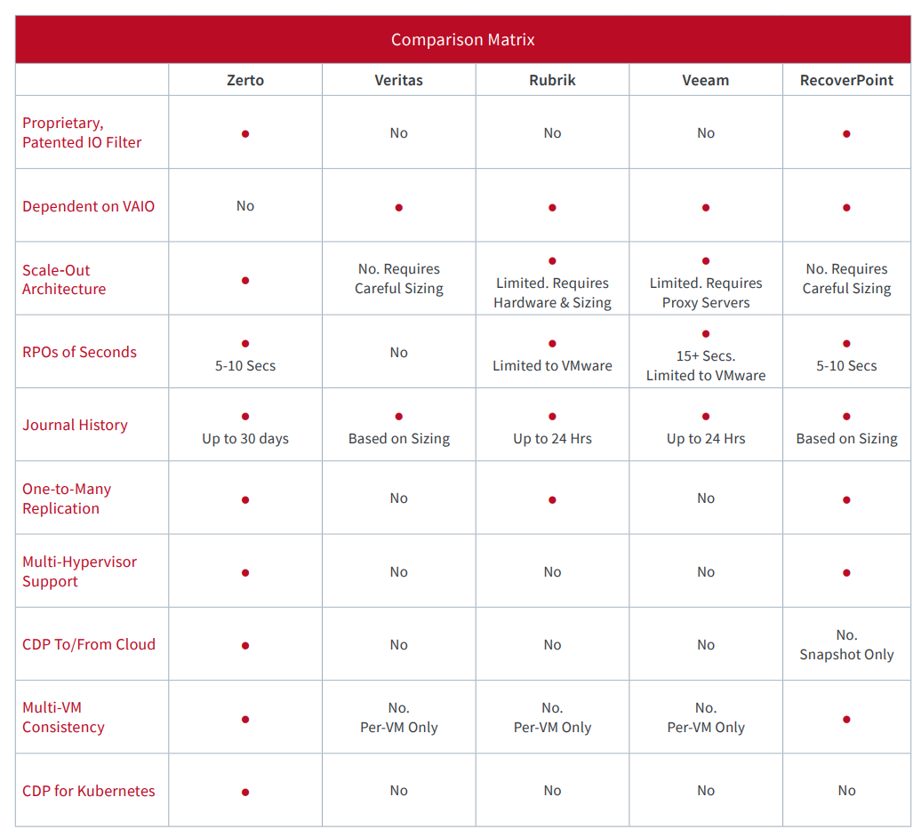
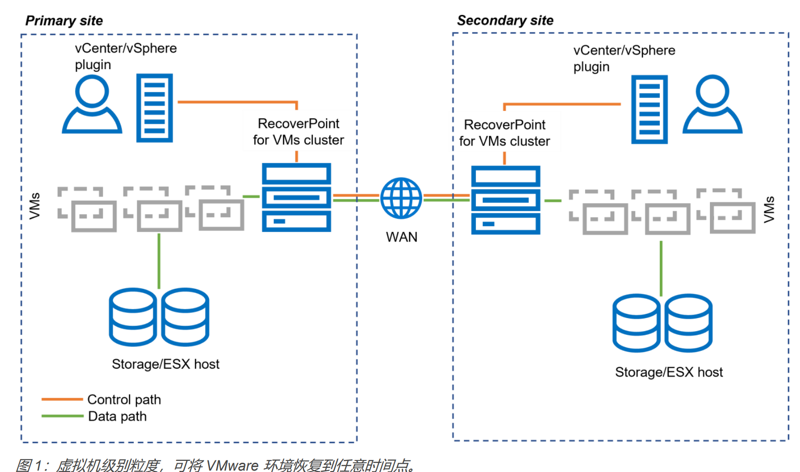

# CDP技术综述

# 1. CDP概述

## 1.1 备份粒度

### 1.1.1 块级别备份

块级别 - CBT（Changed Block Tracking）技术，只备份发生变化的块，减少备份时间和存储空间。

### 1.1.2 文件级别备份

## 1.2 常见技术

### 快照技术

一般需要文件系统支持，快照技术可以实现文件级别的备份，例如，btrfs、ntfs、微软VSS技术、ZFS。部分文件系统ext4fs需要使用LVM技术来实现快照备份。

飞康的快照技术在非windows平台是基于文件系统的快照技术，dell则在更多的操作系统上实现了块粒度的跟踪技术。

### Journaling技术

Journaling技术是一种记录块/文件系统中的变化的技术，可以实现块/文件级别的备份。

避免多快照链导致的性能，例如，vmware的快照链大于7个情况下，性能可能下降30%。

# 2. 相关厂商

## 2.1 迪备（成都）

根据文档和源码：

Linux使用块设备驱动模式实现CBT功能，可以实现卷、磁盘级别的备份和恢复。

Windows使用WDK驱动同样实现CBT功能，可以实现卷、磁盘级别的备份和恢复。

恢复使用快照挂载恢复 -- 免除文件块的检索，恢复的粒度也是磁盘级别。

待定问题：

COW数据管理？-- 一般需要使用B+树来管理数据块，快速索引和查找，减少文件的碎片，例如，VMWare。

数据传输？ -- 一般使用iSCSI协议，数据传输效率高，例如，dell。

## 2.1 Dell EMC RecoverPoint

**RecoverPoint** 的历史版本最早可以追溯到 2005 年左右，当时由以色列公司 **Kashya** 开发，专注于提供企业级的连续数据保护（CDP）和灾难恢复解决方案。2006 年，**EMC** 收购了 Kashya，并将其技术整合到 EMC 的存储产品线中。最初的 RecoverPoint 版本主要用于物理环境，提供基于块的复制和 CDP 功能，支持广泛的 EMC 存储阵列，如 **CLARiiON** 和 **VMAX** 系列。
### RecoverPoint 关键版本和演进：
1. **初期版本（2005-2010年）**：
   - 该时期的 RecoverPoint 主要为物理服务器和存储系统提供保护，支持远程和本地的灾难恢复功能。
   - 它的最大特点是连续数据保护（CDP）和以任意时间点恢复（Point-in-Time Recovery）为核心的复制技术。
2. **2011-2015年**：
   - 随着虚拟化技术的兴起，特别是 VMware 环境的广泛使用，EMC（后来并入 Dell Technologies）推出了 **RecoverPoint for Virtual Machines (RP4VM)**，这标志着其技术转向虚拟化环境的保护。
   - RP4VM 专注于保护 VMware 环境中的虚拟机，实现无代理的灾难恢复和任意时间点恢复。
3. **2016 年后**：
   - RecoverPoint 的物理环境支持逐渐减少，Dell Technologies 更加专注于虚拟化和云环境，RP4VM 成为该产品的主要方向。
   - Dell 在数据保护领域将更多资源投入到 **PowerProtect** 系列中，而 RecoverPoint 逐步专注于虚拟环境的保护，如 VMware vSphere 环境。
   - 物理服务器的支持功能则更多地被整合到其他产品线，特别是 **PowerProtect Data Manager** 和 **PowerProtect DD** 系列。
### 何时停止支持物理服务器：
RecoverPoint 从 2015 年开始专注于虚拟化环境，特别是通过推出 **RP4VM** 实现了对 VMware 虚拟机的专用支持。随后，物理环境的支持逐渐减少，并逐步被 Dell 的其他现代数据保护解决方案（如 PowerProtect）所取代。
因此，Dell 基本在 2016 年前后开始逐步减少对物理服务器的直接支持，转而重点发展虚拟化和云环境的数据保护。

[1] recoverpoint-vms datasheet. https://www.delltechnologies.com/asset/en-us/products/storage/technical-support/h11802-recoverpoint-vms-ds.pdf

[2] RecoverPoint for Virtual Machines 手册 https://www.delltechnologies.com/asset/en-us/products/storage/technical-support/docu89973.pdf

[3] CDP产品比较 https://www.zerto.com/wp-content/uploads/2022/11/Comparison-Continuous-Data-Protection-Competitive-Overview.pdf

https://docs.actifio.com/10.0/PDFs/Introducing.pdf