数据去重技术由于其消除冗余写入和提高存储空间效率的能力，在现代文件系统中越来越受欢迎。近年来，闪存友好文件系统（F2FS）在基于闪存存储设备（包括智能手机、高速服务器和物联网设备）中被广泛采用。在本文中，提出了F2DFS（基于去重的F2FS），它引入了三个主要的设计贡献。首先，F2DFS集成了内联和离线混合去重。内联去重消除了冗余写入并增强了闪存设备的耐久性，而离线去重则减轻了负面的I/O性能影响并节省了更多的存储空间。其次，F2DFS遵循文件系统耦合设计原则，有效地利用了去重和原生F2FS的潜力和优势。此外，借助这一原则，F2DFS实现了高性能和空间高效的增量去重。第三，F2DFS采用虚拟索引来缓解去重引起的段清理期间的多对一映射更新。我们进行了F2DFS、原生F2FS和其他最先进的去重方案之间的全面实验比较，使用了合成和真实世界的工作负载。对于内联去重，F2DFS在I/O带宽性能和去重率方面优于SmartDedup、Dmdedup和ZFS。而对于离线去重，与SmartDedup、XFS和BtrFS相比，F2DFS表现出更高的执行效率、更低的资源使用率和更大的存储空间节省。此外，F2DFS在段清理方面比原生F2FS更高效。

# 1. Introduction

近年来，随着数据存储需求的增加，数据去重技术被广泛采用，以避免冗余设备写入并节省存储空间。数据去重通过识别和消除相同的数据块，并维护逻辑引用与不同物理数据副本之间的多对一映射关系来实现[94, 148]。先前的研究提出将去重集成到现代文件系统中，这不仅可以感知文件系统信息，如I/O行为和文件语义，还可以继承文件索引结构来组织去重索引，从而减少空间和管理开销[12, 19, 158, 172]。此外，根据操作时间，去重可以分为内联和离线，分别在前台和后台执行。

在过去的几十年中，基于NAND闪存的存储（如固态硬盘，SSD）已广泛应用于移动和服务器设备，如智能手机、物联网和高速服务器。日志结构文件系统（如F2FS、NILFS2和NOVA）[66, 72, 96, 120, 152]由于其追加日志模式，提供了比基于日志的文件系统（如Ext4、XFS和ReiserFS）和写时复制文件系统（如BtrFS、ZFS和WAFL）更好的随机写性能，因而受到了广泛关注。由于闪存友好系统设计，闪存友好文件系统（F2FS）目前是最广泛使用和研究的基于闪存的日志结构文件系统[57, 62, 79]。为了应对文件碎片化和快速空间消耗[48, 65]，F2FS将执行段清理操作以回收无效空间。这是通过将有效数据块迁移到新的物理位置，然后用新位置更新相应的文件引用，最后回收旧的物理空间来实现的。

然而，将去重集成到日志结构文件系统中可能会出现几个关键问题。（i）实施不当的去重索引结构可能导致无效信息的低效移除[38, 44, 78]、长查找和更新路径[85, 99, 172, 178]以及高空间开销[91, 141]问题。（ii）由于识别重复数据的CPU密集型和耗时性，内联去重将严重降低I/O性能[78, 109, 123, 148]。在有限的内存空间下，也很难实现高去重率[106, 131, 158]。（iii）离线去重也难以同时考虑执行效率[32, 36, 94, 162]、元数据空间开销[110, 158, 161]和用户交互性[21, 68, 128]。（iv）去重后，一个数据块可能被多个文件引用引用。因此，在段清理期间，日志结构文件系统（如F2FS）将面临相应文件引用的多对一映射更新。这不可避免地导致高元数据空间开销，降低前台I/O性能，甚至加速存储空间的消耗[48, 148, 176]。

为此，我们提出了F2DFS，这是一种基于去重的文件系统，以F2FS作为基线日志结构文件系统。本文的主要贡献包括：

* F2DFS支持内联和离线混合去重。内联去重旨在减少关键路径上的许多冗余写入，而不会阻塞前台I/O或消耗过多的内存空间。离线去重可以消除未去重的数据以进一步节省存储空间，并以增量方式执行以提高效率。
* F2DFS完全遵循文件系统耦合设计原则，以限制去重引起的负面影响，并充分利用去重和原生F2FS的优势。与其他在F2FS之上或之下实现去重的工作相比，F2DFS实现了更低的元数据空间开销、更高的I/O性能和更高的去重率。
* F2DFS提出了虚拟索引，可以解耦文件逻辑引用和物理数据块之间的多对一映射关系。它帮助F2DFS在段清理期间缓解去重引起的多对一映射更新问题。与几种最先进的去重方案相比，F2DFS在真实世界的工作负载中表现出更好的性能结果。首先，对于内联去重，F2DFS的写入带宽性能分别比SmartDedup [158]、Dmdedup [131]和ZFS [11, 12]高19.2%、52.6%和86.6%。F2DFS的内联去重率也分别比这三种方案高16.4%、53.6%和47.0%。其次，对于离线去重，执行效率分别是SmartDedup、XFS [52, 127]和BtrFS [118]的1.5倍、2.3倍和29.4倍。F2DFS将内存空间开销限制在它们的41.8%、27.7%和27.7%。F2DFS的离线去重率也比XFS和BtrFS高13.1%和27.8%。第三，与原生F2FS相比，F2DFS将后台和前台段清理的执行时间分别减少了最多17.5%和17.7%。

本文的其余部分组织如下：第2节介绍了去重的背景和挑战。第3节分析了不同真实世界工作负载中重复数据的特征。第4节讨论了将去重引入F2FS时的三个关键问题。第5节描述了F2DFS的设计。第6节对F2DFS和几种最先进的工作进行了全面实验。第7节回顾了相关工作。第8节总结了本文。

# 2 Background and Challenges

## 2.1 Deduplication in Diferent Levels

现代去重方案通常利用指纹（FPs），即加密抗碰撞哈希函数的输出值，来识别相同的数据内容。因此，可以通过比较指纹值来识别重复的数据内容，而不是通过低效的逐字节比较数据内容。数据去重可以在不同层次上实现，包括用户空间[19, 35, 42, 45, 102, 158]、设备端层[21, 46, 47, 50, 176]、块层[23, 77, 87, 131, 141, 143, 144]和文件系统[12, 52, 55, 69, 97, 100, 114, 118, 164]。

首先，由于资源和安全问题，很难在用户空间（例如应用程序、内存模块和用户空间中的文件系统）中消除所有重复数据[7, 75, 137]。例如，权限受限的应用程序难以与拥有更高优先级的其他应用程序比较和共享数据内容。此外，一些系统仅对特定应用数据和文件类型执行去重，导致去重率较低。其次，一些工作倾向于将去重加载到设备端，例如现代固态硬盘（SSD）中的闪存转换层[21, 143, 176]。然而，设备端去重只能检测单个存储设备内的重复数据，难以跨多个SSD共享相同的数据块，导致去重率较低[2, 3, 144]。第三，为了实现高去重率，可以在块层实现去重。然而，它未能考虑文件语义和进程上下文，例如文件类型、文件系统级元数据和上下文切换[87, 158]。它还将一些重要的数据结构（如日志和检查点）置于数据丢失的风险中[41, 176]。

为避免上述问题，基于去重的文件系统可以是一个可靠的选择。基于去重的文件系统可以直接从页面缓存中检索内存数据内容，或通过文件系统级块位置访问存储中的数据块，以确定它们是否重复。它还可以通过直接继承文件索引来存储去重后的逻辑到物理映射，从而减少管理开销。一些文件系统还提供通用系统调用，例如reflink()，可以通过轻量级逻辑数据复制消除冗余数据，以及remap_file_range()，可以引用其他文件中的相同内容[17, 83, 106, 147, 164]。

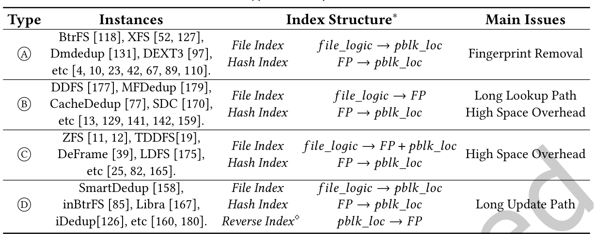
通常，主机端文件系统的物理块位置（pblk_loc）表示设备端的逻辑块地址（LBA）。需要注意的是，一些与去重相关的元数据，如块大小和引用计数，可能存储在索引结构的不同部分，甚至不需要存储。例如，一些工作采用固定大小的基于块的去重[21, 69, 114, 126, 131, 141, 158]，或使用反向链表来保持物理数据块的逻辑引用数量（即，pblk_loc->{file_logic}）以替代块引用计数[47, 50, 76, 143, 144]。

一些工作[21, 69, 100, 114, 116, 140]可能不会直接存储pblk_loc->FP反向映射，而是建立一对一的静态映射关系（即，FP->pblk_loc）。例如，系统可以将数据块存储在对应于一个pblk_loc值的数据区域中，然后将其FP值存储在元数据区域的相同偏移位置。

## 2.2 DeduplicationIndexDesign

使用文件逻辑引用（file_logic，通常包括文件inode和文件内偏移）、物理块位置（pblk_locs）和哈希指纹，基于去重的文件系统可以通过不同类型的索引结构实现，如表1所总结的。

第一种类型（A）通过使用原生存储系统的文件索引（即，file_logic→pblk_loc）实现去重，并引入新的哈希索引（即，FP→pblk_loc）。然而，这种索引结构的主要问题是指纹移除，即当所有对应的逻辑引用被删除时，如何找到并从哈希索引中移除过时的指纹[38, 44, 69, 78]。最直接的解决方案是读出待删除的数据块，计算其指纹，然后检索哈希索引以进行移除。但这会引入显著的性能下降，特别是在文件删除和更新时。因此，一些解决方案仅在关键路径上检测到未引用的指纹时移除过时的指纹[4, 36]（即，当遇到一次哈希索引访问未命中时），或在后台清理时执行[89, 131]。然而，这也会导致索引结构和数据块的存储空间回收延迟。

第二种类型（B）在文件索引中维护file_logic→FP映射关系，因此文件索引和哈希索引通过指纹值连接。然而，为了服务读操作，数据块位置只能在访问两个索引后获得，导致查找路径较长[99, 175, 178]。此外，在索引中维护两个指纹会增加更多的空间开销，因为一个指纹（几十字节）通常比一个块位置（4或8字节）长[91, 116, 141]。因此，在文件索引中存储整个指纹后，一个文件可以引用的数据量将显著减少。尽管这种类型的索引结构通常用于备份场景[13, 142, 159, 170, 177, 179]或缓存系统[77, 129, 141]，但低效的读操作和高存储空间开销问题使其不适用于传统文件系统。

为了解决上述问题，第三种类型（C）在文件索引中记录指纹和块位置（即，file_logic→FP+pblk_loc）[12, 19, 25, 39, 165, 175]。尽管这种索引类型可以高效地执行文件读和删除操作，但仍然存在高存储空间开销问题。

另一种选择是第四种类型（D），除了类型A外，还引入了另一个反向索引（即，pblk_loc→FP）以帮助找到过时的指纹[126, 158, 160, 180]。当一个块位置的所有文件引用被删除时，通过反向索引获得相应的指纹值，然后可以从哈希索引中移除过时的指纹条目。因此，在反向索引中只需要一次搜索，避免了低效读取和指纹计算的时间开销。唯一的问题是需要维护哈希索引和反向索引之间的映射一致性[71, 85, 172]。例如，在执行更新操作时，两个索引中的块位置应同时更新。虽然可以通过在元数据和数据区域之间建立一对一的静态映射关系（即，FP↔pblk_loc，如脚注中提到的）来简化和优化[21, 69, 100, 114, 140, 167]。

## 2.3 Inline Deduplication

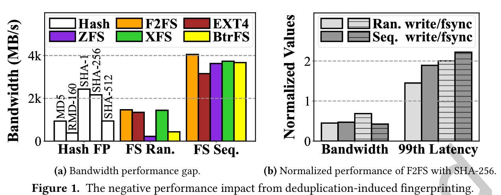

内联去重在前台执行，在将冗余写入提交到存储设备之前消除它们。如今，内联去重通常用于提高I/O带宽性能，增强有限使用寿命设备（如基于闪存的SSD）的耐久性，并节省存储空间[77, 114, 126, 141, 158]。然而，由于CPU密集型的指纹计算、耗时的索引管理和高内存空间开销，内联去重仅期望在关键路径上检测和消除部分重复写入，而不会严重阻塞前台I/O。

我们使用OpenSSL [105]测试了五种常见类型哈希算法的计算性能，并通过在一个核心上同时运行多个哈希作业对其进行了优化[27]。我们还使用Flexible I/O（FIO）[5]收集了五种常用文件系统的随机（Ran.）和顺序（Seq.）写入性能。有关实验设置和参数的详细信息，请参阅第6.1节和第6.2节。如图1a所示，哈希指纹计算与文件系统级写入之间存在明显的带宽性能差距。例如，SHA-256的带宽比F2FS和ZFS的顺序写入带宽低87.2%和67.6%。尽管在某些情况下，哈希指纹的带宽性能高于文件系统，例如，SHA-256是F2FS和ZFS随机写入的1.5倍和9.7倍。这仅意味着随机写入性能可能不会受到指纹计算带宽上限的影响。然而，指纹计算仍显著影响文件系统的写入延迟。图1b进一步显示了在F2FS中引入基于SHA-256的指纹后显著的性能下降。平均而言，指纹计算分别减少了49.2%的带宽并增加了89.1%的99th尾百分位。对于带有fsync()调用的同步写入，其延迟更为敏感[57]。因此，内联去重难以在高速文件系统和存储设备上实现高I/O性能提升，甚至可能导致指纹计算引起的性能瓶颈。

另一方面，为了更快的去重索引，内联去重倾向于将指纹信息存储在内存中。然而，很难在I/O性能、去重率和内存空间开销之间取得良好平衡。首先，将所有指纹存储在内存中可以提高元数据访问效率并实现高去重率。但这是不合理且不切实际的，因为这会导致高内存空间开销。根据我们在第3.1节中的发现，重复数据内容可能在数千万甚至数亿次写入请求之间出现。这意味着当使用SHA-256作为指纹时，内存空间开销将达到数百兆字节甚至数十吉字节。其次，现有的内联去重方案[106, 131, 158]倾向于将指纹存储与内存和存储设备结合使用。也就是说，在写入请求未命中内存指纹后，系统可以访问存储中的指纹存储，以进一步识别该写入是否重复。然而，关键路径上的大量随机访问将严重降低I/O性能。

## 2.4 Offline Deduplication

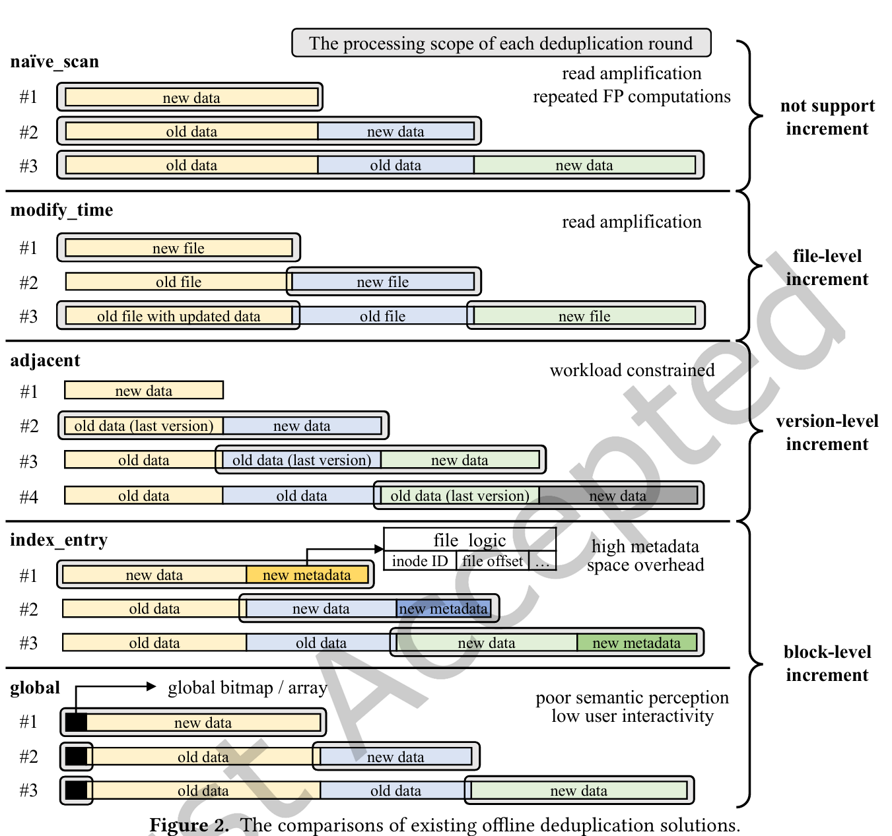

为了解决潜在的性能负面影响和高内存空间开销，离线去重可以在后台利用。它可以通过直接将数据写入存储，并仅在系统空闲或资源压力较低时执行去重来实现[78, 109, 123, 148]。如图2所示，我们将离线去重的方法分为五类：

第一种方法是对整个数据区域进行naïve_scan，无论这些数据内容是否已经去重过[4, 10, 25, 32, 93, 94]。其代价是，由于重复的数据读取和指纹计算，时间成本会显著增加，导致显著的读取放大问题，特别是对于每日增量和每周备份。

第二种方法是基于文件的修改时间（modify_time），仅对离线去重轮次中新创建或更改的文件进行去重[15, 36, 71, 113, 162]。然而，大多数情况下，只有文件内部的少数段被更改（例如，通过fallocate()、truncate()和append()调用），这使得一个文件包含具有不同更新频率的数据内容。这些小而随机的更新操作通常被文档、日志和数据库文件采用[51, 96, 157, 169]。有时，修改时间也可能在不更改数据内容或文件索引的情况下单独更新（例如，通过setattr()和update_time()调用），因为一些应用程序会使用这种方式来预热它们的文件以实现不公平的资源竞争。因此，重复处理未更改的部分可能仍然存在读取放大问题。

此外，一些工作[78, 108, 149, 150]发现，在备份场景中，相邻备份版本之间存在大量相同或相似的数据内容。因此，第三种方法倾向于在新版本和最后一个版本之间执行去重，以实现高执行效率和较高的去重率（例如，通过细粒度的增量压缩）。然而，这也意味着这种方法仅适用于特定的工作负载。

为了解决上述问题，第四种方法仅对新到达的数据块执行增量去重[110, 130, 155, 158, 159, 161]。具体来说，这种方法将记录每个未去重数据块的文件索引条目（即，file_logic），并仅在离线路径上对记录的数据块执行去重。通过这种方式，每轮去重涉及的数据量大大减少，但内存或存储空间开销不能完全忽略。例如，对于每个未去重的数据块，file_logic由文件inode ID和文件内偏移组成，两者长度均为4字节。因此，一个100GB大小的工作负载将带来至少200MB的元数据空间开销。此外，由于权限限制，文件系统通常不允许上层直接通过inode ID访问文件内容，因此一些应用程序可能需要通过绝对路径或符号链接（通常为数百字节）访问文件内容，这进一步增加了元数据空间开销。

另一种选择是第五种方法，引入全局位图或数组以减轻空间开销[21, 68, 69, 134]。具体来说，这种方法将一个数据块存储在对应于其pblk_loc值的数据区域中，并在元数据区域的相同偏移位置使用1位标签来标识每个数据块是否未去重。然而，这种方法无法完全感知上层语义信息，如数据访问频率、文件类型、用户的特定需求等。例如，很难对特定目录或文件类型执行离线去重。因此，这种方法导致文件语义感知能力差和用户交互性低。

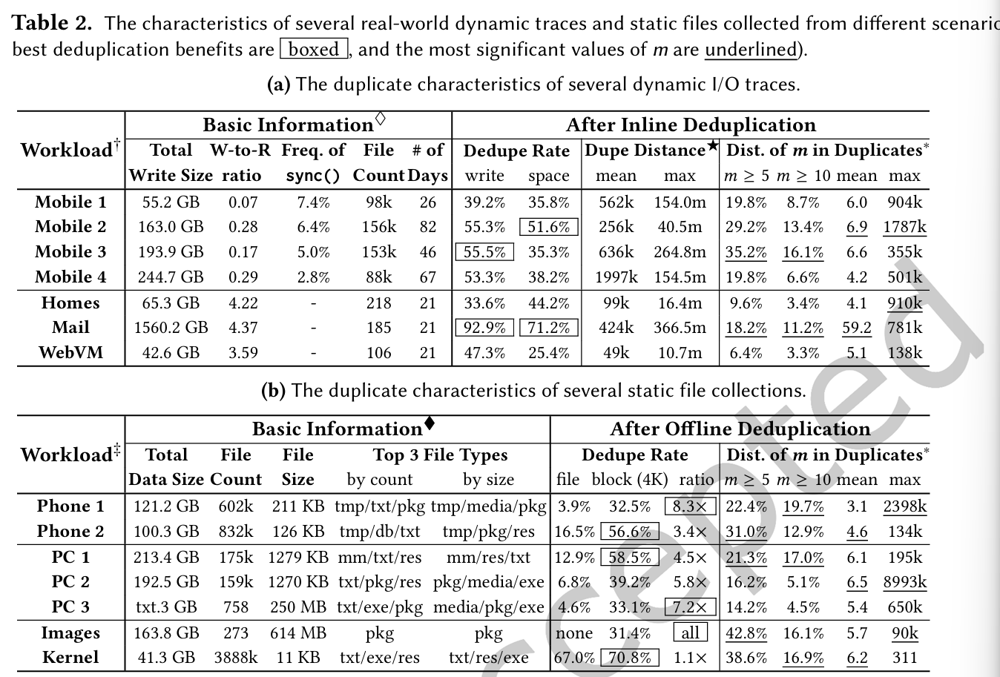

表2a的工作负载列中列出了七个真实世界的工作负载，其中四个智能手机I/O跟踪（Mobile 1~4）来自[70]，三个服务器I/O跟踪（Homes、Mail和WebVM，即FIU服务器）来自[138]。请注意，这些移动跟踪是从一个基于EXT4的智能手机收集的[158]，因此一些关于文件系统级日志的信息被截断，但保留了应用程序级日志的信息。

表2b的工作负载列中列出了七个真实世界的文件或图像集合，其中两个智能手机（Phone 1<del>2）和三个个人电脑（PC 1</del>3）的文件，273个Ubuntu操作系统镜像（Images）来自[136]，63个Linux内核版本（Kernel）来自[135]。

表2a中的“基本信息”：对于每个I/O跟踪，我们列出了总写入量、写入与读取比率、同步写入频率、文件数量和天数。请注意，由于移动跟踪来自EXT4（基于日志的文件系统），而本文主要关注F2FS（日志结构文件系统），一些与EXT4相关的I/O信息（例如，文件系统级日志）已被移除。三个服务器跟踪是从块层收集的，工作负载缺乏同步写入信息，进程数量代替了文件数量。

表2b中的“基本信息”：对于每个静态文件或图像集合，我们列出了数据总量、文件数量、平均文件大小和前三大文件类型（按文件数量和存储空间大小排序）。这里，文件类型分为临时文件（“tmp”，例如.wal、.log、隐式草稿和应用程序缓存）、包文件（“pkg”，例如.img、.iso和压缩文件）、资源文件（“res”，例如.xml、.dat、.csv和文档文件）、数据库文件（“db”，例如.db、.jnl和.db日志）、多媒体文件（“mm”，例如.jpeg、.wav、.avi和.pdf）、文本文件（“txt”，例如纯文本、.c、.sh和.css）和可执行文件（“exe”，例如.exe、.apk、.so和.bin），遵循现有工作的分类方法[57, 95, 158]。

“重复距离”是具有相同内容的数据再次出现的写入间隔数，可以表示重复数据分布的时间局部性，并影响存储中的空间局部性。

m的值表示文件逻辑引用的数量，当物理块位置更改时，这也会导致多对一映射更新。这里，我们列出了重复数据块中m的分布（即，m ≥ 2）。

# 3 UNDERSTANDTHEREAL-WORLDDUPLICATECHARACTERISTICS

为了更好地理解内联和离线去重，我们分析了来自真实世界工作负载的重复数据特征，涵盖了内联和离线场景。如表2所示，顶部展示了移动设备和服务器设备的运行时I/O信息，而底部展示了来自各种存储设备和在线存储库的静态文件集合信息。

在本节中，我们总结了六个发现，可以参考表中的相应列：(i) 内联和离线去重各有其优势和适用场景（表2a和2b中的工作负载列）[78, 109, 123, 148]。(ii) 去重具有很高的潜在收益，包括减少设备写入和节省存储空间（表2a和2b中的去重收益列）[37, 148, 158, 167]。(iii) 重复写入可能在长时间间隔的写入请求中发生，因此仅依靠内存存储记录所有指纹信息是不现实的（表2a中的重复距离列）[23, 39, 78, 148, 158]。(iv) 每个重复数据可能会被多次引用（表2a和2b中的重复数据的m分布列）[18, 30, 92, 110, 146]。(v) 去重的粒度选择很重要（表2b中的文件大小列）[148]。(vi) 基于固定大小块的去重通常比基于文件的去重获得更多收益（表2b中的去重收益列）[32, 40, 148, 171]。

我们的第一个发现显然体现在表2中。不同类型的去重有各自的适用场景，即内联去重可以消除表2a中的冗余写入，而离线去重可以消除表2b中的冗余存储空间。在本节的其余部分，我们将分析这些真实世界工作负载的重复特征，以支持其他发现。

## 3.1 Understand the Dynamic I/O Traces for Inline Deduplication

基本信息。首先，表2a列出了真实世界长期I/O跟踪的基本信息。服务器跟踪通常具有较高的写入与读取比率，以处理来自多个客户端的大量写入。而移动设备经历大量的同步写入（例如，通过fsync()和fdatasync()调用，或带有O_SYNC标志的写入），其频率可高达7.4%。这是因为智能手机通常会经历大量基于SQLite的更新操作、应用程序日志和软件安装[56, 57, 104, 158]。

去重率。然后，去重的好处直接表现为理想的内联去重率，包括写入和空间减少率。这也导致了我们的第二个发现。首先，在所有工作负载中存在许多冗余写入，例如，Mobile 3的最大去重率为55.5%，Mail的最大去重率为92.9%。因此，当采用基于闪存的SSD时，内联去重可以减少大量的闪存写入，从而提高I/O性能，延长闪存寿命并增强设备耐久性。其次，还有很高的空间减少率，例如，Mobile 2的空间减少率为51.6%，Mail的空间减少率为71.2%，这意味着内联去重还可以提高空间效率。

重复距离。此外，表中还展示了重复距离，表示重复数据内容再次出现之间的写入请求数量。重复距离可以看作是重复数据的时间局部性，类似于现代缓存存储系统中的“重用距离/时间”术语[84, 119, 168]。重用距离通常用于研究缓存大小和缓存命中率之间的关系，因此在本文中，重复距离可以用于研究内存中指纹数量和去重率之间的关系。对于大多数工作负载，平均重复距离通常约为数十万次。因此，即使采用最简单的最近最少使用（LRU）缓存替换算法，内存中的指纹存储也可以通过仅保留最近使用的数据的指纹来实现高去重率。例如，对于基于SHA-256的指纹，Mobile 3工作负载仅需要24.3MB的内存空间来存储63.6万个不同的指纹。然而，仍然有一些重复数据被数百万次写入请求分隔。例如，Mobile 3和Mail工作负载的最大距离分别高达2.648亿和3.665亿。在这种情况下，为了消除所有冗余写入，内存空间开销分别高达9.9GB和13.7GB。因此，我们得出第三个发现，即内联去重可以使用少量内存空间实现高去重率，但仅靠内联去重消除所有冗余写入是不现实的。

重复数据中的m分布。为了揭示去重的潜力，还列出了去重后m的分布，这导致了我们的第四个发现。例如，结果显示，在Mobile 3中，35.2%和16.1%的重复数据至少可以被引用五次和十次。最多，Mobile 2和Mail中的数据块分别被引用高达1787次和91万次，这可以看作是不可预测的尾部分布。需要注意的是，尽管这些高度引用的数据块极大地帮助减少了数据冗余，但当它们的块位置发生变化时，这会导致多对一映射关系的更新开销非常高。我们将在第4.3节中详细描述这一挑战。

##  3.2 Understand the Static File Collections for Ofline Deduplication

基本信息。对于表2b，列出了真实世界静态文件和图像集合的基本信息。首先，智能手机中有大量小尺寸且随机分布的文件，而个人电脑和Ubuntu镜像中的文件通常较大。尽管Kernel工作负载的总大小仅为41.3GB，但有多达388.8万个文件主要是文本文件，导致平均文件大小仅为11KB。因此，例如，在处理Kernel工作负载时，4KB大小的细粒度去重可以识别出比128KB大小的粗粒度去重多4.6倍的重复数据。除了作为我们的第五个发现外，这还启发我们思考去重粒度的选择。

去重率。此外，这些工作负载的离线去重率（即存储空间节省）也被展示出来，这进一步支持了我们的第二个发现，即去重具有显著的高收益。基于粒度，有两种可行的去重方法：基于文件的和基于块的。对于基于块的去重，它通过将文件分块为固定大小或可变大小的数据块来实现。尽管可变大小分块（即内容定义分块）由于其移动块边界可以检测到更多的重复数据[101, 151, 179]，但固定大小分块（例如，我们工作中的4KB大小块）可以在执行效率和去重率之间实现更好的平衡。一般来说，基于文件的去重比基于块的去重更高效且需要更少的内存空间，因为可以在较粗粒度上检测到重复数据。然而，就实现的去重率而言，基于块的去重总是比基于文件的去重实现更高的去重率，特别是对于相似但不相同的文件，以及同一文件内的重复块。例如，对于Phone 1、PC 2和PC 3工作负载，4KB大小的基于块的去重可以节省32.5%、39.2%和33.1%的存储空间，分别是基于文件的去重的8.3倍、5.8倍和7.2倍。请注意，Images工作负载是一个操作系统镜像集合，具有不同的文件元数据（例如，文件大小和内部校验和），使所有文件不同。但仍然可以在基于块的粒度上识别重复数据，带来31.4%的空间减少率。因此，我们得出第六个发现，即基于文件的去重可能不如基于块的去重有益。

重复数据中的m分布。对于m的分布，每个重复块在所有工作负载中平均被引用超过三次。此外，在对Kernel工作负载执行去重后，38.6%和16.9%的重复数据至少被引用五次和十次。对于最高的m，Phone 1、PC 2和Images中的值分别为2398、8993和9万。

# 4 WHENDEDUPLICATIONMEETSF2FS

近年来，日志结构文件系统[66, 72, 96, 120, 152]受到了广泛关注。在这项工作中，我们选择了闪存友好文件系统（F2FS）[54, 63, 72]作为基线日志结构文件系统，以实现文件系统级的基于块的去重。

当去重遇到F2FS时，首先需要考虑三个关键问题：(i) 如何使去重适用于F2FS的不同工作场景？(ii) 在实现去重时如何结合和利用F2FS的特性？(iii) 在去重后如何保持F2FS的性能优势？

## 4.1 Howtomakededuplication applicable to diferent work scenarios of F2FS?

F2FS已广泛应用于各种基于闪存的工作场景，如智能手机、物联网（例如，汽车）、缓存系统和高速服务器[9, 57, 62, 65, 79, 104, 154, 174]。基于表2中列出的真实世界工作负载，内联和离线去重也有不同的适用场景和重复特征。

内联去重可以减少大量冗余写入到闪存存储，从而增强设备耐久性。但正如我们在第2.3节中提到的，由于指纹计算和内存空间的高开销，内联去重仅期望在关键路径上消除部分重复写入。相反，可以利用离线去重在系统空闲或资源压力较低时识别和消除未去重的数据。如第2.4节所述，增量离线去重还可以更好地处理增量更新或版本备份，并提高执行效率。然而，现有工作中的高元数据空间开销和较差的用户交互性问题不容忽视。

因此，我们考虑内联和离线混合去重，通过调整内联和离线方案的比例。对于内联去重，主要目标是减轻负面的I/O性能影响，并在有限的内存空间开销下实现高去重率。对于离线去重，主要目标是支持高效和彻底的增量去重，同时具有低空间开销和高用户交互性。

## 4.2  Howtocombine and utilize the features of F2FS when implementing deduplication

为了回答这个问题，应该提出文件系统耦合设计。这里，我们对F2FS的五个基本特性进行了全面分析，即固定大小的块分配、多日志分区布局、基于节点的文件结构、非递归索引更新和段清理。

* 固定大小的块分配
   F2FS将文件索引信息和数据内容分别管理为许多4KB大小的块，称为节点块和数据块。因此，这些块与底层基于闪存的SSD的操作单元（即闪存页）对齐，以避免不必要的数据复制并增强随机I/O性能。作为典型的日志结构文件系统，F2FS以追加日志模式写入脏节点和数据块，能够充分利用SSD的潜力。因此，固定大小的分块策略可以轻松在F2FS上实现，正如第3.2节所述，4KB大小的块级粒度足够细，可以实现相当高的去重率。此外，F2FS的块分配位图（即段信息表，SIT）可以直接识别每个数据块的使用状态，这有助于通过去重防止文件引用无效数据块。而对于某些文件系统，数据内容存储在可变大小的区段中[17, 55, 147]，因此额外的分块操作会引入负面的性能影响和文件系统级的碎片化。

* 多日志分区布局
   传统的日志结构文件系统（例如，NILFS2 [66]和SpriteLFS [121]）将文件索引信息和数据块写入一个大日志区域。然而，这不能充分利用SSD的内部并行性。因此，F2FS根据存储的信息（节点或数据）和预期的更新频率，同时打开不同类型的活动日志。即，有六种类型的日志，分别是（节点，数据）×（热，温，冷）的笛卡尔积。因此，在基于F2FS实现去重时，我们可以将去重相关的元数据存储为节点块或与节点块一起存储。首先，它可以实现高效的元数据同步，因为节点和数据块是分开的，可以并行写入。其次，它可以动态调整元数据区域的大小，不像某些现有的块层去重系统，例如Dmdedup。Dmdedup管理两个块设备，一个用于存储元数据信息，另一个用于挂载主机端文件系统（例如，F2FS）。其中一个主要问题是两个块设备大小的比例是预定义的，导致去重率的固定上限[87, 132, 158]。例如，文件系统仍有可用存储空间，但元数据区域已满。然而，根据第3节，真实世界的数据重复率范围很广。相比之下，文件系统耦合设计可以有效避免这个问题。例如，存储在F2FS节点区域的元数据可以通过简单地分配一个新节点块来动态扩展。

* 基于节点的文件结构

   在F2FS中，目录和文件都由基于指针的节点块索引，每个节点块由一个唯一标识符（称为节点ID）标识，并存储一系列数据块位置。在元数据区域，节点地址表（NAT）记录所有节点块位置，其条目由节点ID索引。因此，给定一个节点ID，F2FS可以快速将其转换为块位置并读出目标节点。这对于实现增量去重非常友好，因为我们只需记录存储待去重数据块的父节点ID，而不是具有更高空间开销的文件绝对路径（即，对于每个文件，4字节长度的节点ID与数百字节长度的文件路径[15, 36]）。对于每个待去重的数据块，可以利用基于节点的位图进一步消除记录文件内偏移的空间开销（即，对于每个数据块，1位大小的位图标签与4字节长度的文件偏移[58, 158, 159]）。此外，这些增量信息可以与相关文件操作（例如，文件更新和删除）同时更新，以提高元数据管理效率。

* 非递归索引更新

  传统的日志结构文件系统存在“游走树”问题[8]，即一旦数据块被更新并写入新位置，其父节点也会被更新，依次类推。因此，文件索引更新会导致显著的写放大，类似于一些基于写时复制的系统[12, 55, 118, 131]。根据我们在第6节中的实验结果，现有的基于去重的文件系统也存在这个问题。例如，在ZFS中，写时复制特性引起的写入甚至超过了内联去重可以消除的冗余写入，导致8.8%的闪存写入增加和54.3%的带宽性能下降。此外，在执行离线去重时，BtrFS节省了10GB的存储空间，但却带来了27.5GB的写入。然而，F2FS通过其非递归索引更新设计有效解决了游走树问题。因此，F2FS还可以减轻由去重相关的元数据和文件索引更新引起的写放大。

* 段清理

  为了避免追加日志模式引起的快速空间消耗，F2FS执行周期性或即时（即在后台或前台）的清理操作，以回收分散和无效的存储空间。F2FS的清理粒度是整个段，通常为2MB。为此，F2FS在段摘要区（SSA）中存储每个数据块的所有者信息，这可以看作是从物理块位置到其文件逻辑引用（即文件inode ID和文件内偏移）的反向索引。清理操作首先选择几个包含少量有效数据块的脏段，称为受害块。接下来，F2FS将所有受害块迁移到一个新的干净段（即新的物理块位置）。为此，F2FS需要通过SSA读取每个受害块的文件引用并将其引用到新块位置，以保持文件一致性。最后，F2FS回收所有脏段的空间并提高文件系统级的空间效率。

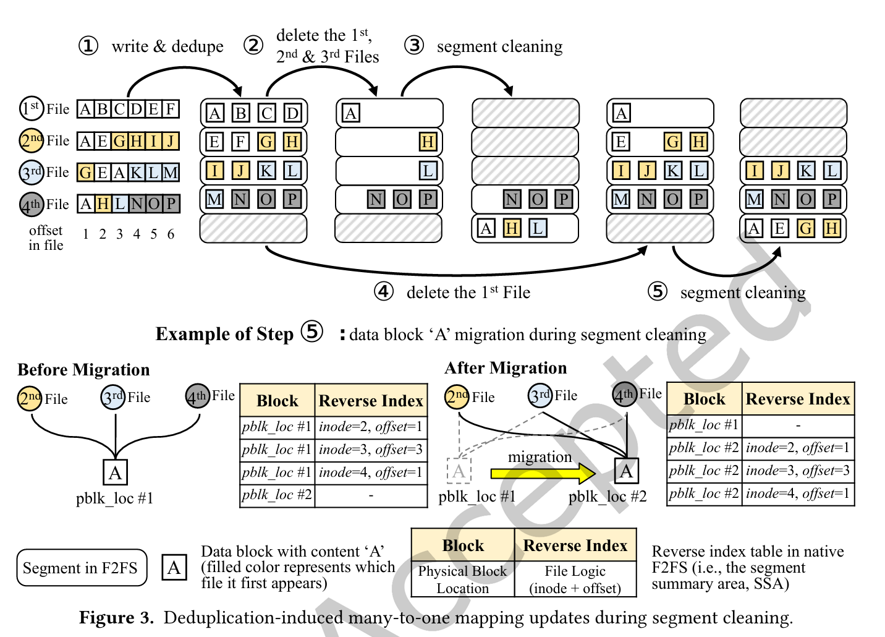

另一方面，去重通常会给主机端文件系统和存储设备带来大量碎片，从而降低I/O性能和空间效率。例如，如图3所示，当几个文件被写入并去重时（①），数据块的空间布局与写入数据流的时间布局不同（依次为第1、2、3和4个文件）。因此，当一些早期文件被删除时，文件系统将遭受严重的碎片化（②）[37, 38, 94, 126, 148, 178]。而对于一些文件系统如XFS和BtrFS，它们的碎片整理工具并不是为去重设计的[17, 34, 147]。然而，在段清理的帮助下，F2FS可以直接缓解这个问题（③），从而大大减少物理碎片整理的频率和开销（例如，基于闪存的SSD内部的垃圾回收）[48, 72, 158]。

## 4.3 How to preserve the performance benefits of F2FS after deduplication?

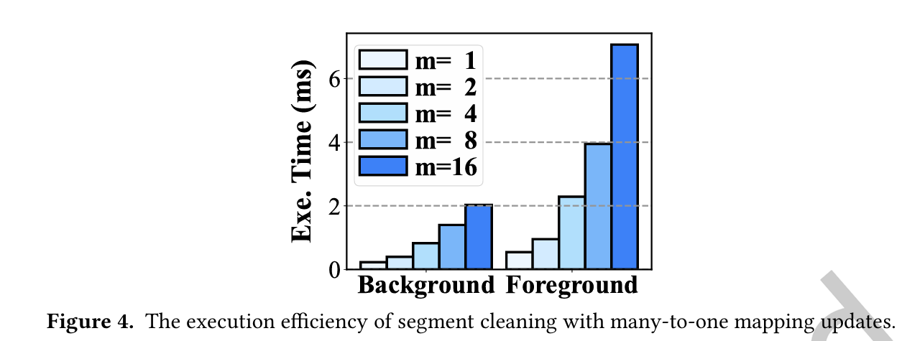

与将去重耦合到F2FS不同，先前的工作通常在F2FS之上或之下实现去重[131, 158, 176]。因此，除了传统的去重引起的问题（见4.1节），F2FS还应面对去重引起的段清理期间多对一映射更新的最显著问题。图3说明了去重后有许多数据块被多次引用。以块A为例，在一系列文件操作后，它同时被第2、第3和第4个文件引用（①, ④）。如图底部所示（即步骤⑤），当块A被迁移时，其物理块位置也会发生变化（例如，从pblk_loc#1到pblk_loc#2），导致三个文件引用被更新。

首先，F2FS需要存储更多的反向索引，带来更高的空间开销。不同于其他领域中预定义的逻辑到物理引用次数上限[50, 58, 141, 143]，去重通常带来不可预测的多对一映射关系。例如，如表2所列，真实世界工作负载中的多对一比率通常很高，甚至达到数千。因此，使用每个数据块的预定义上限的反向索引是不合理的。此外，动态上限带来了额外的管理开销。例如，一些工作设置了固定的去重率上限[76, 131, 144, 176]，可能会耗尽所有逻辑引用，但仍留有空闲的物理空间。

其次，多对一映射更新也严重降低了段清理的执行效率。图4显示了在迁移物理数据块的有效比率相同的情况下，不同逻辑引用次数级别的段清理执行时间。考虑了后台和前台清理，前台清理时间更长，因为它立即迁移数据以快速回收空间，而不是累积足够的数据并批量写入。例如，与F2FS中的原生一对一映射相比（即，m=1），当多对一比率增长到16（即，m=16）时，后台和前台段清理分别需要9.0倍和13.0倍的时间。因此，段清理期间的多对一映射更新（尤其是前台清理）将严重阻塞I/O，有时甚至成为性能瓶颈[37, 48, 176]。现有工作通常在后台触发清理操作[32, 99, 131, 160]，或减少高引用数据块被选为受害者的概率[37, 176]。然而，这些方法难以完全解决这个问题。

第三，多个文件引用的更新可能会加剧快速空间消耗问题。在迁移一个受害块后，其文件inode和父节点都将在追加日志模式下更新。通常，F2FS会将同一文件和父节点的所有数据块批量处理，以限制写入节点块引起的空间消耗速度。但多对一映射更新将放大这个问题，特别是在以小文件为主的场景中。

在本文中，我们提出了虚拟索引来解耦去重引起的多对一映射。我们的原型可以实现比原生F2FS更高效的段清理。

# 5  THE DESIGN OF F2DFS

## 5.1 System Overview

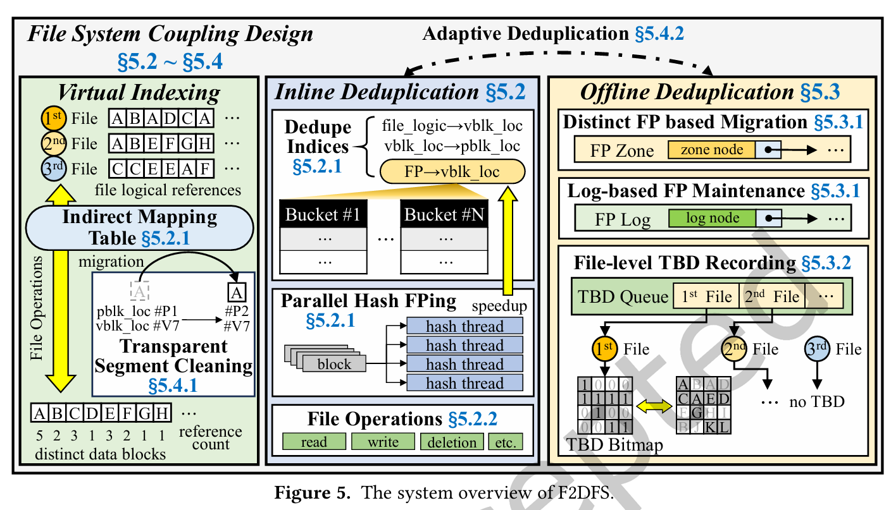

在这项工作中，我们提出了F2DFS，将去重集成到F2FS中。图5详细展示了F2DFS的系统概述。F2DFS充分考虑了第4节讨论的三个关键设计原则，即内联和离线混合去重（4.1节）、文件系统耦合设计（4.2节）和虚拟索引（4.3节）。

文件系统耦合设计原则贯穿于F2DFS的设计和实现中（5.2节至5.4节）。去重相关的数据结构和资源管理通过内核空间文件系统实现，例如第4.2节中提到的一些原生F2FS的系统特性。因此，F2DFS可以限制去重引起的负面影响（例如，高元数据空间开销和严重的碎片化），并最大化去重和原生F2FS的优势（例如，简单的分块、并行写入和空间高效的文件索引结构）。F2DFS还继承了原生F2FS的几个系统机制，如一致性、并发性和事务支持，从而避免了冗余的管理开销。

为了解决第4.3节中提到的多对一映射更新问题，F2DFS提出了虚拟索引，如图左侧所示。F2DFS利用间接映射表（IMT，5.2.1节）来解耦文件逻辑引用（file_logic）和去重数据块之间的多对一映射关系，无论是在单个文件中还是跨多个文件。IMT帮助去重文件执行常规文件操作，并记录数据块的引用计数以确定它们是否在使用中。F2DFS使用虚拟块位置（vblk_loc）的概念，文件直接引用虚拟块位置，IMT维护虚拟块位置到存储设备中物理块位置（pblk_loc）的映射关系。因此，在段清理期间，可以通过简单地更新IMT条目来实现数据块的迁移，而无需触及所有相应的文件引用（5.4.1节）。

在本节中，为了便于阅读和理解，从内联和离线混合去重的角度介绍F2DFS的详细设计。F2DFS采用自适应去重（5.4.2节）来调整内联和离线方案的比例。

内联去重（5.2节）用于尽可能减少冗余写入，增强闪存设备的耐久性并提高I/O性能。如图中间所示，去重索引结构（5.2.1节）包括三个索引，其中内存中的指纹信息存储在多个桶中，类似于先前的工作[100, 141, 167]。此外，为了减轻第2.3节中提到的内联去重引起的负面性能影响，通过采用多个哈希线程并行来提高指纹计算速度，这被称为并行哈希指纹计算（5.2.1节）。还详细介绍了常规文件操作的过程（5.2.2节），如读取、写入和删除。

离线去重（5.3节）用于缓解内联去重引起的性能和内存空间开销，并消除所有潜在的重复数据。为了更高效的去重，我们还考虑了第2.4节中提到的增量场景。如图右侧所示，首先，指纹信息以增量方式维护，其中FP区存储所有不同数据块的指纹，FP日志缓冲区存储需要在未来重放到FP区的临时修改日志（5.3.1节）。FP区和FP日志都组织在一系列基于链表的节点块中，因此去重相关的元数据和去重数据块可以并行写入存储设备。其次，F2DFS仅对待去重（TBD）数据块执行离线去重。这里，提出了两种TBD元数据结构来记录这些数据块在文件系统中的位置。TBD队列帮助用户快速定位具有TBD数据内容的文件（例如，第1和第2个文件），TBD位图进一步识别文件中的每个数据块是否处于TBD状态。在文件级TBD记录的帮助下（5.3.2节），F2DFS可以实现高执行效率、低元数据空间开销和高用户交互性。

## 5.2 Inline Deduplication Phase

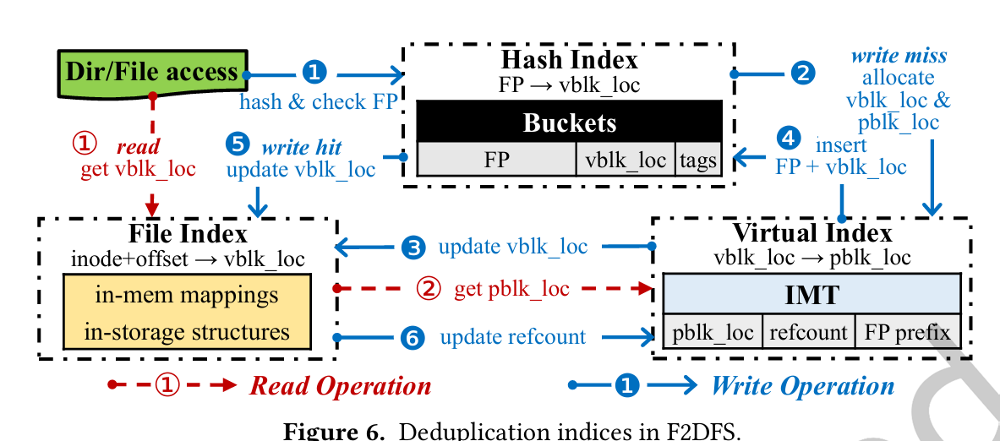

在本小节中，我们将介绍F2DFS的去重索引结构，包括不同索引之间的关系（5.2.1节）以及如何将它们与常规文件操作集成（5.2.2节）。基于这些索引，可以在写入路径中利用内联去重。

### 5.2.1 去重索引

图6展示了F2DFS中的三种基本去重索引，在引入哈希指纹和虚拟块位置后。

文件索引（inode+offset→vblk_loc）。在原生F2FS中，文件索引包括内存中的文件映射（即页面缓存文件映射）和存储中的文件结构（即基于节点块的文件结构），维护文件逻辑引用和物理块位置之间的映射。F2DFS重构了现有的文件索引，通过将物理块位置简单替换为虚拟块位置来建立新的文件索引。需要注意的是，F2DFS的索引设计和实现仅包括文件引用和数据块位置之间的关系，不包括目录和文件之间的关系，从而保留了大多数文件系统调用，如fopen/close()、symlink()、rename()等[83]。

虚拟索引（vblk_loc→pblk_loc）。为了集成虚拟块位置，F2DFS将原生F2FS的节点地址表（NAT）转换为间接映射表（IMT），可以将虚拟块位置转换为目标数据块的物理块位置。每个IMT条目对应一个虚拟块位置，并存储三个字段，即物理块位置、引用计数（refcount）和指纹前缀。引用计数表示数据块的文件逻辑引用数量，也用于确定相应的虚拟和物理块位置是否有效。指纹前缀用于移除过时的指纹，将在5.3.1节中进一步讨论。

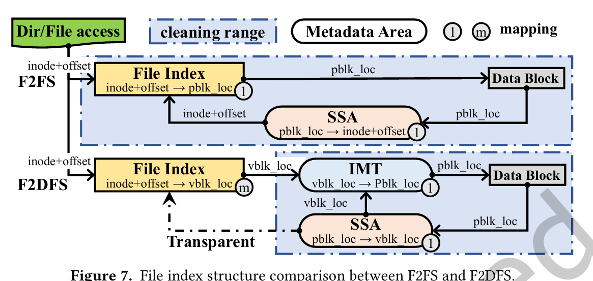

如图7所示，在IMT的帮助下，文件引用和物理块位置之间的映射关系被解耦。因此，建立了文件引用和虚拟块位置之间的多对一映射，以及虚拟块位置和物理块位置之间的一对一映射。因此，当执行段清理时，F2DFS只需要遍历和更新一对一映射（即虚线蓝色容器内），从而避免触及多对一映射。请注意，由于SSA中的反向映射专用于F2FS，因此不被视为F2DFS中的去重索引之一。有关段清理操作的更多详细信息将在5.4.1节中进一步讨论。

F2DFS中的IMT不仅包含原生F2FS的NAT条目，还维护数据块的条目，导致更快的空间消耗。因此，IMT分配了比NAT更大的空间，并且最初只将一小部分IMT条目加载到内存中，这些条目以最近最少使用（LRU）的方式管理。当内存中出现IMT条目未命中时，可以直接从存储中加载该条目，使用其虚拟块位置作为元数据区域的地址偏移[63, 72]。此外，当连续访问虚拟块位置时，F2DFS可以使用文件系统级预取（例如，readahead() [83]）来提高访问效率。当内存中的IMT条目已满时，文件系统检查点将启动，以将任何脏的IMT条目写入存储以保持一致性。此外，总IMT条目的数量也被过度配置以缓解快速消耗问题，在我们的实现中，过度配置空间比例仅为10%，这足够小[72, 88, 122]。请注意，空闲IMT条目的分配开销远小于块的段清理开销，后者直接决定了文件系统的空间效率。

哈希索引（FP→vblk_loc）。由于哈希指纹的值取决于随机数据内容，指纹前缀也是随机分布的，因此基于前缀的数据结构可以在重负载下有效减少并发锁争用。

因此，我们提出了内存中的桶（Buckets），其中桶ID由指纹前缀确定，多个写请求可以根据前缀值并行访问不同的桶。这样的索引设计类似于集合关联缓存系统[90, 141, 167]。每个桶包含固定且可配置数量的槽，每个槽包括哈希指纹值、虚拟块位置和标签。指纹和虚拟块位置可以以最近最少使用的方式识别为键值对。标签是几个比特大小，记录了该键值对的状态，例如是否持久化到存储或指纹是否过时（5.3.1节）。当写请求到达时，其数据内容首先被计算为指纹值。目标桶由指纹前缀定位，然后扫描以检查是否命中现有的键值对。如果是，则被视为重复写入并成功去重，而无需提交到存储设备。如果不是，则将其作为新的指纹到虚拟块位置对插入到桶中。

不同于传统的键值存储如btree或LSM-tree [107]，在基于去重的系统中，指纹（键）的长度通常比块位置（值）的长度长。键值对的顺序还应反映数据块的访问热度或引用计数[77, 141]，而不是按插入时间或每个存储节点中键的值排序。因此，F2DFS可以将键值对无序放置并在桶级别管理，而不是全局树结构。F2DFS还可以使用指纹前缀在较粗粒度上定位目标桶，避免遍历整个指纹的开销。

并行哈希指纹计算。正如我们在第2.3节中提到的，由于哈希指纹计算的CPU密集型和耗时性，内联去重后I/O性能提升甚至可能受到阻碍[67, 148]。为了解决这个问题，F2DFS引入了并行设计，应用基于先到先服务的工作队列，使用多个可用线程并行计算指纹和查询桶。为了避免不必要的指纹计算，例如在提交到存储设备之前在内存中被覆盖（即页面缓存中的redirty()）或删除的数据块，工作队列将直接回收其线程资源。因此，可以限制负面影响，如更长的写入尾延迟。

### 5.2.2 General File Operations

基于上述三种去重索引，F2DFS的常规文件操作如下：

读取操作。图6展示了读取请求的处理过程（红色虚线）。首先，F2DFS使用文件inode和文件内偏移通过文件索引获取虚拟块位置（①），然后通过IMT在虚拟索引中将其转换为数据块的物理块位置（②）。最后，可以直接在页面缓存中访问所需的数据块或从存储设备中读取。

写入操作。当一个新的写入请求到达时（图6中的蓝色实线），首先检查带有桶的哈希索引（❶）。如果写入未命中哈希索引，则其内容被视为不同。因此，分配一对新的虚拟和物理块位置，并在IMT中建立它们的映射关系（❷）。随后，虚拟块位置更新到相应的文件引用（❸），并将新的指纹到虚拟块位置对插入到哈希索引中（❹）。然而，如果写入命中哈希索引，则直接从命中桶槽中获取虚拟块位置并更新到文件引用（❺）。之后，相应IMT条目的引用计数值加1（❻）。请注意，如果是更新操作，在❹或❻之后（即写入未命中或命中的结束），旧版本文件引用中的先前虚拟块位置的引用计数值应减1。

删除操作。要以逻辑方式删除一个数据块（例如，通过unlink()或truncate()调用[83]），F2DFS首先获取相应的IMT条目，就像读取操作一样。然后，引用计数值减1。F2DFS仅在引用计数值降至0后释放数据块的物理空间并解除块位置分配。然后，哈希索引中的相应指纹信息变为过时状态，将在空闲时移除（将在5.3.1节中详细讨论）。

在系统并发性方面，F2DFS通过采用原生F2FS的NAT访问机制和块分配位图管理，分别实现并发IMT访问、块分配和解除分配。此外，F2DFS使用简单的mutex()锁来互相管理每个桶内的槽顺序、插入和移除。

总之，F2DFS在常规文件操作中更新文件索引和虚拟索引，遵循文件系统耦合设计。因此，F2DFS避免了表1中类型B和D的长查找和更新路径问题。此外，F2DFS在删除操作期间直接释放未引用的数据块，解决了类型A相关的问题。而且，虚拟和物理块位置都是4字节长度，因此F2DFS可以简单地在文件索引中用虚拟块位置替换物理块位置。对于IMT，它仅存储指纹前缀而不是整个指纹，空间开销比类型B和C更小。

## 5.3 Ofline Deduplication Phase

本小节首先介绍离线去重的设计原则，然后提出若干遵循这些原则的方法。

原则 I. "彻底去重"：仅通过内联去重彻底消除重复是不现实的，因为这可能会严重阻塞前台I/O，并导致存储所有指纹的高内存空间开销（见2.3节）。为了在最大程度上实现存储减少并保持关键路径上的性能，应在系统空闲或资源压力较低时执行离线去重。

原则 II. "低开销的离线去重"：如第2.4节所述，现有的离线去重解决方案通常面临读取放大、工作负载限制、高元数据空间开销或较差的用户交互性问题。因此，在执行离线去重时，应充分考虑这些方面。

基于上述两个原则，F2DFS提出了以下几种方法：

方法 I. "基于不同指纹的迁移"：F2DFS在一个特定的元数据区域（称为FP区）中维护存储中的指纹存储，覆盖所有已去重的不同数据块的指纹信息。因此，在FP区的帮助下，后续的离线去重可以仅对新到达的数据块增量执行。

方法 II. "基于日志的指纹维护"：在两个相邻的离线去重轮次之间，FP区有两种修改操作：删除和插入。为了解决这个问题，采用了FP日志，另一个存储中的指纹存储，用于临时存储新到达的指纹信息作为修改日志。这些日志将在空闲时或准备好足够的日志时重放到FP区，从而进一步限制FP区的访问和更新频率。

方法 III. "文件级待去重记录"：结合上述两种方法，离线去重涉及的数据总量减少，仅需处理待去重的数据。因此，F2DFS采用文件系统级粗粒度元数据和文件级位图来记录待去重的数据块。不同于全局位图，文件级位图可以支持与用户需求的交互，并增强多个文件之间的并发性。

在本工作中，我们在5.3.1节中实现了方法I和II，在5.3.2节中实现了方法III。

### 5.3.1 Fingerprint Migration and Maintenance.

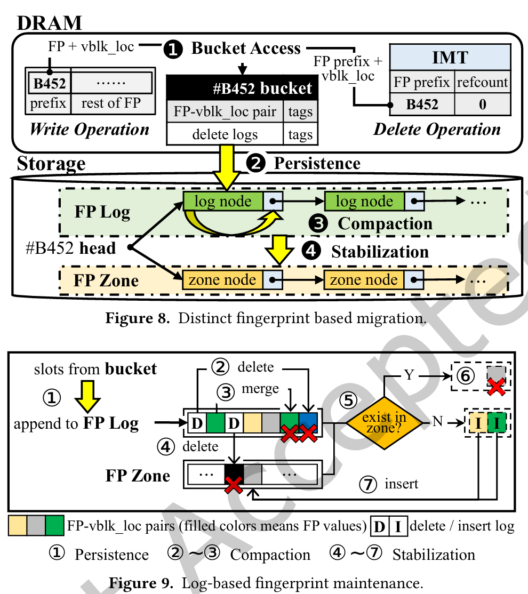

在一次离线去重轮次后，FP区维护存储中所有不同数据块的指纹信息。当一个新的写入到达并命中内存中的桶时，可以直接在内联路径中去重。但对于写入未命中或删除操作，它分别被记录为插入或删除日志。这些日志随后持久化到FP日志，最终重放到FP区。所有这些过程涉及四个步骤，如图8所示，并在图9中进一步详细说明。

步骤1：桶访问（❶）。对于写入操作，F2DFS使用其指纹前缀索引目标桶，然后在未命中桶后插入由指纹和虚拟块位置组成的新键值对，如5.2.2节中所述。

另一方面，对于删除操作，F2DFS首先确定其引用计数值是否降至0。如果是，F2DFS应删除内存和存储中的过时指纹信息。首先，在IMT的帮助下定位目标桶。然后，扫描桶中的所有槽以找出是否存在与删除操作中的虚拟块位置相同的匹配键值对。如果存在匹配且未持久化的对，F2DFS简单地将其删除并完成删除操作。否则，删除桶中的键值对（如果存在），并将删除日志添加到桶中以便将来在存储设备中删除。考虑到有限的内存，每个删除日志仅包含虚拟块位置及其过时的指纹前缀。F2DFS可以简单地使用桶ID（即指纹前缀）定位目标FP日志和FP区，并在虚拟块位置的帮助下识别并删除存储中的过时指纹信息。在我们的实现中，每个桶中的槽可以有一个指纹到虚拟块位置对或九个删除日志，并使用1位标签区分它们。

步骤2：从桶到FP日志的持久化（❷，①）。当一个桶满了或系统空闲时（由系统守护进程监控），F2DFS将脏的指纹到虚拟块位置对和删除日志驱逐到FP日志（①），其中驱逐的指纹到虚拟块位置对作为插入日志维护。每个FP日志组织为存储中的链表，每个新日志按顺序简单地附加到列表头部。之后，桶中删除日志的内存空间被回收，这些桶槽的标签被标记为已持久化。如果桶满了且这些对最近很少使用，F2DFS可以直接删除不常访问的持久化指纹到虚拟块位置对。

步骤3：FP日志内部的压缩（❸，②~③）。为了减少重放到FP区的日志数量，FP日志应适时压缩。首先，如图9所示，删除日志从当前位置扫描到列表尾部。如果检测到任何过时的指纹信息，则直接删除（②）。其次，合并剩余的插入日志，具体来说，如果它们共享相同的指纹值，则仅保留一个，其余的删除（③）。

步骤4：从FP日志到FP区的稳定化（❹，④~⑦）。在压缩之后，每个FP日志应进一步重放到相应的FP区，以建立所有不同数据块的新指纹存储。首先，删除日志被重放到FP区（④）。其次，插入日志被重放（⑤）。如果FP区中存在相同的指纹，则直接放弃插入日志（⑥）。否则，将其插入到FP区（⑦）。

为了确保数据一致性，在所有步骤中最高优先级都给予删除日志。具体来说，在步骤2中，删除日志首先从桶中驱逐，然后持久化指纹。在步骤3和步骤4中，删除日志优先于插入日志重放。考虑到步骤2~4期间的并发性，F2DFS将使用桶的mutex()同时锁定目标桶、FP日志和FP区，确保FP日志在三个步骤中是互斥的。此外，F2DFS可以优化为在一系列持久化之后执行一次压缩，或在一系列压缩之后执行一次稳定化，而不是频繁执行压缩和稳定化。

存储中的指纹存储组织。在F2DFS中，FP日志和FP区都组织为一系列链表，每个链表由多个节点块组成，这些节点块存储多个修改日志或指纹到虚拟块位置对，称为FP节点。FP节点信息在IMT中管理，方式与原生F2FS的普通节点相同。因此，F2DFS可以并行写入带有去重相关元数据（例如指纹信息）的节点块和去重数据块，从而提高整体I/O性能。

不同链表的头节点ID由指纹前缀预分配和确定（例如，在图8中，前缀#B452使用两个预分配的ID分别访问其FP日志和FP区）。如果一个头节点用完了其可用空间，则分配另一个新的FP节点，然后将头节点中存储的节点内容和旧的后继ID复制到新的FP节点。之后，头节点被清空以接收新的日志或指纹到虚拟块位置对，并且新的FP节点的节点ID也存储为新的后继。通过这种方式，可以基于给定的前缀和一系列后继ID定位目标FP日志或FP区的任何节点。当一个FP节点变为无效时，F2DFS只需调整链表中的后继ID，然后回收无效节点的ID空间（频繁访问的头节点除外）。此外，不同于仅在头节点附加以加快持久化的FP日志，FP区可以根据访问热度调整指纹的顺序，从而提高离线去重期间的效率和命中率。这也意味着F2DFS可以在突然断电或系统崩溃后支持冷启动，从而预热内存中的指纹信息。

### 5.3.2 File-level to-be-deduplicated Recording

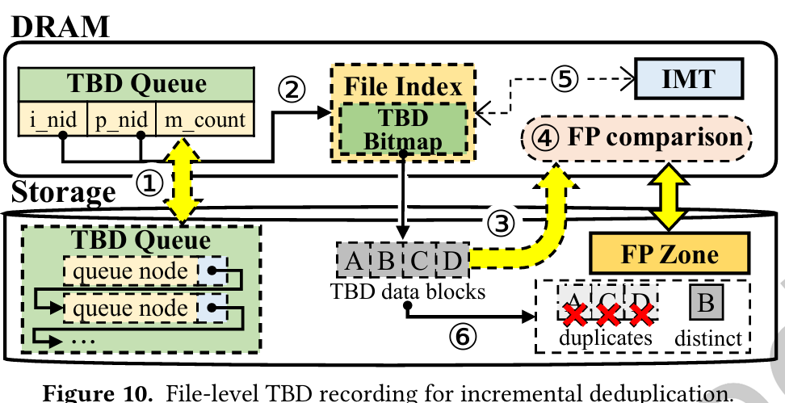

在离线去重之前，增量的待去重（TBD）数据信息已经准备好，并存储在两种结构中。第一种称为TBD位图，存储在每个父节点中，用于识别自上次离线去重轮次以来每个数据块是否已更改并成为TBD。第二种称为TBD队列，记录TBD数据的节点信息。如图10左侧所示，每个队列条目由inode ID（i_nid）、父节点ID（p_nid）和修改计数（m_count）组成，其中inode ID用于搜索给定文件的队列条目，父节点ID指向拥有TBD数据的父节点。修改计数是一个有符号整数，表示最近插入（+）或删除（-）的TBD数据块数量（即TBD位图中的最近更改）。F2DFS在内存中分配多个TBD队列，其并发机制类似于桶。当F2DFS用完内存中的TBD队列时，所有条目作为一系列队列节点刷新到存储中，索引和组织方式类似于FP节点。在离线去重开始时，F2DFS通过将具有相同inode ID和父节点ID的内存和存储队列条目合并在一起，并在相加结果为0时删除它们。

图10展示了F2DFS中对特定文件X的离线去重过程：① 通过文件X的inode ID加载TBD队列条目，并合并修改计数。② 读取文件inode和父节点。③ 根据TBD位图读取TBD数据块。④ 计算指纹并与FP区进行去重。在这里，最近访问的指纹被预热到FP区的头节点并加载到桶中。⑤ 更新相应IMT条目中的文件引用和引用计数。⑥ 释放重复的数据块，而保留不同的数据块，并将其指纹插入FP区。最后，F2DFS删除相应的队列条目并清除位图。简而言之，F2DFS使用TBD队列快速粗略地搜索给定文件的队列条目，并使用文件级TBD位图对TBD数据块进行细粒度去重。

遵循文件系统耦合设计，增量TBD信息可以与常规文件操作一起更新，以减少时间成本和管理开销。在空间开销方面，每个TBD队列条目配置为10字节，其中inode ID和父节点ID各占4字节，修改计数占2字节。由于每个父节点可以指向超过1000个数据块，每个TBD数据记录的平均空间为0.08比特。因此，一个256KB大小的内存TBD队列可以记录超过100GB的TBD数据。对于TBD位图，由于父节点中的每个块位置使用4字节索引最多16TB的数据卷，F2DFS仅占用最高有效位来指示相应的数据块是否为TBD。因此，TBD位图无需额外的空间开销。对于大于8TB的存储需求，F2DFS可以将TBD位图转换为节点级元数据，而不占用块位置的最高有效位，这需要128字节。在这种情况下，每个TBD数据块记录的平均空间为1.08比特。文件系统耦合设计还允许F2DFS仅通过inode ID访问文件内容，而不是文件的绝对路径，这也减少了内存和存储空间开销。此外，F2DFS通过文件预取提高去重效率，并保持与用户需求的交互，例如限制去重范围。

## 5.4 Other Features

### 5.4.1 Transparent Segment Cleaning

根据图7底部（5.2.1节），在F2DFS中，段清理操作只需要更新虚拟块位置和物理块位置之间的一对一映射，并且对所有文件逻辑引用的多对一映射是透明的。我们称这种清理操作为透明段清理。

在选择几个脏段作为受害者后，透明段清理准备就绪。F2DFS首先分配一个临时的全局清理文件，读取所有受害数据块并将它们索引到清理文件中。在累积足够或所有数据块后，F2DFS将它们批量写入新的干净段，然后更新IMT中维护的一对一映射。与常规文件不同，清理文件具有更高的I/O优先级，用于将数据块写入干净段回收。在我们的实现中，每次累积一个段大小（通常为2MB）的脏数据块时，清理文件会写入存储设备。因此，F2DFS可以提高存储空间和段管理的效率。

但作为代价，透明段清理也会引发潜在的数据不一致问题。例如，当一个受害数据块正在迁移时，其所有逻辑引用被删除（例如，通过文件逻辑删除或更新操作）。因此，清理后，数据块变成孤儿，即没有文件引用它，但它占用了一个物理块位置。为了解决这个问题，F2DFS简单地更改IMT中的引用计数字段。即，F2DFS在迁移前将迁移数据块的引用计数值增加1，迁移后将其减少1，这可以指示数据块是否被清理文件占用。因此，当迁移完成但数据块的引用计数值降至0时，F2DFS可以通过删除操作直接丢弃它。

### 5.4.2 Data Recovery and Adaptive Deduplication

为了避免突然断电或系统崩溃带来的负面影响，原生F2FS采用周期性检查点机制来保持稳定和一致的状态，以便文件系统在挂载后可以恢复到最新的检查点（即回滚恢复）[81, 104, 166]。之后，F2FS比较最新检查点后写入的每个节点的新内容（即一系列块位置），这些数据块由于系统调用如fsync()或flush()而写入，与最新检查点保护的该节点的旧内容进行比较。通过节点两个版本之间的差异，F2FS可以恢复那些同步的数据块，并重建文件inode和文件系统级元数据，如块分配位图（即前滚恢复）[54, 63, 65, 72]。

在F2DFS的情况下，在每个检查点期间，所有脏的IMT条目和TBD元数据都会刷新到存储中。为了减轻元数据持久化的性能开销，有两种解决方案：

首先，F2DFS基于实时I/O行为（如fsync()、flush()和direct_IO() [83]）采用自适应去重。对于这些行为，F2DFS暂时关闭内联去重，并在文件索引中维护文件逻辑引用和物理块位置之间的直接映射，与原生F2FS相同（见图7顶部，也遵循其清理）。F2DFS仅记录离线去重的TBD元数据，并在父节点中标记一个跳过标签。为了减轻空间开销，对于跳过的父节点，F2DFS将其TBD位图转换为PV位图，其中PV指示每个数据块位置是物理位置还是虚拟位置。此类节点中的所有数据块都被视为TBD数据，并在离线去重后将位图转换回TBD位图。在发生断电或系统崩溃时，F2DFS使用原生F2FS的回滚和前滚机制恢复同步数据，并使用节点两个版本之间的差异恢复TBD元数据。桶中的修改日志不需要在检查点期间刷新，因为F2DFS可以在断电后恢复它们或在离线去重期间重建它们。

其次，IMT和TBD元数据持久化的开销也与重复率和文件语义相关。即，重复率越低，持久化的元数据越多。因此，F2DFS监控内联去重实现的实时重复率（在一段时间内的重复数），如果该比率低于阈值，可以像自适应去重一样关闭内联去重。此外，还考虑了文件语义，例如频繁更新的目录或日志数据，数据足迹较低，或者预压缩和加密数据，重复率较低。

# 6 Evaluation

## 6.1 Configuration

* 实现。F2DFS中IMT条目的引用计数大小设置为3字节，允许每个数据块最多被引用224次。如果数据块超过此限制，F2DFS将分配一个新的IMT条目并更新其虚拟块位置到相应的KV对。在内联和离线路径中，F2DFS以4KB大小的块级粒度执行去重。为了管理内存中的桶，F2DFS利用14位长度的指纹前缀作为桶ID，并采用LRU算法驱逐不常访问的条目。对于每个满的桶，所有条目将被持久化，并且仅保留1/3最近使用的条目在桶中。F2DFS还在内存中管理16个并行的TBD队列。文件inode ID的4位长度后缀用作队列ID，因此不同文件可以并行访问不同的TBD队列。如果任何TBD队列达到其容量，所有条目将迁移到存储设备。

* 实验测试平台。我们在运行Ubuntu 20.04和Linux内核5.10的机器上进行了全面的实验。测试平台配备了一个10核Intel® Core™ i7-12700 CPU、32GB Kingston DDR4主内存和1TB Samsung 980 NVMe SSD。为了公平起见，所有评估的去重方案都采用SHA-256哈希函数生成指纹。我们的测试平台可以在峰值数据量为每秒2.1GB的情况下计算SHA-256哈希值[105]。

* 比较方案。我们将F2DFS与五种最先进的（SOTA）去重方案进行了比较：SmartDedup [158]、Dmdedup [131, 132]、ZFS [11, 12, 106]、XFS [52, 127, 147]和BtrFS [17, 118]。SmartDedup是一种为资源受限的存储设备设计的内联和离线混合去重方案。它还基于一段时间内的重复数采用自适应去重，以减少对存储设备的访问开销。Dmdedup是一种块层内联去重方案，使用写时复制btree存储去重索引。它还需要定期将元数据刷新到存储设备以确保崩溃一致性。ZFS是一种写时复制文件系统，将内联去重作为写事务的一部分执行。XFS和BtrFS分别是基于日志和写时复制的现代Linux文件系统。它们都可以运行“duperemove”[36]来支持增量离线去重。请注意，这五种SOTA方案仅涵盖表1中的类型A、C和D，因为类型B主要用于备份、加密或网络场景[99, 116, 177]。

* 综合实验。为了全面评估F2DFS的性能和开销，我们在不同的访问模式和适用场景下进行了系列实验。每个实验至少重复五次。

* 无重复的性能（6.2节）：我们使用FIO [5]生成不同的无重复I/O工作负载（即最坏情况），这可以帮助我们了解指纹计算、虚拟索引和自适应去重的影响。我们还比较了原生F2FS和F2DFS之间后台和前台段清理的效率。

* 内联去重的性能（6.3节）：我们比较了F2DFS与SmartDedup、Dmdedup和ZFS在写路径中的性能。我们首先测试了不同重复级别的基本内联去重。然后重放表2a中列出的真实世界移动和服务器I/O跟踪。我们还考虑了F2DFS的元数据开销和敏感性研究。

* 离线去重的性能（6.4节）：我们比较了F2DFS、SmartDedup、XFS和BtrFS之间的性能和开销。我们首先考虑了基本和增量离线去重场景。接下来，为了研究F2DFS的潜力，我们还使用表2b中列出的工作负载评估了真实世界场景中的离线去重。

## 6.2  Performance w/o Duplicates

### 6.2.1 FlexibleI/O(FIO)

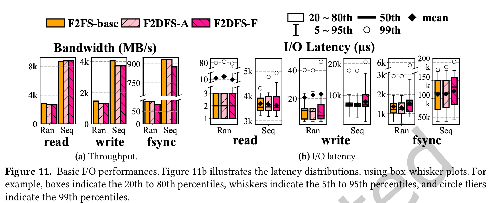

对于FIO测试的配置，iodepth设置为16，线程数设置为8。对于每个线程，总数据量大小设置为10GB。对于读取和写入，我们测试了4KB随机（Ran.）和4MB顺序（Seq.）模式。此外，在另一个同步写入测试中，每四次写入后调用fsync()。为了更好地理解F2DFS在有和没有自适应去重情况下的性能，我们考虑了两种类型的F2DFS：第一种是F2DFS-A，在遇到同步写入请求时自适应地关闭内联去重，另一种是F2DFS-F，强制执行内联去重。为了评估基本的I/O性能，所有合成文件都是在没有重复的情况下生成的。

图11a和11b展示了基线F2FS（F2FS-base）、F2DFS-A和F2DFS-F之间读取、写入和fsync()的带宽和I/O延迟的比较。F2DFS-A和F2DFS-F在正常读取和写入下表现出类似的I/O性能。对于读取，即使引入了虚拟索引的访问开销，F2DFS的性能结果仍然与F2FS-base相似。对于正常写入，由于并行哈希指纹计算，F2DFS将写入性能的负面影响限制在平均8.5%，这远低于其他最先进的方案（将在6.3节中讨论）。然而，在调用fsync()后，性能显著下降。在此阶段，F2DFS-A触发自适应去重以减轻去重引起的负面性能，99百分位尾延迟平均仅增加3.5%。然而，F2DFS-F经历了显著的性能下降，如更高的随机写入延迟和更低的顺序写入带宽。因此，可以得出结论，在同步写入路径中集成内联去重是不明智的，特别是在重复率低和可用CPU资源有限的情况下。

以F2FS为例，在调用fsync()期间，脏数据块、文件inode和父目录必须按顺序持久化，以保持文件系统级的一致性和原子性。这个过程既是强制的、即时的，也是串行的[53, 57, 81, 104]。其他基于日志和写时复制的文件系统也类似地处理[61, 64, 145]。

### 6.2.2 Segment Cleaning

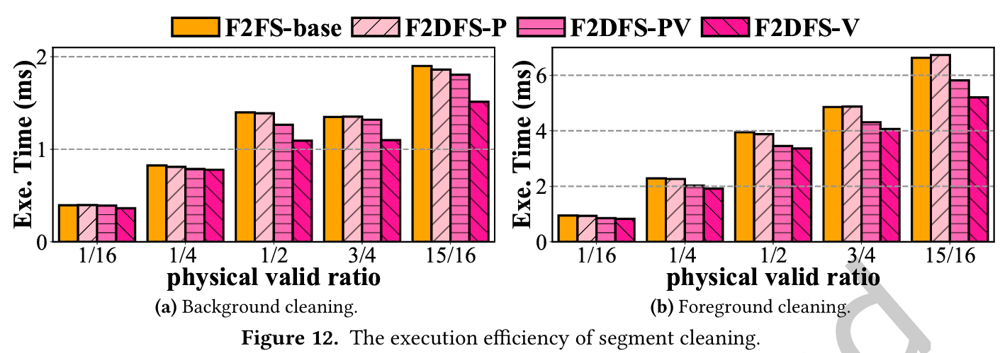

为了揭示虚拟索引对段清理效率的影响，我们预热了几个具有不同有效数据比率的数据段。如图12所示，我们记录了后台和前台段清理的执行时间。正如我们在5.4.2节中提到的，由于自适应去重，一个文件逻辑引用可能存储物理或虚拟块位置。因此，我们将F2DFS分为三类进行评估：仅存储物理块位置的F2DFS-P、仅存储虚拟块位置的F2DFS-V，以及两者各占一半的F2DFS-PV。首先，前台清理旨在更快地回收空间，并且在受害块迁移期间不会累积足够的脏数据块，导致其执行时间比后台清理更长。例如，在F2FS-base和F2DFS-PV中，前台段清理的执行时间分别是后台段清理的3.0倍和2.79倍。其次，F2DFS-P仅引起轻微的性能变化，因为它完全遵循F2FS-base的清理过程。第三，随着基于虚拟块位置的数据块数量的增加，在透明段清理下迁移的有效块更多。结果，F2DFS可以避免遍历和更新文件逻辑引用的额外时间成本，这包括文件inode和父节点块。与F2FS-base相比，F2DFS-PV将后台和前台清理的执行时间分别减少到平均94.9%和88.1%。而F2DFS-V甚至进一步将其减少到仅82.5%和82.3%。值得注意的是，F2DFS仍有很大的潜力，因为数据去重可以减少数据无效的概率和段清理的频率。

## 6.3 Performance w/ Inline Deduplication

在这里，我们将F2DFS与F2FS-base和三种最先进的内联去重方案进行了比较，分别是SmartDedup [158]、Dmdedup [131, 132] 和 ZFS [11, 12, 106]。为了公平比较，SmartDedup和Dmdedup都挂载了原生F2FS。对于Dmdedup，为了提高其I/O性能，元数据同步触发频率设置得非常低，大约每4GB随机写入一次。我们还增强了Dmdedup，使其可以在F2FS构建检查点时刷新元数据[87]。对于ZFS，我们将其块粒度与写入请求对齐，以便它可以识别和消除所有重复写入。此外，还考虑了不带去重的基线ZFS（即ZFS-base）。所有去重方案都在4KB大小的粒度上执行。

我们的实验涵盖了基本内联去重（6.3.1节）、真实世界场景中的内联去重（6.3.2节）、去重相关的元数据开销和敏感性研究（6.3.3节）。

### 6.3.1  BasicInlineDeduplication

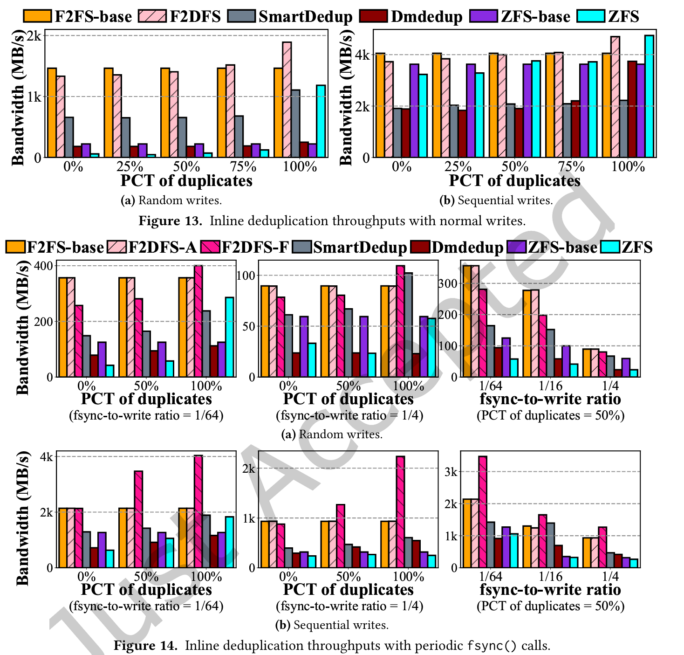

我们在FIO工作负载中改变了重复数据的百分比（PCTs）。在我们的实验中，F2DFS的桶大小设置为仅缓存单个线程写入量的一半，并且有8个线程同时运行。

正常写入。图13a和13b分别展示了随机和顺序写入的带宽性能。可以看出，由于指纹计算和索引管理开销，所有内联去重方案都表现出显著的性能下降。但随着重复数据百分比的增加和更多冗余写入被消除，它们的性能也不断提高。首先，F2DFS和Dmdedup分别在文件系统层和块层实现。因此，F2DFS的性能始终优于Dmdedup，随机写入性能平均高出7.6倍，顺序写入性能高出1.8倍。其次，F2DFS以并行方式缓解了CPU密集型和耗时的指纹计算开销，带来了2.0倍于SmartDedup的带宽。第三，F2DFS和ZFS相比各自的基线（即F2FS-base和ZFS-base）都表现出性能下降，但ZFS的下降更为明显。平均而言，F2DFS的随机和顺序写入性能分别是ZFS的5.0倍和1.1倍。

带有Fsync()的写入。我们随后进行了同步写入测试，考虑了不同级别的重复数据和fsync()调用频率。在这里，我们还考虑了带有和不带自适应去重的F2DFS（即F2DFS-A和F2DFS-F）。图14a和14b分别展示了随机和顺序写入的结果。首先，F2DFS-A的随机和顺序写入性能与F2FS-base相似。其次，由于同步写入对指纹计算引起的延迟敏感，F2DFS-F的随机写入性能远低于F2FS-base。但F2DFS-F的带宽性能仍然是SmartDedup、Dmdedup和ZFS的1.5倍、3.4倍和2.5倍。第三，在顺序写入方面，F2DFS-F表现出显著的性能提升，甚至是F2FS-base的1.5倍。这是因为并行哈希指纹计算的优势在顺序写入中更容易体现。此外，当fsync与写入的比例为1/64且重复率为50%时，F2DFS-F的带宽性能分别是SmartDedup、Dmdedup和ZFS的2.07倍、3.40倍和4.07倍。

### 6.3.2  Inline Deduplication in Real-world Scenarios

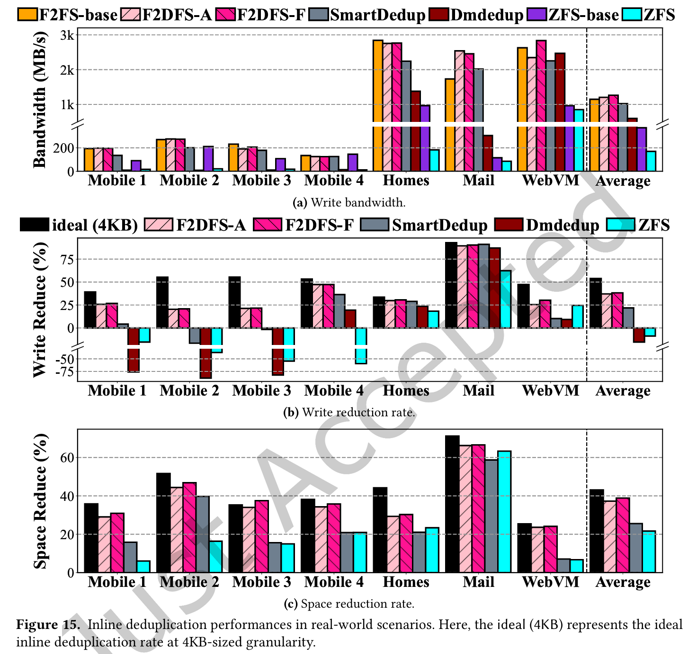

基本内联去重的结果启发我们探索在真实世界场景中内联去重的性能和优势。因此，我们进一步使用POSIX系统调用重放了表2a中列出的真实世界移动和服务器I/O跟踪。对于从块层收集的三个服务器跟踪（即Homes、Mail和WebVM），缺少文件路径和写入同步等信息，因此它们的数据内容在写入时未调用fsync()。我们将写入带宽性能和内联去重率作为指标，后者可以进一步分为闪存写入减少和存储空间节省。对于写入减少指标，我们使用“smartctl”[26]程序记录闪存基SSD设备经历的数据写入量，并将结果与基线（即F2FS-base和ZFS-base）进行比较。对于空间节省指标，我们使用Linux调用“df -Th”收集文件系统级存储空间减少率。对于Dmdedup，有大量未被垃圾回收的未引用数据块，因此我们忽略了其存储空间节省。请注意，减少闪存写入比节省空间更重要，因为它直接延长了闪存寿命并增强了设备耐久性[76, 77, 141]。

带宽性能。如图15a所示，F2DFS-A和F2DFS-F的带宽性能均优于其他内联去重方案。首先，移动设备通常经历许多小尺寸和同步写入请求，因此它们的带宽性能结果远低于服务器跟踪。其次，与F2FS-base相比，F2DFS-A和F2DFS-F分别平均提高了4.9%和10.3%。在Mail工作负载中，F2DFS-A和F2DFS-F的带宽性能最多可提高46.6%和41.8%。第三，与SmartDedup和Dmdedup相比，F2DFS-F分别最多可超过23.7%和111.0%。尽管ZFS也与文件系统耦合，但其频繁的磁盘访问和写时复制特性导致其性能比ZFS-base下降了54.3%[106]。总体而言，F2DFS-F的带宽性能最高。与F2DFS-F相比，SmartDedup、Dmdedup和ZFS分别低19.2%、52.6%和86.6%，而F2DFS-A仅低4.8%。

闪存写入减少。图15b显示了不同去重方案的实际闪存写入减少与“理想”内联去重率（即表2a中的“Dedupe Benefit - write”列）之间的差距。首先，对于具有高频同步写入的移动跟踪，去重相关的元数据更可能提交到闪存设备。这甚至引入了更多的闪存写入，导致写入减少率为负值。例如，对于Mobile 2工作负载，理想值为55.3%，但SmartDedup、Dmdedup和ZFS分别比其基线多16.6%、88.3%和37.4%的写入（即三个负值）。然而，F2DFS可以通过文件系统耦合设计缓解这个问题。具体来说，F2DFS继承了原生F2FS的非递归索引更新设计，可以减少去重相关元数据和文件索引的更新开销。因此，F2DFS-A和F2DFS-F在Mobile 2中仍然可以分别减少20.4%和20.8%的闪存写入。其次，当重放三个服务器工作负载时，F2DFS仍然可以实现高写入减少率。例如，对于Mail工作负载，F2DFS-A和F2DFS-F可以分别消除89.5%和90.3%的总闪存写入。总体而言，与F2DFS-F相比，SmartDedup、Dmdedup、ZFS和F2DFS-A的平均闪存写入减少率分别低16.4%、53.6%、47.0%和0.9%。

存储空间节省。图15c显示了实际空间减少率与“理想”去重率的差异，该理想值是通过“DEDISgen”[111, 112]程序分析工作负载得到的。对于具有许多小文件的移动跟踪，ZFS需要更多的空间开销来存储去重相关的元数据和文件索引，导致其空间减少率与理想值之间的差距较大。原生F2FS特别适合以小文件为主的场景，如以4KB块粒度管理文件索引和数据内容。因此，在文件系统耦合设计的帮助下，F2DFS-A和F2DFS-F都可以实现高空间减少率。例如，平均而言，F2DFS-F减少了38.8%的存储空间，仅比理想值低4.2%。此外，F2DFS-F最多可以超过SmartDedup和ZFS 13.3%和17.2%，而F2DFS-A仅比F2DFS-F低1.6%。

### 6.3.3  Overhead Analysis

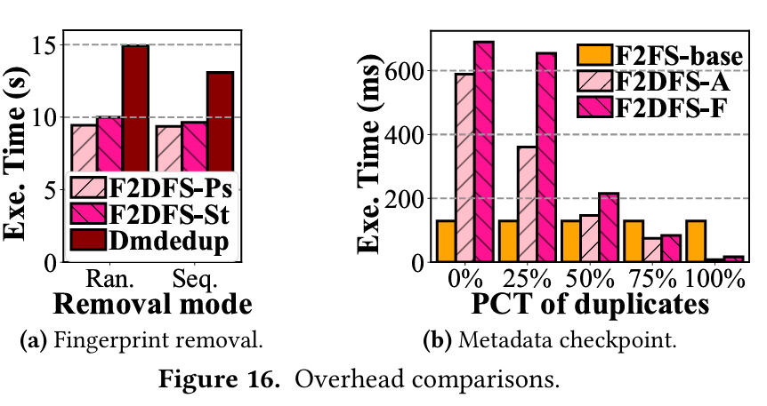

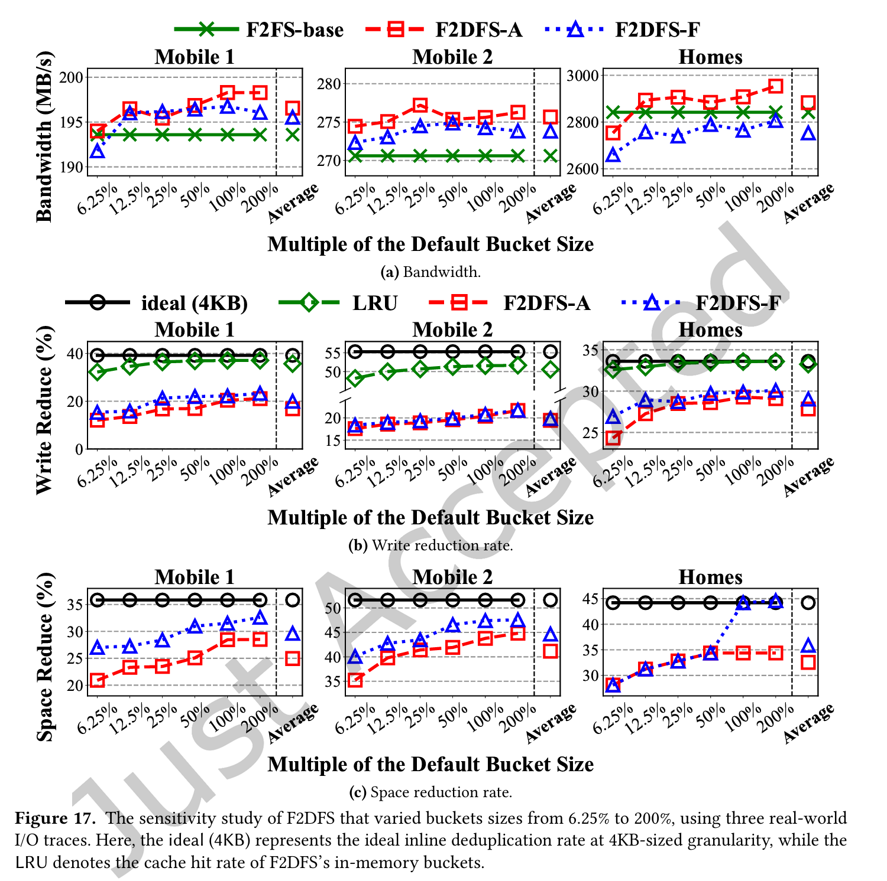

然后，我们测量了F2DFS的时间和空间开销，并进行了不同桶大小的敏感性研究。

指纹移除的时间开销。我们首先比较了F2DFS、SmartDedup、Dmdedup和ZFS的去重索引结构。如表1所示，Dmdedup、ZFS和SmartDedup分别采用类型A、C和D。因此，SmartDedup和ZFS可以直接在文件删除路径中移除过时的指纹。然而，Dmdedup需要执行额外的垃圾回收以回收未引用数据块的存储空间，然后才能移除指纹。我们测量了F2DFS和Dmdedup随机或顺序移除400万个指纹的执行时间。这里，F2DFS分为两种类型：带持久化的F2DFS（F2DFS-Ps）和带稳定化的F2DFS（F2DFS-St）。图16a显示，与Dmdedup相比，F2DFS-Ps在随机和顺序移除中分别仅需37%和28%的时间，而F2DFS-St仅需稍多一些时间。

元数据的时间开销。关于F2DFS数据结构的时间开销，我们关注元数据检查点，这涉及定期将脏的IMT条目和TBD元数据刷新到存储设备。图16b显示了刷新20GB大小工作负载的元数据结果。由于TBD元数据设计轻量，所需时间很少。然而，对于继承自原生F2FS的NAT的IMT，需要更长的检查点周期。在没有重复数据的最坏情况下，F2DFS-A和F2DFS-F分别需要4.6倍和5.3倍于F2FS-base的时间。然而，随着重复数据水平的增加，F2DFS不仅减少了分配的IMT条目数量，还降低了检查点的频率，即使脏条目比F2FS-base更多。例如，在75%的重复数据情况下，F2DFS-A和F2DFS-F仍然可以分别比F2FS-base减少58%和62%的时间。为了解决这个问题，F2DFS-A可以配置为考虑一段时间内的重复数据数量。

存储空间开销。在存储空间开销方面，F2DFS只需考虑IMT和FP区，因为临时指纹日志和TBD队列在稳定化和离线去重后可以完全释放。F2DFS为每个数据块分配一个9字节的IMT条目，因此IMT仅占总数据的0.2%。此外，现有工作通常将所有指纹信息存储在存储设备中，而F2DFS仅为每个数据块存储一个指纹到块位置的对，没有其他字段。因此，FP区仅占总数据的0.9%。请注意，我们使用基于SHA-256的指纹只是为了公平的实验比较。

敏感性研究和内存空间开销。真实世界重复数据的局部性通常取决于工作负载。正如我们在第3节中讨论的，重复写入可能在写请求的长间隔中发生。以82天长度的Mobile 2工作负载为例，重复写入平均每256,000个请求发生一次，而最坏情况下甚至需要40.5百万个请求的间隔。因此，不可能在内存中记录所有指纹。与一些现有工作类似，F2DFS利用内存和存储中的指纹存储来减轻内存空间开销，并采用自适应去重以更好地平衡带宽性能、去重率和内存空间开销。因此，我们进行了一个敏感性实验，改变了F2DFS内存中指纹的数量。具体来说，每个FP桶的大小设置为默认值的6.25%到200%，其中默认配置仅需要130MB内存空间。这里选择了三个真实世界的I/O跟踪，即Mobile 1、Mobile 2和Homes，其特征列在表2a中。

图17a显示了F2FS-base、F2DFS-A和F2DFS-F的带宽性能。F2DFS-A分别比F2FS-base和F2DFS-F高出1.6%和2.0%。即使桶大小较小，F2DFS也不会出现显著的性能下降。例如，对于Mobile 1和Homes工作负载，即使只有默认桶大小的6.25%，F2DFS-F也仅比F2FS-base减少0.9%和6.4%。这是因为当桶满时，F2DFS会批量驱逐多个不常访问的桶槽，并并行执行不同桶的驱逐。但正如我们在第6.3.2节中提到的，现有内联去重方案的带宽性能下降更为明显。

如图17b和17c所示，我们还比较了理想、F2DFS-A和F2DFS-F的去重率。此外，基于简单“LRU”替换算法的桶缓存命中率也在图17b中进行了比较。随着桶大小的增加，更多的指纹可以存储在内存中，F2DFS可以消除更多的冗余写入并节省更多的存储空间。例如，当桶大小从6.25%增加到200%时，F2DFS-F可以分别为三个工作负载实现7.9%、3.3%和3.2%更高的写入减少率。然而，尽管缓存命中率（即LRU值）在所有工作负载中接近理想值，去重相关元数据引起的写放大仍然导致较低的写入减少率。这意味着即使采用一些重复感知的缓存替换算法[77, 129]，实际的写入减少率仍然会受到限制。然而，正如我们在第6.3.2节中提到的，在文件系统耦合设计的帮助下，F2DFS通常比最先进的内联去重方案具有更高的去重收益。另一方面，空间节省率受影响较小，因为元数据占用的存储空间比例较小。平均而言，F2DFS-A和F2DFS-F分别消除了21.4%和23.0%的闪存写入，并节省了32.9%和36.7%的存储空间。

总之，F2DFS-A和F2DFS-F各有其独特的优势。F2DFS-A专注于稳定的写入性能和较低的检查点开销，而F2DFS-F可以消除更多的重复数据。选择它们取决于用户的具体需求。

## 6.4 Performance w/ Ofline Deduplication

[52, 127, 147] 和 BtrFS [17, 118] 之间的执行效率、资源开销和去重率。此外，所有评估的方案都支持增量离线去重。根据第2.4节中的离线去重类型，SmartDedup采用类型index_entry，而XFS和BtrFS采用类型modify_time。具体来说，SmartDedup利用一个“跳过缓冲区”记录未去重数据块的文件逻辑引用信息（包括inode ID和文件内偏移），以便这些块可以在离线路径中定位和访问。XFS和BtrFS采用duperemove [36] 程序实现文件级增量去重。duperemove维护两个基于SQLite3的数据库表，分别称为“file_table”和“hash_table”，前者记录已去重文件的元数据（例如文件inode ID、文件名和最后修改时间），后者记录这些文件的指纹信息。因此，如果给定上次离线去重轮次的这两个表，XFS和BtrFS可以直接跳过已去重且未更改的文件，从而提高执行效率。请注意，其他类型的离线去重（即类型naïve_scan、adjacent和global）通常需要特定的物理设备或适用场景。为了公平比较，F2DFS和SmartDedup都没有提前触发内联去重。

我们的实验涵盖了基本离线去重（6.4.1节）、增量离线去重（6.4.2节）和真实世界场景中的离线去重（6.4.3节）。

### 6.4.1  Basic Offline Deduplication

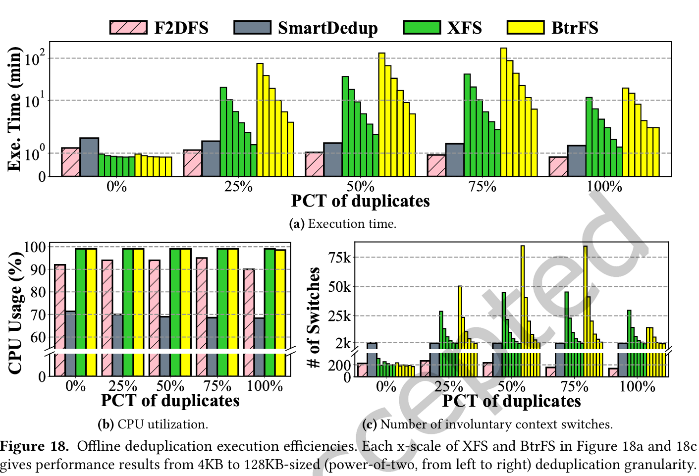

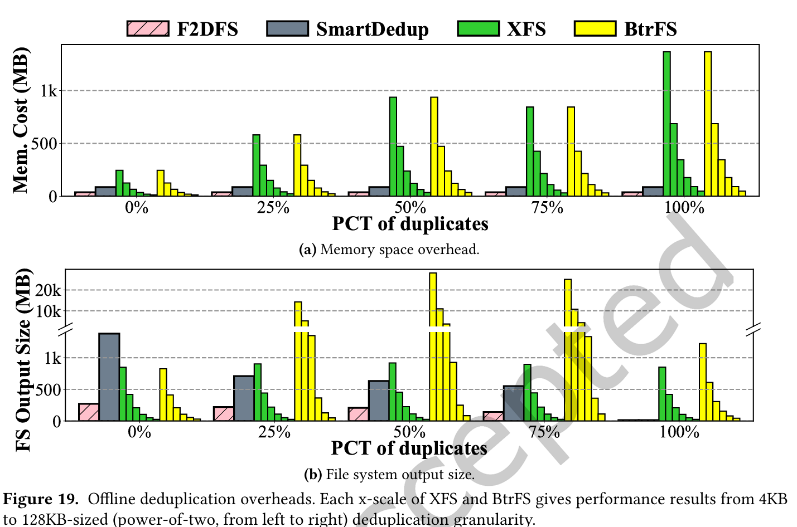

为了评估基本离线去重，我们总结了执行时间、CPU利用率、上下文切换次数、内存空间开销（即去重相关元数据的最大驻留集大小）和文件系统输出大小（表示离线去重引起的闪存写入）。我们使用Linux系统调用“/usr/bin/time -v”来收集这些性能结果。我们的实验工作负载大小设置为20GB，具有不同级别的重复数据。这里，F2DFS和SmartDedup始终执行4KB大小的细粒度去重，而XFS和BtrFS在4KB和128KB之间进行评估，以了解去重粒度的影响。

执行时间。图18a展示了所有评估方案的执行效率。首先，由于文件系统耦合设计，F2DFS在大多数情况下比SmartDedup、XFS和BtrFS具有更高的执行效率。例如，F2DFS受益于文件预读机制。F2DFS的平均执行时间仅为SmartDedup、XFS和BtrFS的70.3%、13.3%和3.8%。其次，F2DFS和SmartDedup将去重粒度与原生F2FS的I/O粒度（即4KB）对齐，有效减少了文件系统级开销。然而，当块粒度变细时，XFS和BtrFS的执行时间会更长。例如，当去重粒度从4KB增加到128KB时（即每个x轴上的结果从左到右），XFS和BtrFS的执行效率分别提高到4.9倍和9.3倍。这是因为它们需要额外的数据分块步骤，而BtrFS由于其写时复制特性成本更高。第三，当重复数据百分比从0%增加到100%时，F2DFS和SmartDedup分别减少了32.0%和19.5%的时间，而XFS和BtrFS则需要更多时间来更新文件索引。例如，在执行4KB时，XFS和BtrFS处理75%重复数据的工作负载所需的时间分别是处理0%重复数据的43.9倍和182.0倍。

CPU利用率。如图18b所示，无论粒度大小和重复数据百分比如何，XFS和BtrFS在去重过程中几乎占用了所有的CPU资源。然而，F2DFS仍有进一步改进的潜力，因为它没有完全占用所有的CPU资源。需要注意的是，尽管SmartDedup需要较少的CPU资源，但其执行效率仍低于F2DFS。主要原因是F2DFS可以将文件级位图与原生F2FS的预读机制结合，有效减少由于存储设备访问延迟而导致的空闲CPU周期。然而，SmartDedup中跳过缓冲区的结构设计导致了许多随机存储设备访问和大量的空闲CPU周期。

上下文切换次数。较长的执行时间会导致更多的上下文切换，我们主要关注非自愿切换，因为它们比自愿切换成本更高。由于文件系统耦合设计，F2DFS可以有效避免频繁的用户空间和内核空间之间的切换。如图18c所示，F2DFS的上下文切换次数远低于其他方案。具体来说，F2DFS的上下文切换次数平均比SmartDedup、XFS和BtrFS分别少86.1%、97.9%和98.7%。当去重粒度固定为4KB时，XFS和BtrFS的上下文切换次数甚至比F2DFS多145.9倍和230.3倍。

内存空间开销。我们进一步比较了元数据内存空间开销，并总结了图19a中的结果。首先，F2DFS和SmartDedup仅缓存四分之一的指纹在内存中，因此它们的开销不大。此外，XFS和BtrFS显示了类似的结果，因为它们都采用了duperemove。然而，它们的内存开销仍然很高，甚至是4KB粒度下F2DFS的9.8倍到54.6倍。其次，F2DFS和SmartDedup之间也存在显著的内存空间开销差距，因为它们使用不同的数据结构存储增量TBD元数据。具体来说，F2DFS仅需要每个数据块平均0.08位的文件级TBD位图，而SmartDedup需要每个块8字节（即4字节长度的inode ID和4字节长度的文件内偏移）。结果，SmartDedup的内存空间开销平均是F2DFS的2.3倍。

文件系统输出大小。如图19b所示，离线去重还会将大量更新的文件索引和去重相关元数据持久化到文件系统中，导致额外的闪存写入。首先，当去重粒度为4KB且重复率为0%时，SmartDedup、XFS和BtrFS的文件系统输出大小分别是F2DFS的5.1倍、3.1倍和3.0倍。其次，随着重复数据百分比从0%增加到100%，F2DFS和SmartDedup引入的元数据显著减少，因此它们的文件系统写入分别减少了94.1%和98.8%。第三，我们还发现由于写时复制特性，BtrFS通常会生成大量的文件系统写入，这类似于其写放大问题[16, 86]。最坏情况下，当4KB粒度下去重50%的重复数据时，BtrFS在去重后节省了约10GB的存储空间，但却导致了高达27.5GB的文件系统写入。

###  6.4.2 Incremental Ofline Deduplication

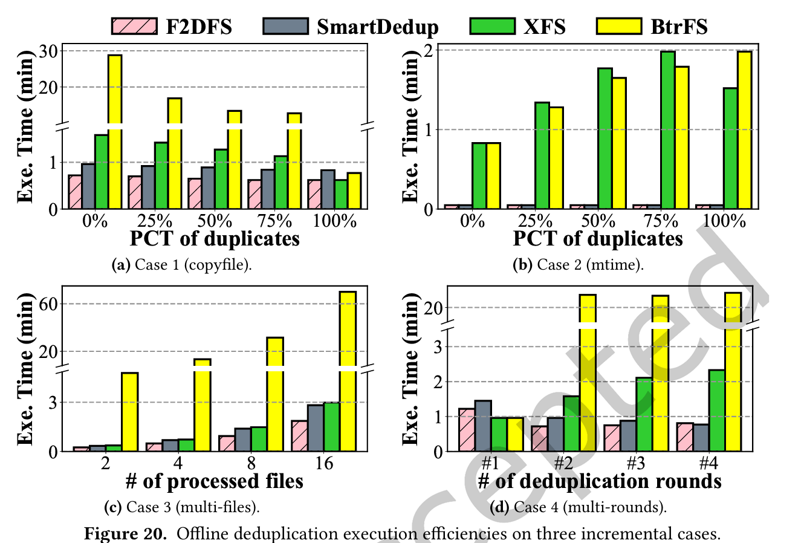

然后，我们进行了几项实验，以执行时间作为性能指标评估增量离线去重的执行效率。我们设计了以下四个增量实验案例。

案例1（复制文件）：在去重工作负载后，我们直接复制它（通过direct_IO()绕过页面缓存）并对这个新数据副本执行增量去重。

案例2（修改时间）：我们通过Linux调用“touch -c”更新去重工作负载的修改时间。也就是说，文件元数据已更改，但其数据内容没有更改。这有时会发生在缓存系统中，其中一些应用程序仅更改文件的修改时间以提高访问频率。

案例3（多文件）：我们在单次去重中处理多个相同的文件，以显示多文件索引更新的效率。这也可以反映不同评估方案中的元数据并发性，因为多个文件可能访问共享的元数据区域（例如引用计数和指纹）。

案例4（多轮次）：最后，我们评估了在不同去重轮次中具有相同数据内容的工作负载的效率，这类似于处理周期性增量和备份的某些场景。这里，案例1和案例2在不同的重复数据百分比下进行评估，而案例3和案例4分别在不同的处理文件数量和去重轮次下进行评估。案例1、案例2和案例4的工作负载大小均为10GB，案例3中的每个文件大小设置为2GB。这里，XFS和BtrFS在128KB大小的粒度下执行去重以提高效率。

案例1（复制文件）。图20a显示了在新相同数据副本上执行去重时的执行时间。根据表1中的去重索引结构类型，XFS和BtrFS采用类型A，并且都受到过时指纹移除的困扰。具体来说，由于与主机端文件系统未耦合，duperemove程序不清楚已去重的数据块在文件系统中是否仍然有效。例如，即使数据块与现有指纹匹配，仍然需要验证共享数据块是否已被删除。因此，XFS和BtrFS花费大量时间读取共享数据块并计算其指纹进行验证。因此，当重复率为0%时，XFS和BtrFS的执行时间分别是F2DFS的2.2倍和40.0倍。SmartDedup、XFS和BtrFS的平均时间分别比F2DFS长1.3倍、1.8倍和22.0倍。

案例2（修改时间）。如图20b所示，F2DFS和SmartDedup都只需几毫秒，而XFS和BtrFS平均需要1.5分钟。这是因为在更新工作负载的修改时间后，XFS和BtrFS需要在新的去重轮次中重新遍历所有文件索引，即使它们之前已经去重过。这将导致显著的读取放大问题。然而，F2DFS和SmartDedup根据新更改的数据内容而不是文件的修改时间执行增量去重。并且F2DFS可以使用比SmartDedup更少的内存空间来实现这一点。总之，F2DFS和SmartDedup支持块级增量离线去重，而XFS和BtrFS支持文件级去重。

案例3（多文件）。当多个文件同时更新其文件索引以引用共享数据块时，F2DFS可以避免不必要的程序级开销，例如数据一致性、并发性和上下文切换。然而，SmartDedup、XFS和BtrFS引入了大量此类开销。从图20c可以看出，当同时处理16个文件时，F2DFS比SmartDedup、XFS和BtrFS分别节省了34.0%、37.6%和97.3%的时间。

案例4（多轮次）。如图20d所示，增量去重的执行效率可以在多轮次离线去重中更直观地展示，其中每轮次处理的数据内容相同。在第一轮中，XFS和BtrFS可以避免高文件索引更新开销，因此所需时间少于F2DFS。然而，在随后的轮次中，XFS和BtrFS平均比F2DFS多花费2.5倍和38.8倍的时间。SmartDedup的执行时间也比F2DFS长16%。这表明，即使在相邻备份版本之间有大量相似内容的备份场景中，F2DFS也能实现高效的离线去重。

###  6.4.3 Ofline Deduplication in Real-world Scenarios

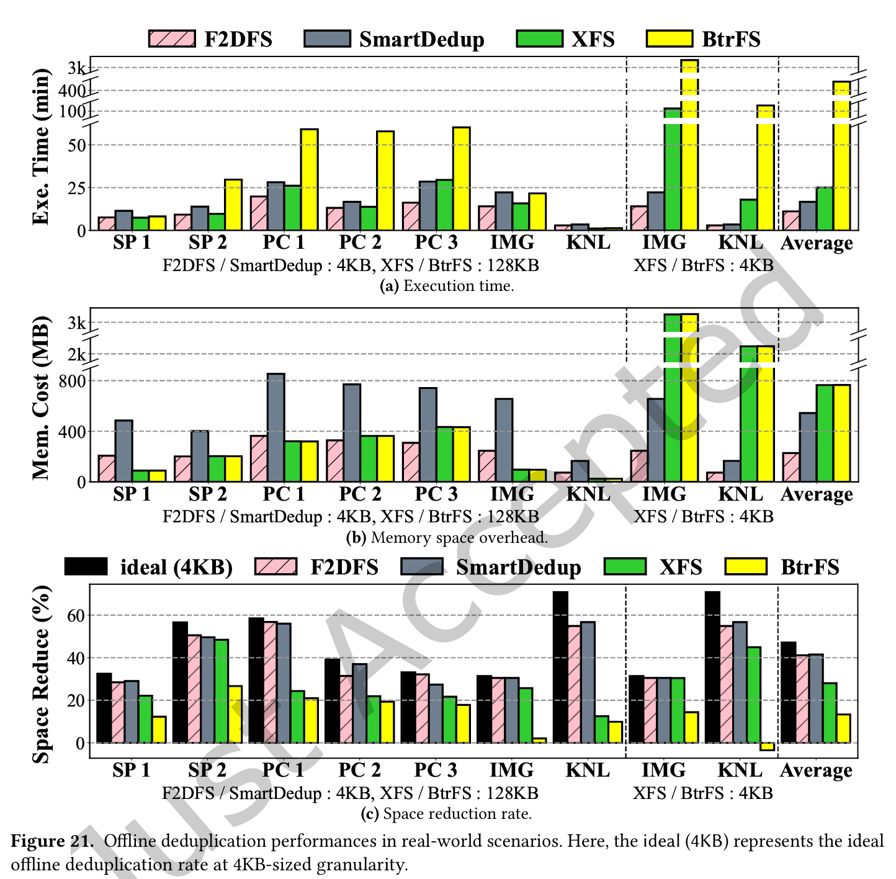

除了使用合成工作负载外，我们还使用表2b中列出的各种真实世界工作负载评估了离线去重的性能和开销。我们的实验完全继承了工作负载的原始信息，如数据内容、文件类型、目录深度和文件路径。对于XFS和BtrFS，工作负载在128KB大小的粒度下进行去重（例如，Images-128KB和Kernel-128KB），并且只有两个与图像和内核相关的工作负载在4KB下进一步去重（即，Images-4KB和Kernel-4KB）。因为我们发现，当以4KB处理这两个工作负载时，XFS和BtrFS引入了显著的高内存空间开销和低执行效率。请注意，F2DFS和SmartDedup始终在4KB大小的粒度下执行去重。我们的性能指标包括执行时间、内存空间开销和离线去重率（即存储空间节省）。

执行时间。如图21a所示，F2DFS在几乎所有实验中显示出最高的执行效率。唯一的例外是Kernel-128KB，其中XFS和BtrFS所需时间少于F2DFS。这是因为Linux内核源代码中的文件大小通常小于128KB，粗粒度去重会带来更高的执行效率，而忽略了这些小文件。然而，正如我们在第6.4.1节中讨论的，当执行文件级去重时，XFS和BtrFS会经历显著的性能下降。例如，对于Images和Kernel工作负载，当去重粒度从128KB细化到4KB时，XFS的执行时间分别增加到6.6倍和15.4倍，而BtrFS的执行时间甚至增加到166.4倍和82.8倍。然而，F2DFS和SmartDedup可以将去重粒度与原生F2FS的I/O粒度（即4KB）对齐，有效缓解去重引起的额外开销。值得注意的是，由于文件系统级预读机制，F2DFS的执行效率始终高于SmartDedup。结果，SmartDedup、XFS和BtrFS的平均时间分别是F2DFS的1.5倍、2.3倍和39.4倍。

内存空间开销。图21b展示了去重相关元数据的内存空间开销，包括内存中的指纹和增量元数据。首先，SmartDedup通常占用大量内存空间，主要记录未去重数据块的增量元数据（即TBD元数据），其大小甚至直接与工作负载大小相关。然而，F2DFS通过文件级位图有效缓解了这个问题，从而将内存开销减少到SmartDedup的41.8%。其次，XFS和BtrFS的内存空间开销主要取决于指纹的数量。粗粒度去重产生的指纹比细粒度去重少，因此在所有128KB大小的实验中，XFS和BtrFS的成本低于F2DFS。然而，对于Images和Kernel工作负载，XFS在4KB大小的粒度下分别需要86.8倍和32.8倍的内存空间，而在128KB大小的粒度下则需要更少的内存空间。BtrFS显示了类似的结果，因为XFS和BtrFS都采用了duperemove。平均而言，F2DFS的内存开销仅为XFS和BtrFS的27.7%。

存储空间节省。图21c显示了实际离线去重率与“理想”去重率之间的性能差距。首先，由于文件索引和去重相关元数据的存储空间开销，所有评估方案的实际去重率始终低于理想去重率。然而，F2DFS可以通过文件系统耦合设计缩小这一差距。与理想值相比，F2DFS、SmartDedup、XFS和BtrFS的平均去重率分别低6.0%、5.7%、19.1%和33.8%。其次，细粒度去重通常实现更高的实际去重率。以Kernel-128KB为例，XFS和BtrFS的空间减少率分别为12.5%和4.9%，而F2DFS的空间减少率为54.9%。第三，由于原生F2FS、XFS和BtrFS中文件索引结构的不同组织类型，文件索引的存储空间开销也会影响实际去重率。例如，对于Kernel工作负载，BtrFS在4KB大小的粒度下比在128KB大小的粒度下施加了更多的存储开销。它甚至在图中导致了负值。然而，F2DFS继承了原生F2FS的基于节点的文件索引结构，从而提高了空间效率。例如，对于以大文件为主的PC 1~3和Images工作负载，F2DFS的空间减少率仅比理想值低3.5%和0.9%。总体而言，F2DFS可以比XFS和BtrFS多节省13.1%和27.8%的存储空间，仅比SmartDedup少0.3%。

##  6.5 Summary

F2DFS 是一种基于内联和离线混合去重的日志结构文件系统，使用F2FS作为基线文件系统。与现有在F2FS之上或之下实现去重的工作不同[158, 160, 176]，F2DFS 完全遵循文件系统耦合设计原则。我们进行了全面的实验测试，并将F2DFS与现有的最先进去重方案进行了比较。以下是一些在真实世界场景中的性能和开销示例。

内联去重。与其他内联去重方案相比，F2DFS 具有更高的带宽性能和更高的去重率（6.3.2节）。为了提高I/O性能，F2DFS 在文件系统层实现去重，并利用并行哈希指纹计算加速指纹计算。结果表明，F2DFS 的带宽性能比SmartDedup、Dmdedup 和 ZFS 分别高19.2%、52.6% 和 86.6%。此外，F2DFS 继承了原生F2FS 对小文件友好的特性，从而缓解了元数据引起的写放大问题。例如，F2DFS 的闪存写入量比SmartDedup、Dmdedup 和 ZFS 分别少16.4%、53.6% 和 47.0%。我们还对F2DFS 进行了敏感性研究，结果表明，即使在内存空间有限的情况下，F2DFS 仍能实现高带宽性能和高去重率（6.3.3节）。

离线去重。与其他离线去重方案相比，F2DFS 具有更高的执行效率、更低的内存空间开销和更高的去重率（6.4.3节）。例如，F2DFS 的效率分别是SmartDedup、XFS 和 BtrFS 的1.5倍、2.3倍和29.4倍。此外，F2DFS 以文件级位图的方式记录增量待去重元数据，从而将内存开销减少到SmartDedup 的41.8%。F2DFS 的去重率也比XFS 和 BtrFS 分别高13.1% 和 27.8%。此外，F2DFS 在CPU 利用率、上下文切换次数和文件系统输出大小（即去重引起的写入）方面也取得了良好的结果（6.3.1节）。F2DFS 还以块级粒度执行增量去重，这与其他方案采用的文件级粒度不同（6.4.2节）。

其他指标。F2DFS 在其他指标上也提供了显著的性能优势。例如，为了移除过时的指纹，F2DFS 的执行时间比Dmdedup 低37%（6.3.3节）。在虚拟索引的帮助下，与原生F2FS 相比，F2DFS 分别将后台和前台段清理的效率提高了17.5% 和 17.7%（6.2.2节）。

已知问题。现有的去重解决方案通常导致低性能或高开销。例如，由于在块层实现去重，Dmdedup 无法完全感知文件语义，导致空间回收延迟[132, 144] 和去重率的固定上限[87, 158]。基于写时复制数据结构的去重系统，如Dmdedup、ZFS 和 BtrFS，通常也会导致显著的写放大问题[16, 74, 86, 124]，这会引入更多的闪存写入，降低I/O 带宽性能和实现的去重率。此外，在增量离线去重方面，SmartDedup 和 XFS 分别存在高内存空间开销和读取放大问题。F2DFS 有效地解决了内联和离线路径中的上述问题。然而，F2DFS 仍有很大的优化空间。例如，自适应去重可以根据工作负载特征进行优化，如基于不同的应用程序和文件类型，或基于历史去重率的学习结果。对于检查点元数据开销，F2DFS 也可以通过同步虚拟索引相关的元数据信息（如文件系统级日志）进行改进。在我们当前的实现中，4KB 大小的粒度足以实现高去重率。但F2DFS 在去重粒度方面值得进一步讨论，如粗粒度高效去重或更细粒度的增量压缩[108, 153, 170, 178]。此外，我们在实验中使用SHA-256 只是为了确保公平。但F2DFS 可以通过采用空间开销较小的哈希函数（例如，MD5 和 SHA-1），或使用采样哈希和轻量级预哈希（例如，murmur3、xxhash，甚至ECC）来预哈希数据块并过滤掉不匹配的块，从而进一步改进[21, 30, 158]。

# 7 Related Work

## 7.1 Data Deduplication

许多研究已经证明了去重在减少数据占用、更高的空间效率、更高的I/O带宽和更好的设备耐久性方面的有效性和益处[94, 148, 177]。例如，CAFTL [21]在闪存转换层（FTL）实现去重，延长了闪存寿命并增强了设备耐久性。Nitro [76]通过将压缩数据的大小与闪存擦除粒度对齐，减少了基于闪存的SSD中的垃圾回收引起的开销。Dmdedup [131, 132]在块层操作，使用设备映射将文件系统和应用程序与块设备分离。SES-Dedup [155]和ESD [30]用硬件中嵌入的纠错码（ECC）替代加密哈希函数，以实现高效的哈希指纹计算。ARM-Dedup [144]进一步支持跨多个SSD的高效重复数据识别。CacheDedup [77]设计了重复感知的缓存替换算法，以减少混合缓存存储系统中的I/O未命中率。AustereCache [141]和Libra [167]分别缓解了混合缓存存储系统中的内存和缓存空间放大问题。MFDedup [179]利用管理友好的数据布局，在备份系统中实现了高I/O性能和高去重率。MeGA [178]支持字节级去重（即增量压缩），同时也实现了接近块级去重的备份和恢复速度。dbDedup [153]是一个基于相似性的数据库去重管理引擎，结合了部分索引、增量压缩、编码和缓存机制。此外，许多现有工作倾向于将去重集成到重复数据比例高的工作场景中，如备份、镜像、克隆、快照和子卷[23, 39, 60, 67, 111, 126, 159]。

## 7.2  Deduplication-based File System

去重可以在文件系统层执行，以在I/O性能、去重率、资源开销和用户交互性之间取得良好平衡。基于去重的文件系统可以进一步分为内核空间和用户空间（即FUSE）两种。

基于内核空间的去重文件系统。
ZFS [11, 12, 106] 是一种事务性写时复制文件系统，支持快照、子卷、独立磁盘冗余阵列（RAID）和称为“zpool”的存储池。ZFS可以将内联去重与这些特性集成。例如，为快照节省更多存储空间，通过RAID实现更高的带宽并将数据放入分布式位置，通过多个子卷共享指纹和数据副本，提高高引用数据副本的数据可靠性。然而，在启用内联去重后，ZFS经历了I/O带宽性能下降（6.3.1节）。由于元数据同步，ZFS还导致大量闪存设备写入，其大小甚至可能超过内联去重消除的冗余数据量（6.4.3节）。

XFS [52, 127, 147] 和 BtrFS [17, 118] 分别是基于日志和写时复制的现代Linux文件系统。它们都将文件内容存储为数据区间，并可以采用“duperemove”执行离线去重。duperemove可以将大尺寸的区间拆分为多个小尺寸的区间以实现高去重率。然而，细粒度去重通常导致低执行效率，而粗粒度去重导致低去重率（6.4.3节）。此外，细粒度去重还意味着更高的内存空间开销和更多的元数据引起的文件系统级写入（6.4.1节）。此外，尽管duperemove可以支持高效的增量去重，但它目前仅在文件级记录未去重数据的元数据，而不是块级，这导致读取放大问题（6.4.2节）。

BetrFS [164] 是一种全路径索引和写优化的文件系统，具有高效的克隆性能（例如，Linux调用“cp–reflink”）。inBtrFS [85] 可以使用“btrfs-progs”程序通过ioctl()在BtrFS中实现内联去重，但它仅支持特定内核。ZFS和BtrFS通常采用时间侧信道，可以揭示数据块是否已去重，而DUPEFS [6] 表明这种侧信道构成了意外的安全威胁。一些工作还将去重集成到传统的内核空间文件系统中，如DEXT3 [97]、VxFS [139] 和 LiveDFS [100]。为了节省存储空间，一些文件系统支持无复制快照和文件克隆，如WAFL [60]、SIS [10]、GCTree [29]、Versionfs [98] 和 Exo-clones [125]。请注意，F2DFS也是在内核空间实现的，基于F2FS的源代码。

基于用户空间的去重文件系统。也有一些基于去重的FUSEs。SmartDedup [158] 在资源受限的设备上利用内联和离线去重，这些设备配备了有限的容量、内存和功耗[22]。TDDFS [19] 是一种面向混合缓存存储系统的分层感知去重文件系统。TDDFS管理快速和慢速存储层，并实现两层之间的高效文件迁移。Minervafs [102] 是第一个用于广义去重的FUSE，类似于增量压缩，但避免了跨文件的一些依赖性。Minervafs在一些真实世界场景中（如卫星图像和虚拟机图像）实现了接近Gzip的压缩率。DedupFS [103] 采用基于SQLite3的指纹数据库。DEDE [25] 和 SDFS（又名OpenDedup）[14] 分别针对虚拟机和云存储场景。

基于去重的FUSEs应挂载在传统的内核空间文件系统之上（例如，EXT4、BtrFS和F2FS）。通常，它们仅维护去重相关的元数据，如引用计数和指纹，而文件索引的一致性应通过底层的内核空间文件系统维护。其优点是这些系统可以挂载到不同类型的文件系统。例如，SmartDedup可以适应EXT4的日志机制和F2FS的检查点机制。但这也意味着任何基于去重的FUSE可能固有地受到底层内核空间文件系统的限制，导致额外的资源开销或显著的性能下降。例如，根据我们的实验结果，SmartDedup在以同步写入为主的场景中引入了较差的I/O性能（6.3.1节）。SmartDedup还需要高内存空间开销来记录未去重数据块的元数据（6.4.1节）。Minervafs在写入密集型场景中的吞吐量也低于其基线文件系统。此外，一些基于去重的FUSEs，如DEDE和SDFS，仅设计用于特定工作负载，如备份或虚拟机图像。

## 7.3  Log-Structured File System

这些年来，日志结构文件系统（例如，F2FS [54, 63, 72]、NILFS2 [66] 和 NOVA [152]）受到了广泛关注，因为它们可以将上层应用程序的随机写入转换为文件系统层的顺序写入（即仅追加日志），从而带来更高的随机I/O性能。这种写入特性也适用于几乎任何类型的存储设备，例如基于闪存的SSD [59, 72, 96, 115]、硬盘驱动器（HDD）[66, 120, 121]、叠瓦式磁记录HDD（SMR HDD）[1, 174]、分区命名空间SSD（ZNS SSD）[9, 49, 133] 和非易失性存储器（NVM）[31, 152, 173]。因此，日志结构文件系统可以应用于不同的场景，如智能手机、个人电脑、物联网和快速缓存服务器。其中，F2FS是目前最广泛使用[57, 62, 79] 和研究[9, 65, 104, 154, 166, 174] 的闪存日志结构文件系统。

基于日志结构文件系统的去重
现有工作主要在日志结构文件系统之上或之下执行去重。例如，SmartDedup [158] 在用户空间集成了内联和离线去重，位于F2FS之上。NV-Dedup [140]、Light-Dedup [114] 和 DeNOVA [69] 是为基于NVM的日志结构文件系统设计的。Light-Dedup 被提出为一个轻量级去重框架，考虑了NVM的I/O机制和去重引起的I/O放大。DeNOVA 通过在离线路径中执行去重来确保NVM的超低延迟性能。iDedup [126] 是一个专为延迟敏感的主存储工作负载设计的内联去重系统。它还利用日志结构文件系统来缓解去重引起的碎片化，并减少元数据相关I/O引起的访问延迟。另一方面，一些工作倾向于在日志结构文件系统之下执行去重，例如在块层或设备端。例如，lwDedup [160] 在FTL层进行去重，并表明去重可以减少F2FS段清理的执行时间。Remap-SSD [176] 进一步通过FTL的地址重映射实现了这一想法。Remap-SSD 有效地消除了段清理期间的数据迁移（即数据复制）中的重复写入，从而提高了清理效率。此外，一些备份和归档文件系统利用日志结构设计和去重来提高I/O效率和节省存储空间，如DDFS [177]、Destor [39]、RevDedup [78] 和 ANViL [143]。然而，很难将它们归类为传统的日志结构文件系统。

F2FS 耦合设计
请注意，尽管上述一些工作将F2FS与去重集成，但它们并未与文件系统耦合（例如，SmartDedup 和 Remap-SSD）。据我们所知，F2DFS 是第一个在F2FS上实现文件系统耦合设计的去重文件系统。该设计原则不仅确保了高可移植性和低存储堆栈开销的优势，还简化了主机端文件系统的设计、开发和维护。换句话说，在执行去重时，F2DFS 不需要任何额外的应用程序（例如，用户空间模块）或特定的物理设备（例如，嵌入特定FTL层）。此外，尽管一些日志结构文件系统也在文件系统层使用去重（例如，Light-Dedup 和 DeNOVA），但它们是为NVM设备设计的，仅支持内联或离线去重。F2DFS 主要针对基于闪存的SSD，并支持内联和离线混合去重。

同样，现有的工作也提出了几种F2FS耦合设计，以优化原生F2FS或实现不同的功能。nCache [73] 是一个基于F2FS的文件系统元数据缓存框架，增强了文件系统级的并发性。Max [81] 是一种改进的元数据锁管理机制，大大提高了日志结构文件系统的并发性。Max原型基于F2FS的源代码开发。exF2FS [104] 是最新的事务性日志结构文件系统，支持多文件事务和内存窃取机制。exF2FS还支持在有限内存空间下跨多个文件的事务，例如基于SQLite的数据库更新、LSM-tree压缩和软件安装。FPC [58] 在F2FS上执行前台和后台压缩，以适应不同的文件访问方法。FPC在写入性能、功耗和存储空间节省方面取得了良好的性能结果，并有效缓解了解压缩期间的读取放大问题。iTRIM [80] 将trim()命令分配到系统空闲时间，以减少F2FS段清理和前台I/O之间的资源争用。此外，一些工作[156, 157, 163] 倾向于优化F2FS的段清理策略。

# 8 Conclusion

我们介绍了F2DFS，一种基于去重的F2FS，提出了三个关键设计：文件系统耦合设计限制了去重引起的负面影响，并充分利用了去重和原生F2FS的优势。内联和离线混合去重自适应地平衡了内联和离线去重，并利用增量去重实现了低时间和空间开销。虚拟索引解耦了去重引起的多对一映射关系，实现了高效的段清理。与最先进的去重方案相比，F2DFS在性能和开销方面表现更佳。

# REFERENCES

 [1] Manzanares Adam, Watkins Noah, Guyot Cyril, L Damien, Maltzahn Carlos, and Bandic Zvonimr. 2016. ZEA: A Data Management
 Approach for SMR. In Proceedings of the USENIX Workshop on Hot Topics in Storage and File Systems (HotStorage).
 [2] Mohammadamin Ajdari, Pyeongsu Park, Joonsung Kim, Dongup Kwon, and Jangwoo Kim. 2019. CIDR: A Cost-Efective In-line Data
 Reduction System for Terabit-per-Second scale SSD Arrays. In Proceedings of the IEEE International Symposium on High Performance
 Computer Architecture (HPCA).
 [3] Mohammadamin Ajdari, Pyeongsu Park, Dongup Kwon, Joonsung Kim, and Jangwoo Kim. 2017. A Scalable HW-based Inline
 Deduplication for SSD Arrays. IEEE Computer Architecture Letters 17, 1 (2017).
 [4] Carlos Alvarez. 2011. NetApp Deduplication for FAS and V-Series Deployment and Implementation Guide. Technical Report (2011).
 [5] Jens Axboe. 2023. FIO: Flexible I/O Tester Synthetic Benchmark. https://git.kernel.dk/cgit/io.
 [6] Andrei Bacs, Saidgani Musaev, Kaveh Razavi, Cristiano Giufrida, and Herbert Bos. 2022. DUPEFS: Leaking Data Over the Network
 With Filesystem Deduplication Side Channels. In Proceedings of the USENIX Conference on File and Storage Technologies (FAST).
 [7] Ashish Bijlani and Umakishore Ramachandran. 2019. Extension Framework for File Systems in User space. In Proceedings of the USENIX
 Annual Technical Conference (ATC).
 [8] Artem B Bityuckiy. 2005. JFFS3 Design Issues. Memory Technology Device (MTD) Subsystem for Linux (2005).
 [9] Matias Bjùrling, Abutalib Aghayev, Hans Holmberg, Aravind Ramesh, Damien Le Moal, Gregory R Ganger, and George Amvrosiadis.
 2021. ZNS: Avoiding the Block Interface Tax for Flash-based SSDs. In Proceedings of the USENIX Annual Technical Conference (ATC).
 [10] William J Bolosky, Scott Corbin, David Goebel, and John R Douceur. 2000. Single instance storage in Windows 2000. In Proceedings of
 the USENIX Windows Systems Symposium.
 [11] Jef Bonwick, Matt Ahrens, Val Henson, Mark Maybee, and Mark Shellenbaum. 2003. The Zettabyte File System. Atlas of Zeolite
 Framework Types (2003).
 [12] Jef Bonwick and Bill Moore. 2007. ZFS: The Last Word in File Systems. https://www.snia.org/sites/default/orig/sdc_archives/2008_
 presentations/monday/JefBonwick-BillMoore_ZFS.pdf.
 [13] Fabiano C. Botelho, Philip Shilane, Nitin Garg, and Windsor Hsu. 2013. Memory Eicient Sanitization of a Deduplicated Storage
 System. In Proceedings of the USENIX Conference on File and Storage Technologies (FAST).
 [14] Jeramiah Bowling. 2013. Opendedup: Open-Source Deduplication Put to the Test. Linux Journal 2013, 228 (2013).
 [15] Jody Bruchon. 2023. Jdupes: A Powerful Duplicate File Finder and An Enhanced Fork of Fdupes. https://github.com/jbruchon/jdupes.
 [16] BtrFS. 2023. Deduplication Metadata Write Ampliication Problem in BtrFS. https://btrfs.readthedocs.io/en/latest/Hardware.html.
 [17] BtrFS. 2023. The Documentation of BtrFS. https://btrfs.readthedocs.io/en/latest.
 [18] Zhichao Cao, Shiyong Liu, Fenggang Wu, Guohua Wang, Bingzhe Li, and David HC Du. 2019. Sliding Look-Back Window Assisted
 Data Chunk Rewriting for Improving Deduplication Restore Performance. In Proceedings of the USENIX Conference on File and Storage
 Technologies (FAST).
 [19] Zhichao Cao, Hao Wen, Xiongzi Ge, Jingwei Ma, Jim Diehl, and David HC Du. 2019. TDDFS: A Tier-Aware Data Deduplication-based
 File System. ACM Transactions on Storage (TOS) 15, 1 (2019).
 [20] João Carlos Menezes Carreira, Rodrigo Rodrigues, George Candea, and Rupak Majumdar. 2012. Scalable Testing of File System Checkers.
 In Proceedings of the ACM European Conference on Computer Systems (EuroSys).
 [21] Feng Chen, Tian Luo, and Xiaodong Zhang. 2011. CAFTL: A Content-Aware Flash Translation Layer Enhancing the Lifespan of Flash
 Memory based Solid State Drives. In Proceedings of the USENIX Conference on File and Storage Technologies (FAST).
 [22] Ying Chen, Zili Shao, Qingfeng Zhuge, Chun Xue, Bin Xiao, and EH-M Sha. 2005. Minimizing Energy via Loop Scheduling and DVS
 for Multi-Core Embedded Systems. In Proceedings of the IEEE International Conference on Parallel and Distributed Systems (ICPADS).
 [23] Zhuan Chen and Kai Shen. 2016. OrderMergeDedup: Eicient, Failure-Consistent Deduplication on Flash. In Proceedings of the USENIX
 Conference on File and Storage Technologies (FAST).
 [24] Vijay Chidambaram, Tushar Sharma, Andrea C Arpaci-Dusseau, and Remzi H Arpaci-Dusseau. 2012. Consistency Without Ordering.
 In Proceedings of the USENIX Conference on File and Storage Technologies (FAST).
 [25] Austin T. Clements, Irfan Ahmad, Murali Vilayannur, and Jinyuan Li. 2009. Decentralized Deduplication in SAN Cluster File Systems.
 In Proceedings of the USENIX Annual Technical Conference (ATC).
 [26] Control and Monitor Utility for SMART Disks. 2023. smartctl: Control and Monitor Utility for the Self-Monitoring, Analysis and
 Reporting Technology (S.M.A.R.T.) Disks. https://www.smartmontools.org.
 [27] Intel Corporation. 2023. Intel(R) Intelligent Storage Acceleration Library Crypto Version. https://github.com/intel/isa-l_crypto.
 [28] Quynh H. Dang. 2015. Secure Hash Algorithm. (2015).
 [29] Chris Dragga and Douglas J Santry. 2016. GCTrees: Garbage Collecting Snapshots. ACM Transactions on Storage (TOS) 12, 1 (2016),
 1ś32.
 [30] Chunfeng Du, Suzhen Wu, Jiapeng Wu, Bo Mao, and Shengzhe Wang. 2023. ESD: An ECC-assisted and Selective Deduplication for
 Encrypted Non-Volatile Main Memory. In Proceedings of the IEEE International Symposium on High Performance Computer Architecture
 (HPCA).
 [31] Subramanya R Dulloor, Sanjay Kumar, Anil Keshavamurthy, Philip Lantz, Dheeraj Reddy, Rajesh Sankaran, and Jef Jackson. 2014.
 System Software for Persistent Memory. In Proceedings of the ACM European Conference on Computer Systems (EuroSys).
 [32] Ahmed El-Shimi, Ran Kalach, Ankit Kumar, Adi Ottean, Jin Li, and Sudipta Sengupta. 2012. Primary Data Deduplication-Large Scale
 Study and System Design. In Proceedings of the USENIX Annual Technical Conference (ATC).
 [33] Marc Eshel, Roger L Haskin, Dean Hildebrand, Manoj Naik, Frank B Schmuck, and Renu Tewari. 2010. Panache: A Parallel File System
 Cache for Global File Access. In Proceedings of the USENIX Conference on File and Storage Technologies (FAST).
 [34] EXT4, BtrFS, and XFS. 2013. Defragmentation Mechanism of Modern File Systems. https://manpages.ubuntu.com/manpages/trusty/
 man8/e4defrag.8.html , https://btrfs.readthedocs.io/en/latest/Defragmentation.html , https://www.kernel.org/pub/linux/utils/fs/xfs/
 docs/xfs_ilesystem_structure.pdf.
 [35] Heitor Faria, J Luiz Bordim, and P Solis Barreto. 2017. Backup Storage Block Level Deduplication with DDUMBFS and BACULA.
 International Journal of Advanced Information Technology (IJAIT 07) 7, 4 (2017).
 [36] Mark Fasheh. 2023. duperemove: Tools for Finding Duplicated Extents and Submitting them for Deduplication. http://markfasheh.
 github.io/duperemove.
 [37] Min Fu, Dan Feng, Yu Hua, Xubin He, Zuoning Chen, Jingning Liu, Wen Xia, Fangting Huang, and Qing Liu. 2015. Reducing
 Fragmentation for In-line Deduplication Backup Storage via Exploiting Backup History and Cache Knowledge. IEEE Transactions on
 Parallel and Distributed Systems (TPDS) 27, 3 (2015).
 [38] Min Fu, Dan Feng, Yu Hua, Xubin He, Zuoning Chen, Wen Xia, Fangting Huang, and Qing Liu. 2014. Accelerating Restore and Garbage
 Collection in Deduplication-based Backup Systems via Exploiting Historical Information. In Proceedings of the USENIX Annual Technical
 Conference (ATC).
 [39] Min Fu, Dan Feng, Yu Hua, Xubin He, Zuoning Chen, Wen Xia, Yucheng Zhang, and Yujuan Tan. 2015. Design Tradeofs for Data
 Deduplication Performance in Backup Workloads. In Proceedings of the USENIX Conference on File and Storage Technologies (FAST).
 [40] Min Fu, Shujie Han, Patrick PC Lee, Dan Feng, Zuoning Chen, and Yu Xiao. 2018. A Simulation Analysis of Redundancy and Reliability
 in Primary Storage Deduplication. IEEE Transactions on Computers (TC) 67, 9 (2018).
 [41] Min Fu, Patrick PC Lee, Dan Feng, Zuoning Chen, and Yu Xiao. 2016. A Simulation Analysis of Reliability in Primary Storage
 Deduplication. In Proceedings of the IEEE International Symposium on Workload Characterization (IISWC).
 [42] Yinjin Fu, Hong Jiang, Nong Xiao, Lei Tian, Fang Liu, and Lei Xu. 2013. Application-Aware Local-Global Source Deduplication for
 Cloud Backup Services of Personal Storage. IEEE Transactions on Parallel and Distributed Systems (TPDS) 25, 5 (2013).
 [43] Om Rameshwar Gatla, Mai Zheng, Muhammad Hameed, Viacheslav Dubeyko, Adam Manzanares, Filip Blagojevic, Cyril Guyot, and
 Robert Mateescu. 2018. Towards Robust File System Checkers. ACM Transactions on Storage (TOS) 14, 4 (2018).
 [44] Fanglu Guo and Petros Efstathopoulos. 2011. Building a High-Performance Deduplication System. In Proceedings of the USENIX Annual
 Technical Conference (ATC).
 [45] Peizhen Guo and Wenjun Hu. 2018. Potluck: Cross-Application Approximate Deduplication for Computation-Intensive Mobile
 Applications. In Proceedings of the ACM International Conference on Architectural Support for Programming Languages and Operating
 Systems (ASPLOS).
 [46] Aayush Gupta, Raghav Pisolkar, Bhuvan Urgaonkar, and Anand Sivasubramaniam. 2011. Leveraging Value Locality in Optimizing
 NANDFlash-based SSDs. In Proceedings of the USENIX Conference on File and Storage Technologies (FAST).
 [47] Aayush Gupta, Raghav Pisolkar, Bhuvan Urgaonkar, and Anand Sivasubramaniam. 2011. Leveraging Value Locality in Optimizing
 NANDFlash-based SSDs. In Proceedings of the USENIX Conference on File and Storage Technologies (FAST).
 [48] Sangwook Shane Hahn, Sungjin Lee, Cheng Ji, Li-Pin Chang, Inhyuk Yee, Liang Shi, Chun Jason Xue, and Jihong Kim. 2017. Improving
 File System Performance of Mobile Storage Systems using a Decoupled Defragmenter. In Proceedings of the USENIX Annual Technical
 Conference (ATC).
 [49] Kyuhwa Han, Hyunho Gwak, Dongkun Shin, and Jooyoung Hwang. 2021. ZNS+: Advanced zoned namespace interface for supporting
 in-storage zone compaction. In Proceedings of the USENIX Symposium on Operating Systems Design and Implementation (OSDI).
 [50] Kyuhwa Han, Hyukjoong Kim, and Dongkun Shin. 2019. WAL-SSD: Address Remapping-based Write-Ahead-Logging Solid-State
 Disks. IEEE Transactions on Computers (TC) 69, 2 (2019).
 [51] Tyler Harter, Chris Dragga, Michael Vaughn, Andrea C. Arpaci-Dusseau, and Remzi H. Arpaci-Dusseau. 2012. A File is Not a File:
 Understanding the I/O Behavior of Apple Desktop Applications. ACM Transactions on Computer Systems (TOCS) 30, 3 (2012).
 [52] Christoph Hellwig. 2009. XFS: The Big Storage File System for Linux. USENIX & SAGE Login Magazine 34 34, 5 (2009).
 [53] Yige Hu, Zhiting Zhu, Ian Neal, Youngjin Kwon, Tianyu Cheng, Vijay Chidambaram, and Emmett Witchel. 2019. TxFS: Leveraging
 File-System Crash Consistency to Provide ACID Transactions. ACM Transactions on Storage (TOS) 15, 2 (2019).
 [54] Joo-Young Hwang and Ltd. Samsung Electronics Co. 2013. Flash-Friendly File System (F2FS). In Embedded Linux Conference (ELC).
 [55] William Jannen, Jun Yuan, Yang Zhan, Amogh Akshintala, John Esmet, Yizheng Jiao, Ankur Mittal, Prashant Pandey, Phaneendra
 Reddy, Leif Walsh, et al. 2015. BetrFS: A Right-Optimized Write-Optimized File System. In Proceedings of the USENIX Conference on File
 and Storage Technologies (FAST).
 [56] Daeho Jeong, Youngjae Lee, and Jin-Soo Kim. 2015. Boosting Quasi-Asynchronous I/O for Better Responsiveness in Mobile Devices. In
 Proceedings of the USENIX Conference on File and Storage Technologies (FAST).
 [57] Sooman Jeong, Kisung Lee, Seongjin Lee, Seoungbum Son, and Youjip Won. 2013. I/O Stack Optimization for Smartphones. In
 Proceedings of the USENIX Annual Technical Conference (ATC).
 [58] Cheng Ji, Li-Pin Chang, Riwei Pan, Chao Wu, Congming Gao, Liang Shi, Tei-Wei Kuo, and Chun Jason Xue. 2021. Pattern-Guided File
 Compression with User-Experience Enhancement for Log-Structured File System on Mobile Devices. In Proceedings of the USENIX
 Conference on File and Storage Technologies (FAST).
 [59] William K Josephson, Lars A Bongo, Kai Li, and David Flynn. 2010. DFS: A File System for Virtualized Flash Storage. ACM Transactions
 on Storage (TOS) 6, 3 (2010), 1ś25.
 [60] Ram Kesavan, Matthew Curtis-Maury, Vinay Devadas, and Kesari Mishra. 2019. Storage Gardening: Using a Virtualization Layer for
 Eicient Defragmentation in the WAFL File System. In Proceedings of the USENIX Conference on File and Storage Technologies (FAST).
 [61] DohyunKim,KwangwonMin,JoontaekOh,andYoujipWon.2022. ScaleXFS: Getting Scalability of XFS Back on the Ring. In Proceedings
 of the USENIX Annual Technical Conference (ATC).
 [62] Jaegeuk Kim. 2017. Crosshatch: Switch Userdata Filesystem From EXT4 to F2FS. https://android.googlesource.com/device/google/
 crosshatch/+/a0d74ba2c0b943c6370288b13ade0cf6c4868da2.
 [63] Jaegeuk Kim. 2023. The Documentation of F2FS. https://jaegeuk.github.io.
 [64] Jongseok Kim, Cassiano Campes, Joo-Young Hwang, Jinkyu Jeong, and Euiseong Seo. 2021. Z-Journal: Scalable Per-Core Journaling. In
 Proceedings of the USENIX Annual Technical Conference (ATC).
 [65] Juwon Kim, Minsu Kim, Muhammad Danish Tehseen, Joontaek Oh, and YouJip Won. 2022. IPLFS: Log-Structured File System without
 Garbage Collection. In Proceedings of the USENIX Annual Technical Conference (ATC).
 [66] Ryusuke Konishi, Yoshiji Amagai, Koji Sato, Hisashi Hifumi, Seiji Kihara, and Satoshi Moriai. 2006. The Linux Implementation of a
 Log-Structured File System. ACM Special Interest Group on Operating Systems (SIGOPS) Operating Systems Review 40, 3 (2006).
 [67] Iwona Kotlarska, Andrzej Jackowski, Krzysztof Lichota, Michal Welnicki, Cezary Dubnicki, and Konrad Iwanicki. 2023. InftyDedup:
 Scalable and Cost-Efective Cloud Tiering with Deduplication. In Proceedings of the USENIX Conference on File and Storage Technologies
 (FAST).
 [68] Kai Krakow, Timofey Titovets, and Jiahao Xu. 2023. Best-Efort Extent-Same (BEES). https://github.com/Zygo/bees.
 [69] Hyungjoon Kwon, Yonghyeon Cho, Awais Khan, Yeohyeon Park, and Youngjae Kim. 2022. DENOVA: Deduplication Extended NOVA
 File System. In Proceedings of the IEEE International Parallel and Distributed Processing Symposium (IPDPS).
 [70] VISA Laboratory. 2022. Smartphone File System I/O Traces from Research Laboratory for Virtualized Infrastructures, Systems and
 Applications. http://visa.lab.asu.edu/web/resources/traces.
 [71] Lakshmipathi. 2023. Dduper: Fast Block-Level Out-of-Band BtrFS Deduplication Tool. https://github.com/lakshmipathi/dduper.
 [72] Changman Lee, Dongho Sim, Jooyoung Hwang, and Sangyeun Cho. 2015. F2FS: A New File System for Flash Storage. In Proceedings of
 the USENIX Conference on File and Storage Technologies (FAST).
 [73] Chang-Gyu Lee, Sunghyun Noh, Hyeongu Kang, Soon Hwang, and Youngjae Kim. 2021. Concurrent File Metadata Structure Using
 Readers-Writer Lock. In Proceedings of the Annual ACM/SIGAPP Symposium on Applied Computing (SAC).
 [74] Eunji Lee, Julie Kim, Hyokyung Bahn, Sunjin Lee, and Sam H Noh. 2017. Reducing Write Ampliication of Flash Storage through
 Cooperative Data Management with NVM. ACM Transactions on Storage (TOS) 13, 2 (2017), 1ś13.
 [75] James Lembke, Pierre-Louis Roman, and Patrick Eugster. 2022. DEFUSE: An Interface for Fast and Correct User Space File System
 Access. ACM Transactions on Storage (TOS) 18, 3 (2022).
 [76] Cheng Li, Philip Shilane, Fred Douglis, Hyong Shim, Stephen Smaldone, and Grant Wallace. 2014. Nitro: A Capacity-Optimized SSD
 Cache for Primary Storage. In Proceedings of the USENIX Annual Technical Conference (ATC).
 [77] Wenji Li, Gregory Jean-Baptise, Juan Riveros, Giri Narasimhan, Tony Zhang, and Ming Zhao. 2016. CacheDedup: In-line Deduplication
 for Flash Caching. In Proceedings of the USENIX Conference on File and Storage Technologies (FAST).
 [78] Yan-Kit Li, Min Xu, Chun-Ho Ng, and Patrick PC Lee. 2014. Eicient Hybrid Inline and Out-of-line Deduplication for Backup Storage.
 ACMTransactions on Storage (TOS) 11, 1 (2014).
 [79] Yu Liang, Chenchen Fu, Yajuan Du, Aosong Deng, Mengying Zhao, Liang Shi, and Chun Jason Xue. 2017. An Empirical Study of F2FS
 on Mobile Devices. In Proceedings of the IEEE International Conference on Embedded and Real-Time Computing Systems and Applications
 (RTCSA).
 [80] Yu Liang, Cheng Ji, Chenchen Fu, Rachata Ausavarungnirun, Qiao Li, Riwei Pan, Siyu Chen, Liang Shi, Tei-Wei Kuo, and Chun Jason
 Xue. 2020. iTRIM: I/O-Aware TRIM for Improving User Experience on Mobile Devices. IEEE Transactions on Computer-Aided Design of
 Integrated Circuits and System (TCAD) 40, 9 (2020), 1782ś1795.
 [81] Xiaojian Liao, Youyou Lu, Erci Xu, and Jiwu Shu. 2021. Max: A Multicore-Accelerated File System for Flash Storage. In Proceedings of
 the USENIX Annual Technical Conference (ATC).
 [82] MarkLillibridge, Kave Eshghi, and Deepavali Bhagwat. 2013. Improving Restore Speed for Backup Systems that Use Inline Chunk-based
 Deduplication. In Proceedings of the USENIX Conference on File and Storage Technologies (FAST).
 [83] Linux. 2023. The Overview of the Linux Virtual File System (VFS). https://www.kernel.org/doc/html/latest/ilesystems/vfs.html.
 [84] Tiantian Liu, Yingchao Zhao, Minming Li, and Chun Jason Xue. 2010. Task Assignment with Cache Partitioning and Locking for
 WCETMinimization on MPSoC. In Proceedings of the IEEE International Conference on Parallel Processing (ICPP).
 [85] Fengqi Lu and Wenruo Qu. 2023. Development of Userspace BtrFS Tools with Inline Deduplication Support. https://github.com/kdave/
 btrfs-progs.
 [86] Youyou Lu, Jiwu Shu, and Weimin Zheng. 2013. Extending the Lifetime of Flash-based Storage through Reducing Write Ampliication
 from File Systems. In Proceedings of the USENIX Conference on File and Storage Technologies (FAST).
 [87] Sonam Mandal, Geof Kuenning, Dongju Ok, Varun Shastry, Philip Shilane, Sun Zhen, Vasily Tarasov, and Erez Zadok. 2016. Using
 Hints to Improve Inline Block-layer Deduplication. In Proceedings of the USENIX Conference on File and Storage Technologies (FAST).
 [88] Stathis Maneas, Kaveh Mahdaviani, Tim Emami, and Bianca Schroeder. 2022. Operational Characteristics of SSDs in Enterprise Storage
 Systems: A Large-Scale Field Study. In Proceedings of the USENIX Conference on File and Storage Technologies (FAST).
 [89] Bo Mao, Jindong Zhou, Suzhen Wu, Hong Jiang, Xiao Chen, and Weijian Yang. 2018. Improving Flash Memory Performance and
 Reliability for Smartphones with I/O Deduplication. IEEE Transactions on Computer-Aided Design of Integrated Circuits and System
 (TCAD) 38, 6 (2018).
 [90] Sara McAllister, Benjamin Berg, Julian Tutuncu-Macias, Juncheng Yang, Sathya Gunasekar, Jimmy Lu, Daniel S Berger, Nathan
 Beckmann, and Gregory R Ganger. 2021. Kangaroo: Caching Billions of Tiny Objects on Flash. In Proceedings of the ACM Symposium
 on Operating Systems Principles (SOSP).
 [91] Dirk Meister, André Brinkmann, and Tim Sü . 2013. File Recipe Compression in Data Deduplication Systems. In Proceedings of the
 USENIX Conference on File and Storage Technologies (FAST).
 [92] Dirk Meister, Jurgen Kaiser, Andre Brinkmann, Toni Cortes, Michael Kuhn, and Julian Kunkel. 2012. A Study on Data Deduplication in
 HPCStorage Systems. In Proceedings of the IEEE International Conference on High Performance Computing, Networking, Storage and
 Analysis (SC).
 [93] Jai Menon, David A Pease, Robert Rees, Linda Duyanovich, and Bruce Hillsberg. 2003. IBM Storage TankTM: A Heterogeneous Scalable
 SANFile System. IBM Systems Journal 42, 2 (2003).
 [94] Dutch T. Meyer and William Joseph Bolosky. 2012. A Study of Practical Deduplication. ACM Transactions on Storage (TOS) 7, 4 (2012).
 [95] MIME. 2023. Multipurpose Internet Mail Extensions (MIME) Types. https://developer.mozilla.org/en-US/docs/Web/HTTP/Basics_of_
 HTTP/MIME_types.
 [96] Changwoo Min, Kangnyeon Kim, Hyunjin Cho, Sang-Won Lee, and Young Ik Eom. 2012. SFS: Random Write Considered Harmful in
 Solid State Drives. In Proceedings of the USENIX Conference on File and Storage Technologies (FAST).
 [97] Amar More, MAE Alandi, Zishan Shaikh, and Vishal Salve. 2012. DEXT3: Block Level Inline Deduplication for Ext3 File System. In
 Proceedings of the Linux Symposium.
 [98] Kiran-Kumar Muniswamy-Reddy, Charles P Wright, Andrew Himmer, and Erez Zadok. 2004. A Versatile and User-Oriented Versioning
 File System. In Proceedings of the USENIX Conference on File and Storage Technologies (FAST).
 [99] Athicha Muthitacharoen, Benjie Chen, and David Mazieres. 2001. A Low-Bandwidth Network File System. In Proceedings of the ACM
 Symposium on Operating Systems Principles (SOSP).
 [100] Chun-Ho Ng, Mingcao Ma, Tsz-Yeung Wong, Patrick PC Lee, and John Lui. 2011. Live Deduplication Storage of Virtual Machine Images
 in an Open-Source Cloud. In Proceedings of the ACM/IFIP/USENIX International Middleware Conference (Middleware).
 [101] Fan Ni and Song Jiang. 2019. RapidCDC: Leveraging Duplicate Locality to Accelerate Chunking in CDC-based Deduplication Systems.
 In Proceedings of the ACM Symposium on Cloud Computing (SoCC).
 [102] Lars Nielsen, Dorian Burihabwa, Valerio Schiavoni, Pascal Felber, and Daniel E Lucani. 2021. Minervafs: A User-Space File System for
 Generalised Deduplication. In Proceedings of the IEEE International Symposium on Reliable Distributed Systems (SRDS).
 [103] Peter Odding. 2023. DedupFS: A Deduplicating FUSE File System Written in Python. https://github.com/xolox/dedupfs.
 [104] Joontaek Oh, Sion Ji, Yongjin Kim, and Youjip Won. 2022. exF2FS: Transaction Support in Log-Structured Filesystem. In Proceedings of
 the USENIX Conference on File and Storage Technologies (FAST).
 [105] OpenSSL. 2023. Open Secure Sockets Layer (OpenSSL). https://www.openssl.org.
 [106] OpenZFS. 2023. The Documentation of ZFS. https://openzfs.github.io/openzfs-docs.
 [107] Patrick O’Neil, Edward Cheng, Dieter Gawlick, and Elizabeth O’Neil. 1996. The Log-Structured Merge-Tree (LSM-Tree). Acta Informatica
 33, 4 (1996).
 [108] Jisung Park, Jeonggyun Kim, Yeseong Kim, Sungjin Lee, and Onur Mutlu. 2022. DeepSketch: A New Machine Learning-based Reference
 Search Technique for Post-Deduplication Delta Compression. In Proceedings of the USENIX Conference on File and Storage Technologies
 (FAST).
 [109] João Paulo and José Pereira. 2014. A Survey and Classiication of Storage Deduplication Systems. Comput. Surveys 47, 1 (2014).
 [110] João Paulo and José Pereira. 2016. Eicient Deduplication in a Distributed Primary Storage Infrastructure. ACM Transactions on Storage
 (TOS) 12, 4 (2016).
 [111] João Paulo, Pedro Reis, José Pereira, and Antonio Sousa. 2012. DEDISbench: A Benchmark for Deduplicated Storage Systems. In
 Proceedings of the Confederated International Conferences on the Move to Meaningful Internet Systems (OTM).
 [112] João Paulo, Pedro Reis, José Pereira, and Antonio Sousa. 2020. DEDISbench: A Disk I/O Block-based Benchmark for Deduplication
 Systems. https://github.com/jtpaulo/dedisbench.
 [113] Gabriel De Perthuis. 2016. Bedup: Deduplication for New and Changed Files on BtrFS. https://pypi.org/project/bedup.
 [114] Jiansheng Qiu, Yanqi Pan, Wen Xia, Xiaojia Huang, Wenjun Wu, Xiangyu Zou, Shiyi Li, and Yu Hua. 2023. Light-Dedup: A Light-weight
 Inline Deduplication Framework for Non-Volatile Memory File Systems. In Proceedings of the USENIX Annual Technical Conference
 (ATC).
 [115] Sheng Qiu and AL Narasimha Reddy. 2013. NVMFS: A Hybrid File System for Improving Random Write in NAND-Flash SSD. In
 Proceedings of the IEEE Symposium on Mass Storage Systems and Technologies (MSST).
 [116] Sean Quinlan and Sean Dorward. 2002. Venti: A New Approach to Archival Data Storage. In Proceedings of the USENIX Conference on
 File and Storage Technologies (FAST).
 [117] Ronald Rivest. 1992. The MD5 Message-Digest Algorithm. Technical Report.
 [118] Ohad Rodeh, Josef Bacik, and Chris Mason. 2013. BtrFS: The Linux B-Tree Filesystem. ACM Transactions on Storage (TOS) 9, 3 (2013).
 [119] Liana V Rodriguez, Farzana Yusuf, Steven Lyons, Eysler Paz, Raju Rangaswami, Jason Liu, Ming Zhao, and Giri Narasimhan. 2021.
 Learning Cache Replacement with CACHEUS. In Proceedings of the USENIX Conference on File and Storage Technologies (FAST).
 [120] Mendel Rosenblum and John K Ousterhout. 1992. The Design and Implementation of a Log-Structured File System. ACM Transactions
 on Computer Systems (TOCS) 10, 1 (1992).
 [121] Margo I Seltzer, Keith Bostic, Marshall K McKusick, Carl Staelin, et al. 1993. An Implementation of a Log-Structured File System for
 UNIX. In Proceedings of the USENIX Winter.
 [122] Dongjoo Seo, Ping-Xiang Chen, Huaicheng Li, Matias Bjùrling, and Nikil Dutt. 2021. Is Garbage Collection Overhead Gone? Case
 study of F2FS on ZNS SSDs. In Proceedings of the USENIX Workshop on Hot Topics in Storage and File Systems (HotStorage).
 [123] Philip Shilane, Ravi Chitloor, and Uday Kiran Jonnala. 2016. 99 Deduplication Problems. In Proceedings of the USENIX Workshop on Hot
 Topics in Storage and File Systems (HotStorage).
 [124] Chunlin Song, Xianzhang Chen, Duo Liu, Jiali Li, Yujuan Tan, and Ao Ren. 2023. Optimizing the Performance of Consistency-Aware
 Deduplication Using Persistent Memory. IEEE Transactions on Computer-Aided Design of Integrated Circuits and System (TCAD) (2023).
 [125] Richard P Spillane, Wenguang Wang, Luke Lu, Maxime Austruy, Rawlinson Rivera, and Christos Karamanolis. 2016. Exo-clones: Better
 Container Runtime Image Management across the Clouds. In Proceedings of the USENIX Workshop on Hot Topics in Storage and File Systems (HotStorage).
 [126] Kiran Srinivasan, Timothy Bisson, Garth R Goodson, and Kaladhar Voruganti. 2012. iDedup: Latency-Aware, Inline Data Deduplication
 for Primary Storage. In Proceedings of the USENIX Conference on File and Storage Technologies (FAST).
 [127] Adam Sweeney, Doug Doucette, Wei Hu, Curtis Anderson, and Geof Peck. 2000. Scalability in the XFS File System. USENIX Association
 (2000).
 [128] Yujuan Tan, Baiping Wang, Jian Wen, Zhichao Yan, Hong Jiang, and Witawas Srisa-an. 2018. Improving Restore Performance in
 Deduplication-based Backup Systems via a Fine-grained Defragmentation Approach. IEEE Transactions on Parallel and Distributed
 Systems (TPDS) 29, 10 (2018).
 [129] Yujuan Tan, Jing Xie, Congcong Xu, Zhichao Yan, HongJiang, Yajun Zhao, Min Fu, Xianzhang Chen, DuoLiu, andWenXia.2019. CDAC:
 Content-driven Deduplication-aware Storage Cache. In Proceedings of the IEEE Symposium on Mass Storage Systems and Technologies
 (MSST).
 [130] Yan Tang, Jianwei Yin, Shuiguang Deng, and Ying Li. 2016. DIODE: Dynamic Inline-Oline DE Duplication Providing Eicient
 Space-Saving and Read/Write Performance for Primary Storage Systems. In Proceedings of the IEEE International Symposium on
 Modeling, Analysis and Simulation of Computer and Telecommunication Systems (MASCOTS).
 [131] Vasily Tarasov, Deepak Jain, Geof Kuenning, Sonam Mandal, Karthikeyani Palanisami, Philip Shilane, Sagar Trehan, and Erez Zadok.
 2014. Dmdedup: Device Mapper Target for Data Deduplication. In Proceedings of the Ottawa Linux Symposium (OLS).
 [132] Vasily Tarasov, Deepak Jain, Geof Kuenning, Sonam Mandal, Karthikeyani Palanisami, Philip Shilane, Sagar Trehan, and Erez Zadok.
 2018. Device Mapper Deduplication. https://github.com/orgs/dmdedup/repositories.
 [133] Nick Tehrany. 2023. msF2FS: Design and Implementation of an NVMe ZNS SSD Optimized F2FS File System. https://github.com/
 nicktehrany/msF2FS.
 [134] Yingying Tian, Samira M Khan, Daniel A Jiménez, and Gabriel H Loh. 2014. Last-level Cache Deduplication. In In Proceedings of the
 ACMInternational Conference on Supercomputing (ICS).
 [135] Linus Torvalds. 2023. Publications of Linux Kernel Versions. https://kernel.org/pub/linux/kernel.
 [136] Canonical Ltd. Ubuntu. 2023. Ubuntu Cloud Images. https://cloud-images.ubuntu.com.
 [137] Bharath Kumar Reddy Vangoor, Praful Agarwal, Manu Mathew, Arun Ramachandran, Swaminathan Sivaraman, Vasily Tarasov, and
 Erez Zadok. 2019. Performance and Resource Utilization of FUSE User-Space File Systems. ACM Transactions on Storage (TOS) 15, 2
 (2019).
 [138] Akshat Verma, Ricardo Koller, Luis Useche, and Raju Rangaswami. 2010. FIU I/O Deduplication and Sample-Replicate-Consolidate
 Mapping Traces. In Storage Networking Industry Association (SNIA), Input/Output Traces, Tools, and Analysis Technical Work Group
 (IOTTA TWG) Trace Repository. Storage Networking Industry Association. http://iotta.snia.org/traces/block-io?only=390.
 [139] VxFS. [n.d.]. Veritas File System (VxFS) Deduplication. https://www.veritas.com, https://itpfdoc.hitachi.co.jp/manuals/oem/veritas/
 JP1V115VERINBU00800/NetBackup81_Dedupe_Guide_e.PDF, year = 2023.
 [140] Chundong Wang, Qingsong Wei, Jun Yang, Cheng Chen, Yechao Yang, and Mingdi Xue. 2017. NV-Dedup: High-performance Inline
 Deduplication for Non-Volatile Memory. IEEE Transactions on Computers (TC) 67, 5 (2017).
 [141] Qiuping Wang, Jinhong Li, Wen Xia, Erik Kruus, Biplob Debnath, and Patrick PC Lee. 2020. Austere Flash Caching with Deduplication
 and Compression. In Proceedings of the USENIX Annual Technical Conference (ATC).
 [142] Jiansheng Wei, Hong Jiang, Ke Zhou, and Dan Feng. 2010. MAD2: A Scalable High-Throughput exact Deduplication Approach for
 Network Backup Services. In Proceedings of the IEEE Symposium on Mass Storage Systems and Technologies (MSST).
 [143] Zev Weiss, Sriram Subramanian, Swaminathan Sundararaman, Nisha Talagala, Andrea C Arpaci-Dusseau, and Remzi H Arpaci-Dusseau.
 2015. ANViL: Advanced Virtualization for Modern Non-Volatile Memory Devices. In Proceedings of the USENIX Conference on File and
 Storage Technologies (FAST).
 [144] Yuhong Wen, Xiaogang Zhao, You Zhou, Tong Zhang, Shangjun Yang, Changsheng Xie, and Fei Wu. 2024. Eliminating Storage
 Management Overhead of Deduplication over SSD Arrays through a Hardware/Software Co-Design. In Proceedings of the ACM
 International Conference on Architectural Support for Programming Languages and Operating Systems (ASPLOS).
 [145] Youjip Won, Jaemin Jung, Gyeongyeol Choi, Joontaek Oh, Seongbae Son, Jooyoung Hwang, and Sangyeun Cho. 2018. Barrier-Enabled
 IO Stack for Flash Storage. In Proceedings of the USENIX Conference on File and Storage Technologies (FAST).
 [146] Chun-Feng Wu, Martin Kuo, Ming-Chang Yang, and Yuan-Hao Chang. 2021. Performance Enhancement of SMR-Based Deduplication
 Systems. IEEE Transactions on Computer-Aided Design of Integrated Circuits and System (TCAD) 41, 9 (2021).
 [147] XFS. 2023. The Documentation of XFS. https://kernel.org/pub/linux/utils/fs/xfs/docs/xfs_ilesystem_structure.pdf.
 [148] WenXia,HongJiang,DanFeng,FredDouglis,Philip Shilane, Yu Hua, Min Fu, YuchengZhang,andYukunZhou.2016. AComprehensive
 Study of the Past, Present, and Future of Data Deduplication. Proc. IEEE 104, 9 (2016).
 [149] Wen Xia, Hong Jiang, Dan Feng, and Lei Tian. 2015. DARE: A Deduplication-aware Resemblance Detection and Elimination Scheme
 for Data Reduction with Low Overheads. IEEE Transactions on Computers (TC) 65, 6 (2015), 1692ś1705.
 [150] Wen Xia, Hong Jiang, Dan Feng, Lei Tian, Min Fu, and Yukun Zhou. 2014. Ddelta: A Deduplication-inspired Fast Delta Compression
 Approach. Performance Evaluation: An International Journal 79 (2014), 258ś272.
 [151] Wen Xia, Yukun Zhou, Hong Jiang, Dan Feng, Yu Hua, Yuchong Hu, Qing Liu, and Yucheng Zhang. 2016. FastCDC: A Fast and Eicient
 Content-Deined Chunking Approach for Data Deduplication. In Proceedings of the USENIX Annual Technical Conference (ATC).
 [152] Jian XuandStevenSwanson.2016. NOVA:ALog-StructuredFileSystemforHybridVolatile/Non-Volatile Main Memories. In Proceedings
 of the USENIX Conference on File and Storage Technologies (FAST).
 [153] Lianghong Xu, Andrew Pavlo, Sudipta Sengupta, and Gregory R Ganger. 2017. Online Deduplication for Databases. In Proceedings of
 the ACM International Conference on Management of Data (SIGMOD).
 [154] Dongliang Xue, Linpeng Huang, Chao Li, and Chentao Wu. 2019. Dapper: An Adaptive Manager for Large-Capacity Persistent Memory.
 IEEE Trans. Comput. 68, 7 (2019), 1019ś1034.
 [155] Zhichao Yan, Hong Jiang, Song Jiang, Yujuan Tan, and Hao Luo. 2019. SES-Dedup: A case for Low-Cost ECC-based SSD Deduplication.
 In Proceedings of the IEEE Symposium on Mass Storage Systems and Technologies (MSST).
 [156] Lihua Yang, Zhipeng Tan, Fang Wang, Dan Feng, Hongwei Qin, Shiyun Tu, Jiaxing Qian, and Yuting Zhao. 2021. Improving F2FS
 Performance in Mobile Devices with Adaptive Reserved Space based on Traceback. IEEE Transactions on Computer-Aided Design of
 Integrated Circuits and System (TCAD) 41, 1 (2021).
 [157] Lihua Yang, Zhipeng Tan, Fang Wang, Shiyun Tu, and Jicheng Shao. 2021. M2H: Optimizing F2FS via Multi-Log Delayed Writing
 and Modiied Segment Cleaning Based on Dynamically Identiied Hotness. In Proceedings of the Design, Automation & Test in Europe
 Conference & Exhibition (DATE).
 [158] Qirui Yang, Runyu Jin, and Ming Zhao. 2019. SmartDedup: Optimizing Deduplication for Resource-Constrained Devices. In Proceedings
 of the USENIX Annual Technical Conference (ATC).
 [159] Tianming Yang, Hong Jiang, Dan Feng, Zhongying Niu, Ke Zhou, and Yaping Wan. 2010. DEBAR: A Scalable High-Performance
 De-duplication Storage System for Backup and Archiving. In Proceedings of the IEEE International Parallel and Distributed Processing
 Symposium (IPDPS).
 [160] Miao-Chiang Yen, Shih-Yi Chang, and Li-Pin Chang. 2018. Lightweight, Integrated Data Deduplication for Write Stress Reduction of
 Mobile Flash Storage. IEEE Transactions on Computer-Aided Design of Integrated Circuits and System (TCAD) 37, 11 (2018).
 [161] Jianwei Yin, Yan Tang, Shuiguang Deng, Ying Li, and Albert Y Zomaya. 2017. D3: A Dynamic Dual-Phase Deduplication Framework
 for Distributed Primary Storage. IEEE Transactions on Computers (TC) 67, 2 (2017).
 [162] Jianwei Yin, Yan Tang, Shuiguang Deng, Bangpeng Zheng, and Albert Y Zomaya. 2020. MUSE: A Multi-Tierd and Sla-Driven
 Deduplication Framework for cloud Storage Systems. IEEE Transactions on Computers (TC) 70, 5 (2020).
 [163] Chao Yu. 2020. Support Age-Threshold based Garbage Collection for F2FS. https://lwn.net/Articles/828027.
 [164] Yang Zhan, Alexander Conway, Yizheng Jiao, Nirjhar Mukherjee, Ian Groombridge, Michael A Bender, Martin Farach-Colton, William
 Jannen, Rob Johnson, Donald E Porter, et al. 2020. How to Copy Files. In Proceedings of the USENIX Conference on File and Storage
 Technologies (FAST).
 [165] Datong Zhang, Yuhui Deng, Yi Zhou, Yifeng Zhu, and Xiao Qin. 2021. Improving the Performance of Deduplication-based Backup
 Systems via Container Utilization based Hot Fingerprint Entry Distilling. ACM Transactions on Storage (TOS) 17, 4 (2021).
 [166] Jiacheng Zhang, Jiwu Shu, and Youyou Lu. 2016. ParaFS: A Log-Structured File System to Exploit the Internal Parallelism of Flash
 Devices. In Proceedings of the USENIX Annual Technical Conference (ATC).
 [167] Tianmeng Zhang, Renhui Chen, Congming Gao, Youtao Zhang, and Jiwu Shu. 2023. Libra: A Space-Eicient, High-Performance Inline
 Deduplication for Emerging Hybrid Storage System. In Proceedings of the IEEE International Symposium on Parallel and Distributed
 Processing with Applications (ISPA).
 [168] Yu Zhang, Ping Huang, Ke Zhou, Hua Wang, Jianying Hu, Yongguang Ji, and Bin Cheng. 2020. OSCA: An Online-Model Based Cache
 Allocation Scheme in Cloud Block Storage Systems. In Proceedings of the USENIX Annual Technical Conference (ATC).
 [169] Yuqi Zhang, Ni Xue, and Yangxu Zhou. 2021. Automatic I/O Stream Management Based on File Characteristics. In Proceedings of the
 USENIX Workshop on Hot Topics in Storage and File Systems (HotStorage).
 [170] Yucheng Zhang, Ye Yuan, Dan Feng, Chunzhi Wang, Xinyun Wu, Lingyu Yan, Deng Pan, and Shuanghong Wang. 2020. Improving
 Restore Performance for In-line Backup System Combining Deduplication and Delta Compression. IEEE Transactions on Parallel and
 Distributed Systems (TPDS) 31, 10 (2020).
 [171] Nannan Zhao, Vasily Tarasov, Hadeel Albahar, Ali Anwar, Lukas Rupprecht, Dimitrios Skourtis, Arnab K Paul, Keren Chen, and Ali R
 Butt. 2020. Large-Scale Analysis of Docker Images and Performance Implications for Container Storage Systems. IEEE Transactions on
 Parallel and Distributed Systems (TPDS) 32, 4 (2020).
 [172] Xun Zhao, Yang Zhang, Yongwei Wu, Kang Chen, Jinlei Jiang, and Keqin Li. 2013. Liquid: A Scalable Deduplication File System for
 Virtual Machine images. IEEE Transactions on Parallel and Distributed Systems (TPDS) 25, 5 (2013).
 [173] Shawn Zhong, Chenhao Ye, Guanzhou Hu, Suyan Qu, Andrea Arpaci-Dusseau, Remzi Arpaci-Dusseau, and Michael Swift. 2023. MadFS:
 Per-File Virtualization for Userspace Persistent Memory Filesystems. In Proceedings of the USENIX Conference on File and Storage
 Technologies (FAST).
 [174] SuZhou,Erci Xu,HaoWu,YuDu,JiachengCui,WanyuFu,ChangLiu,YingniWang,WenboWang,ShouquSun,etal.2023. SMRSTORE:
 AStorage Engine for Cloud Object Storage on HM-SMR Drives. In Proceedings of the USENIX Conference on File and Storage TechnologieS (FAST).
 [175] Yongtao Zhou, Yuhui Deng, Laurence T Yang, Ru Yang, and Lei Si. 2018. LDFS: A Low Latency In-line Data Deduplication File System.
 IEEE access 6 (2018), 15743ś15753.
 [176] You Zhou, Qiulin Wu, Fei Wu, Hong Jiang, Jian Zhou, and Changsheng Xie. 2021. Remap-SSD: Safely and Eiciently Exploiting SSD
 Address Remapping to Eliminate Duplicate Writes. In Proceedings of the USENIX Conference on File and Storage Technologies (FAST).
 [177] Benjamin Zhu, Kai Li, and R Hugo Patterson. 2008. Avoiding the Disk Bottleneck in the Data Domain Deduplication File System. In
 Proceedings of the USENIX Conference on File and Storage Technologies (FAST).
 [178] Xiangyu Zou, Wen Xia, Philip Shilane, Haijun Zhang, and Xuan Wang. 2022. Building a High-Performance Fine-grained Deduplication
 Framework for Backup Storage with High Deduplication Ratio. In Proceedings of the USENIX Annual Technical Conference (ATC).
 [179] Xiangyu Zou, Jingsong Yuan, Philip Shilane, Wen Xia, Haijun Zhang, and Xuan Wang. 2021. The Dilemma between Deduplication and
 Locality: Can both be Achieved?. In Proceedings of the USENIX Conference on File and Storage Technologies (FAST).
 [180] Pengfei Zuo, Yu Hua, Ming Zhao, Wen Zhou, and Yuncheng Guo. 2018. Improving the Performance and Endurance of Encrypted
 Non-Volatile Main Memory through Deduplicating Writes. In Proceedings of the Annual IEEE/ACM International Symposium on
 Microarchitecture (MICRO).

