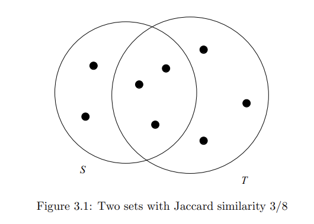
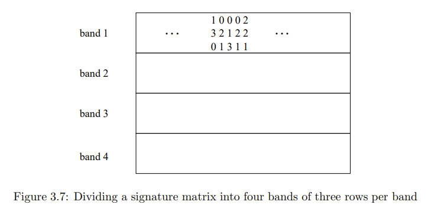
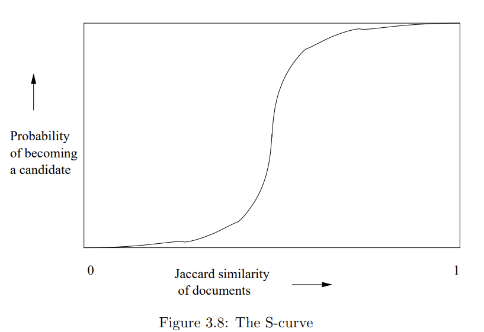

# 查找相似项

一个基本的数据挖掘问题是检查数据中的“相似”项。我们将在第3.1节中讨论应用，但一个例子是查看一组网页并找到近似重复的页面。这些页面可能是抄袭的，例如，或者它们可能是几乎具有相同内容但在主机和其他镜像信息上有所不同的镜像。找到相似项对的简单方法要求我们查看每一对项。当我们处理一个大型数据集时，查看所有项对可能是不可行的，即使有大量的硬件资源。例如，即使是百万项也会给我们带来半万亿对需要检查，而今天的标准认为百万项是一个“小”数据集。因此，了解一种称为局部敏感哈希（LSH）的技术家族是一件令人愉快的事情，它允许我们专注于可能相似的项对，而不必查看所有项对。因此，我们有可能避免朴素算法所需的计算时间的二次增长。局部敏感哈希通常有一个缺点，即存在假阴性，即相似的项对没有包含在我们检查的项对集合中，但通过仔细调整，我们可以通过增加考虑的项对数量来减少假阴性的比例。LSH背后的基本思想是我们使用许多不同的哈希函数来哈希项。这些哈希函数不是传统的哈希函数。相反，它们被精心设计成具有这样的属性：如果项是相似的，那么它们更有可能落在同一个哈希函数的桶中，而不是不相似的项。然后，我们可以只检查候选项对，即至少在一个哈希函数的桶中落在同一个桶中的项对。我们从检查找到相似文档的问题开始讨论LSH——那些共享大量共同文本的文档。我们首先展示如何将文档转换为集合（第3.2节），以便我们可以将文本文档的相似性视为集合具有大量重叠。更准确地说，我们通过它们的Jaccard相似性来衡量集合的相似性，即它们的交集和并集的大小之比。我们需要的第二个关键技巧是最小哈希（第3.3节），这是一种将大集合转换为更小的表示（称为签名）的方法，这些表示仍然可以让我们近似估计所表示集合的Jaccard相似性。最后，在第3.4节中，我们看到如何将LSH固有的分桶思想应用于签名。在第3.5节中，我们开始研究如何将LSH应用于集合以外的项。我们考虑一个告诉我们项相似程度的距离度量的一般概念。然后，在第3.6节中，我们考虑局部敏感哈希的一般思想，并在第3.7节中看到如何对集合以外的一些数据类型进行LSH。然后，第3.8节详细检查了LSH思想的几个应用。最后，我们在第3.9节中考虑一些在我们想要的相似度非常高时可能比LSH更有效的找到相似集合的技术。

## 3.1 集合相似性的应用 

我们将首先关注一种特定的“相似性”概念：通过查看集合交集的相对大小来衡量集合的相似性。这种相似性概念称为Jaccard相似性，在第3.1.1节中介绍。然后我们将研究找到相似集合的一些用途。这些用途包括查找文本上相似的文档和通过查找相似的客户和相似的产品进行协同过滤。为了将文档的文本相似性问题转化为集合交集问题，我们使用一种称为shingling的技术，这是第3.2节的主题。

### 3.1.1 集合的Jaccard相似性

集合S和T的Jaccard相似性是 ${|S \cap T|}/{|S \cup T|}$ ，即S和T的交集大小与它们的并集大小的比率。我们将用$SIM(S, T)$表示S和T的Jaccard相似性。 例3.1：在图3.1中，我们看到两个集合S和T。它们的交集中有三个元素，而在S或T或两者中出现的元素总共有八个。因此，$SIM(S, T) = 3/8$。

### 3.1.2 文档的相似性

Jaccard相似性很好地解决了一类重要的问题，即在大型语料库（如网络或新闻文章集合）中查找文本上相似的文档。我们应该理解，这里我们关注的相似性是字符级别的相似性，而不是“相似的意义”，后者需要我们检查文档中的单词及其用法。这个问题也很有趣，但由其他技术解决，我们在第1.3.1节中提到过。然而，文本相似性也有重要的用途。许多用途涉及查找重复或近似重复的内容。首先，让我们观察一下测试两个文档是否完全重复是很容易的；只需逐字符比较两个文档，如果它们有任何不同，那么它们就不是相同的。然而，在许多应用中，文档并不完全相同，但它们共享大部分文本。以下是一些例子：

**抄袭**

 查找抄袭文档测试了我们查找文本相似性的能力。抄袭者可能只提取文档的某些部分供自己使用。他可能会更改一些单词，并更改原文中句子的顺序。然而，生成的文档可能仍然包含大量原文。没有简单的逐字符比较文档的过程可以检测到复杂的抄袭。

**镜像页面** 

重要或流行的网站通常会在多个主机上复制，以分担负载。这些镜像站点的页面会非常相似，但很少完全相同。例如，它们可能各自包含与其特定主机相关的信息，并且它们可能各自有指向其他镜像站点的链接，但没有指向自己的链接。一个相关的现象是从一个学术课程到另一个课程的网页重用。这些页面可能包括课堂笔记、作业和讲义幻灯片。类似的页面可能会更改课程名称、年份，并且每年都会有一些小的变化。能够检测到这些类型的相似页面很重要，因为搜索引擎在避免在结果第一页中显示两个几乎相同的页面时会产生更好的结果。

**文章来自同一来源**

一个记者写的新闻文章通常会通过美联社等机构分发给许多报纸，这些报纸随后会在其网站上发布该文章。每家报纸都会对文章进行一些修改。它们可能会删减段落，甚至添加自己的内容。它们很可能会在文章周围放置自己的标志、广告和指向其他文章的链接。然而，每家报纸页面的核心内容将是原始文章。新闻聚合器（如Google News）试图找到这种文章的所有版本，以便只显示一个，这项任务需要找到两个网页在文本上相似但不完全相同的情况。
(新闻聚合还涉及查找关于相同主题的文章，即使它们在文本上不相似。这个问题也可以通过相似性搜索来解决，但它需要使用Jaccard相似性以外的技术。)

### 3.1.3 将协同过滤视为相似集合问题

另一类集合相似性非常重要的应用称为协同过滤，这一过程通过向用户推荐其他具有相似品味的用户喜欢的项目来实现。我们将在第9.3节详细研究协同过滤，但目前让我们看看一些常见的例子。

**在线购买**

Amazon.com有数百万客户，并销售数百万商品。其数据库记录了哪些客户购买了哪些商品。如果两个客户购买的商品集合具有较高的Jaccard相似性，我们可以说这两个客户是相似的。同样，具有高Jaccard相似性的购买者集合的两个商品也将被视为相似。注意，虽然我们可能期望镜像站点的Jaccard相似性超过90%，但任何两个客户的Jaccard相似性都不太可能那么高（除非他们只购买了一件商品）。即使是20%的Jaccard相似性也可能足够不寻常，以识别具有相似品味的客户。同样的观察也适用于商品；Jaccard相似性不需要非常高就可以具有显著意义。

协同过滤除了找到相似的客户或商品外，还需要几个工具，如我们在第9章讨论的。例如，两个喜欢科幻小说的Amazon客户可能各自购买了许多科幻小说书籍，但只有少数是共同的。然而，通过将相似性查找与聚类（第7章）结合起来，我们可能能够发现科幻小说书籍是相互相似的，并将它们放在一个组中。然后，通过询问客户是否在许多相同的组中进行了购买，我们可以获得更强大的客户相似性概念。

**电影评分**

Netflix记录了每个客户租借的电影以及客户对这些电影的评分。如果许多相同的客户租借或高度评价了某些电影，我们可以认为这些电影是相似的；如果客户租借或高度评价了许多相同的电影，我们可以认为这些客户是相似的。我们在上面对Amazon的观察在这种情况下同样适用：相似性不需要很高就可以具有显著意义，并且按类型对电影进行聚类会使事情变得更容易。

当我们的数据由评分而不是二元决策（购买/未购买或喜欢/不喜欢）组成时，我们不能简单地依赖集合作为客户或项目的表示。一些选项包括：

1. 忽略低评分的客户/电影对；即，将这些事件视为客户从未观看过该电影。
2. 在比较客户时，为每部电影想象两个集合元素，“喜欢”和“讨厌”。如果客户对电影评分很高，将该电影的“喜欢”放入客户的集合中。如果他们对电影评分很低，将该电影的“讨厌”放入他们的集合中。然后，我们可以在这些集合中寻找高Jaccard相似性。在比较电影时，我们可以使用类似的技巧。
3. 如果评分是1到5星，如果客户对电影评分为n星，则将该电影放入客户的集合n次。然后，在测量客户相似性时使用袋的Jaccard相似性。袋B和C的Jaccard相似性通过在交集中计数元素n次来定义，如果n是元素在B和C中出现的次数的最小值。在并集中，我们计数元素在B和C中出现次数的总和。

（尽管袋的并集通常（例如，在SQL标准中）定义为两个袋中每个副本数量的总和，但这种定义会导致与集合的Jaccard相似性的一些不一致。在这种袋并集的定义下，最大Jaccard相似性是1/2，而不是1，因为一个集合与自身的并集具有的元素数量是其与自身交集的两倍。如果我们希望集合与自身的Jaccard相似性为1，我们可以重新定义袋的并集，使每个元素出现的次数为它在两个袋中出现的最大次数。这一改变也提供了一个合理的袋相似性度量。）

例3.2：袋{a, a, a, b}和{a, a, b, b, c}的袋相似性是1/3。交集计数a两次，b一次，所以其大小是3。两个袋的并集的大小总是两个袋大小的总和，在这种情况下是9。由于袋的最高可能Jaccard相似性是1/2，1/3的得分表明这两个袋非常相似，这从它们的内容检查中应该是显而易见的。

### 3.1.4 第3.1节的练习题

练习3.1.1：计算以下三个集合的每对的Jaccard相似性：{1, 2, 3, 4}，{2, 3, 5, 7}，和{2, 4, 6}。

练习3.1.2：计算以下三个袋的每对的Jaccard袋相似性：{1, 1, 1, 2}，{1, 1, 2, 2, 3}，和{1, 2, 3, 4}。

练习3.1.3：假设我们有一个包含n个元素的全集U，并且我们随机选择两个子集S和T，每个子集包含n个元素中的m个。S和T的Jaccard相似性的期望值是多少？

## 3.2 文档的Shingling

为了识别词汇上相似的文档，将文档表示为集合的最有效方法是从文档中构建出出现在其中的短字符串的集合。如果我们这样做，那么即使这些句子在两个文档中以不同的顺序出现，共享短至句子甚至短语的文档将在它们的集合中有许多共同元素。在本节中，我们介绍最简单和最常见的方法——shingling，以及一个有趣的变体。

### 3.2.1 k-Shingles
文档是一个字符串。定义文档的k-shingle为文档中出现的任何长度为k的子串。然后，我们可以将每个文档与出现在该文档中的k-shingles集合相关联。

例3.3：假设我们的文档D是字符串abcdabd，我们选择k = 2。那么D的2-shingles集合是{ab, bc, cd, da, bd}。

注意，子串ab在D中出现了两次，但作为shingle只出现了一次。shingling的一个变体会生成一个袋，而不是一个集合，因此每个shingle在结果中出现的次数与它在文档中出现的次数相同。然而，我们在这里不使用shingles的袋。✷

关于如何处理空白字符（空格、制表符、换行符等）有几种选择。可能有意义的是将一个或多个空白字符的序列替换为一个空格。这样，我们可以区分覆盖两个或多个单词的shingles和不覆盖的shingles。

例3.4：如果我们使用k = 9，但完全消除空白，那么我们会在句子“The plane was ready for touch down”和“The quarterback scored a touchdown”中看到一些词汇上的相似性。然而，如果我们保留空格，那么第一个句子有shingles touch dow和ouch down，而第二个句子有touchdown。如果我们消除空格，那么两者都会有touchdown。

### 3.2.2 选择Shingle大小

我们可以选择任意常数k。然而，如果我们选择的k太小，那么我们会期望大多数k字符的序列出现在大多数文档中。如果是这样，那么我们可能会有shingle集合具有高Jaccard相似性的文档，但这些文档没有相同的句子甚至短语。

作为一个极端的例子，如果我们使用k = 1，大多数网页将包含大多数常见字符和少数其他字符，因此几乎所有网页将具有高相似性。

k的大小应取决于典型文档的长度和典型字符集的大小。重要的是要记住：

* k应该足够大，以使任何给定shingle出现在任何给定文档中的概率很低。

因此，如果我们的文档语料库是电子邮件，选择k = 5应该是合适的。要理解原因，假设电子邮件中只出现字母和一个通用的空白字符（尽管实际上，大多数可打印的ASCII字符偶尔会出现）。如果是这样，那么将有$$27^5 = 14,348,907$$个可能的shingles。由于典型的电子邮件远小于1400万个字符长，我们预计k = 5效果良好，实际上也是如此。

然而，计算有点微妙。肯定有超过27个字符出现在电子邮件中，但所有字符的出现概率并不相同。常见的字母和空格占主导地位，而“z”和其他在拼字游戏中得分高的字母则很少。因此，即使是短电子邮件也会有许多由常见字母组成的5-shingles，并且不相关的电子邮件共享这些常见shingles的机会比上段中的计算所暗示的要大。一个好的经验法则是想象只有20个字符，并估计k-shingles的数量为$20^k$。对于大型文档，如研究文章，选择k = 9被认为是安全的。

### 3.2.3 Shingles的哈希

我们可以选择一个哈希函数，将长度为k的字符串映射到一些桶，并将结果的桶号视为shingle，而不是直接使用子字符串作为shingle。表示文档的集合是文档中出现的一个或多个k-shingles的桶号的整数集合。例如，我们可以构建文档的9-shingles集合，然后将这些9-shingles中的每一个映射到0到$2^{32} - 1$范围内的桶号。因此，每个shingle由四个字节而不是九个字节表示。数据不仅被压缩了，而且我们现在可以通过单字机器操作来操作（哈希）shingles。

注意，如果我们使用9-shingles并将它们哈希到四个字节，而不是使用4-shingles，我们可以更好地区分文档，尽管表示一个shingle所用的空间是相同的。原因在第3.2.2节中有所提及。如果我们使用4-shingles，大多数四字节序列在典型文档中是不可能找到的。因此，不同shingles的有效数量远小于$2^{32} - 1$。如果像第3.2.2节中那样，我们假设英语文本中只有20个字符是常见的，那么可能出现的不同4-shingles的数量只有$20^4 = 160,000$。然而，如果我们使用9-shingles，可能出现的shingles数量远超过$2^{32}$。当我们将它们哈希到四个字节时，我们可以期望几乎任何四字节序列都是可能的，如第1.3.2节中所讨论的。

### 3.2.4 基于单词的Shingles

另一种形式的shingle在识别相似新闻文章的问题上被证明是有效的，如第3.1.2节中提到的那样。这个问题的可利用区别在于，新闻文章的写作风格与通常出现在页面上的其他元素有很大不同。新闻文章和大多数散文都有很多停用词（见第1.3.1节），即最常见的词，如“and”，“you”，“to”等。在许多应用中，我们希望忽略停用词，因为它们不会告诉我们关于文章的任何有用信息，比如它的主题。

然而，对于查找相似新闻文章的问题，发现将shingle定义为一个停用词后跟随的两个单词（无论它们是否是停用词）形成了一组有用的shingles。这种方法的优点在于，新闻文章将比周围的元素对表示网页的集合贡献更多的shingles。回想一下，这个练习的目标是找到包含相同文章的页面，而不管周围的元素如何。通过偏向于文章的shingle集合，包含相同文章和不同周围材料的页面比包含相同周围材料但不同文章的页面具有更高的Jaccard相似性。

例3.5：一个广告可能有简单的文本“Buy Sudzo”。然而，一篇包含相同想法的新闻文章可能会写成“一个Sudzo公司的发言人今天透露，研究表明购买Sudzo产品对人们有好处。”在这里，我们将所有可能的停用词用斜体表示，尽管没有固定数量的最常见词应该被视为停用词。由一个停用词和接下来的两个单词组成的前三个shingles是：

A spokesperson for
for the Sudzo
the Sudzo Corporation
这句话中有九个shingles，但广告中没有。

### 3.2.5 第3.2节的练习题

练习3.2.1：第3.2节第一句话中的前十个3-shingles是什么？

练习3.2.2：如果我们使用第3.2.4节中的基于停用词的shingles，并且我们将所有三个或更少字母的单词视为停用词，那么第3.2节第一句话中的shingles是什么？

练习3.2.3：一个长度为n字节的文档最多可以有多少个k-shingles？你可以假设字母表的大小足够大，以至于长度为k的可能字符串的数量至少为n。

## 3.3 保持相似性的集合摘要

Shingles的集合很大。即使我们将它们哈希到每个四个字节，存储一个集合所需的空间仍然大约是文档所占空间的四倍。如果我们有数百万个文档，可能无法在主存储器中存储所有的shingle集合。

（还有一个严重的问题：即使集合适合主存储器，成对的数量可能太大，无法评估每对的相似性。我们将在第3.4节中解决这个问题。）

本节的目标是用称为“签名”的更小表示来替换大集合。签名的重要属性是我们可以比较两个集合的签名，并仅从签名估计底层集合的Jaccard相似性。签名不可能给出它们所代表的集合的确切相似性，但它们提供的估计值很接近，并且签名越大，估计越准确。例如，如果我们用1000字节的签名替换从50000字节文档派生的200000字节哈希shingle集合，我们通常可以在几个百分点内得到结果。

### 3.3.1 集合的矩阵表示

在解释如何从大集合构建小签名之前，帮助将集合的集合可视化为它们的特征矩阵是有用的。矩阵的列对应于集合，行对应于从中抽取集合元素的全集的元素。如果行r和列c中有1，则表示行r的元素是列c的集合的成员。否则，位置(r, c)的值为0。

| Element | S1 | S2 | S3 | S4 |
|---------|----|----|----|----|
| a       | 1  | 0  | 0  | 1  |
| b       | 0  | 0  | 1  | 0  |
| c       | 0  | 1  | 0  | 1  |
| d       | 1  | 0  | 1  | 1  |
| e       | 0  | 0  | 1  | 0  |

Figure 3.2: A matrix representing four sets

例3.6：图3.2是一个表示从全集{a, b, c, d, e}中选择的集合的矩阵的示例。这里，S1 = {a, d}，S2 = {c}，S3 = {b, d, e}，S4 = {a, c, d}。最上面的行和最左边的列不是矩阵的一部分，只是为了提醒我们行和列代表什么。✷

重要的是要记住，特征矩阵不太可能是数据存储的方式，但它作为可视化数据的一种方式是有用的。出于不将数据存储为矩阵的一个原因，这些矩阵在实践中几乎总是稀疏的（它们有更多的0而不是1）。通过表示1出现的位置来表示稀疏的0和1矩阵可以节省空间。另一个原因是，数据通常以其他格式存储以用于其他目的。

例如，如果行是产品，列是客户，表示他们购买的产品集合，那么这些数据实际上会出现在购买的数据库表中。这个表中的一个元组会列出商品、购买者以及可能的其他购买细节，例如日期和使用的信用卡。

### 3.3.2 MinHash算法

我们希望为集合构建的签名由大量计算结果组成，比如几百个，每个结果都是特征矩阵的一个“最小哈希”。在本节中，我们将学习如何在原理上计算最小哈希，并在后续章节中看到如何在实践中计算最小哈希的良好近似值。

要对由特征矩阵的一列表示的集合进行最小哈希，首先对行进行一个随机排列。**任何列的最小哈希值是该列在排列顺序中第一个为1的行号。**

**例子3.7**：假设我们选择图3.2中的行顺序为beadc。这种排列定义了一个将集合映射到行的最小哈希函数h。让我们根据h计算集合$S_1$的最小哈希值。第一列，即集合$S_1$的列，在行b中有0，所以我们继续到排列顺序中的第二行e。$S_1$的列中再次有0，所以我们继续到行a，在那里我们找到了1。因此，$h(S_1) = a$。

| Element | S1 | S2 | S3 | S4 |
|---------|----|----|----|----|
| a       | 1  | 0  | 0  | 1  |
| b       | 0  | 0  | 1  | 0  |
| c       | 0  | 1  | 0  | 1  |
| d       | 1  | 0  | 1  | 1  |
| e       | 0  | 0  | 1  | 0  |

Fig 3.2

| Element | S1 | S2 | S3 | S4 |
|---------|----|----|----|----|
| b       | 0  | 0  | 1  | 0  |
| e       | 0  | 0  | 1  | 0  |
| a       | 1  | 0  | 0  | 1  |
| d       | 1  | 0  | 1  | 1  |
| c       | 0  | 1  | 0  | 1  |

Fig 3.3

虽然物理上不可能对非常大的特征矩阵进行排列，但最小哈希函数h隐式地重新排列了图3.2中的矩阵行，使其变为图3.3中的矩阵。在这个矩阵中，我们可以通过从上到下扫描直到遇到1来读取h的值。因此，我们可以看到$h(S_2) = c$，$h(S_3) = b$，$h(S_4) = a$。

### 3.3.3 Minhash 和 Jaccard 相似度

Minhashing 和 Jaccard 相似度之间有一个显著的联系：

 * 对于行的随机排列，两个集合的最小哈希函数产生相同值的概率等于这些集合的 Jaccard 相似度。
  
为了理解这一点，我们需要想象这些集合的列。如果我们只考虑集合 $S_1$ 和 $S_2$ 的列，那么行可以分为三类：

1. 类型 X 行：在两个列中都有 1。
2. 类型 Y 行：在一个列中有 1，另一个列中有 0。
3. 类型 Z 行：在两个列中都有 0。

由于矩阵是稀疏的，大多数行是类型Z。然而，决定 $SIM(S_1, S_2)$ 和 $h(S_1) = h(S_2)$ 概率的是类型 X 和类型 Y 行的数量比率。假设有 x 行是类型 X，y 行是类型 Y。那么 $SIM(S_1, S_2) = x/(x + y)$。原因是 x 是 $S_1 ∩ S_2$ 的大小，而 x + y 是 $S_1 ∪ S_2$ 的大小。

现在，考虑 $h(S_1) = h(S_2)$ 的概率。如果我们想象行被随机排列，并从顶部开始扫描，遇到类型 X 行在遇到类型 Y 行之前的概率是 $x/(x + y)$。如果从顶部开始遇到的第一行是类型 X 行，那么肯定 $h(S_1) = h(S_2)$。另一方面，如果遇到的第一行是类型 Y 行，那么在该行中有 1 的集合将得到该行作为其最小哈希值，而在该行中有 0 的集合肯定会得到排列列表中更靠下的某一行。因此，如果我们首先遇到类型 Y 行，我们知道 $h(S_1) ≠ h(S_2)$。

我们得出结论：

定理： $h(S_1) = h(S_2)$ 的概率是 $x/(x + y)$，这也是 $S_1$ 和 $S_2$ 的 Jaccard 相似度。

$$
[ J(A, B) = P(\text{min}_h(A) = \text{min}_h(B)) = \frac{|A \cap B|}{|A \cup B|} ]
$$

### 3.3.4 minHash签名

再次考虑由特征矩阵 M 表示的一组集合。为了表示这些集合，我们随机选择一些行排列，可能是 100 个排列或几百个排列。将这些排列确定的最小哈希函数称为 $h_1, h_2, \ldots, h_n$。从表示集合 S 的列中，构建 S 的最小哈希签名，即向量 $[h_1(S), h_2(S), \ldots, h_n(S)]$。我们通常将这个哈希值列表表示为一列。因此，我们可以从矩阵 M 形成一个签名矩阵，其中 M 的第 i 列被替换为第 i 列（集合）的最小哈希签名。

请注意，签名矩阵的列数与 M 相同，但只有 n 行。即使 M 没有明确表示，而是以适合稀疏矩阵的压缩形式表示（例如，通过其 1 的位置），签名矩阵通常比 M 小得多。

签名矩阵的显著特点是我们可以使用它们的列来估计对应于签名矩阵列的集合的 Jaccard 相似度。根据 3.3.3 节中证明的定理，我们知道签名矩阵中给定行的两个列具有相同值的概率等于对应集合的 Jaccard 相似度。此外，由于确定最小哈希值的排列是独立选择的，我们可以将签名矩阵的每一行视为一次独立实验。因此，两列在某一行中一致的期望行数等于它们对应集合的 Jaccard 相似度。此外，我们使用的最小哈希次数越多，即签名矩阵中的行数越多，估计 Jaccard 相似度的预期误差就越小。

### 3.3.5 计算minHash

由于对大型特征矩阵进行显式排列是不可行的。即使选择数百万或数十亿行的随机排列也非常耗时，而对行进行必要的排序则需要更多时间。因此，像图3.3所示的排列矩阵虽然在概念上很有吸引力，但在实际中是不可实现的。

幸运的是，可以通过一个随机哈希函数来模拟随机排列的效果，该函数将行号映射到与行数相同的桶中。一个将整数0, 1, ..., k-1映射到桶号0到k-1的哈希函数通常会将一些整数对映射到相同的桶，并留下其他桶未填充。然而，只要k足够大且碰撞不太多，这种差异并不重要。我们可以假设我们的哈希函数h将行r“排列”到排列顺序中的位置h(r)。

因此，我们不再选择n个随机排列的行，而是选择n个随机选择的行哈希函数$h_1, h_2, \ldots, h_n$。我们通过考虑每一行的给定顺序来构建签名矩阵。设$SIG(i, c)$为第i个哈希函数和列c的签名矩阵元素。最初，将所有i和c的$SIG(i, c)$设置为∞。我们通过以下步骤处理行r：

对于每个哈希函数$h_i$：
计算$h_i(r)$。
如果$h_i(r)$小于当前的$SIG(i, c)$，则更新$SIG(i, c)$为$h_i(r)$。
通过这种方式，我们可以有效地模拟随机排列，并构建签名矩阵来估计集合的Jaccard相似度。

1. 计算 $h_1(r), h_2(r), \ldots, h_n(r)$。
2. 对于每一列 c，执行以下操作：
   
   a. 如果 c 在行 r 中为 0，则不做任何操作。

   b. 如果 c 在行 r 中为 1，则对于每个 $i = 1, 2, \ldots, n$，将 $SIG(i, c)$ 设置为当前 $SIG(i, c)$ 和 $h_i(r)$ 中较小的一个。

| Row | S1 | S2 | S3 | S4 | $x + 1 \mod 5$ | $3x + 1 \mod 5$ |
|-----|----|----|----|----|----------------|-----------------|
| 0   | 1  | 0  | 0  | 1  | 1              | 1               |
| 1   | 0  | 0  | 1  | 0  | 2              | 4               |
| 2   | 0  | 1  | 0  | 1  | 3              | 2               |
| 3   | 1  | 0  | 1  | 1  | 4              | 0               |
| 4   | 0  | 0  | 1  | 0  | 0              | 3               |

Fig 3.4

让我们重新考虑图 3.2 的特征矩阵，我们将其与一些附加数据一起重新绘制为图 3.4。我们将行的名称从字母替换为整数 0 到 4。我们还选择了两个哈希函数：$h_1(x) = (x + 1) \mod 5$ 和 $h_2(x) = (3x + 1) \mod 5$。这两个函数应用于行号的值在图 3.4 的最后两列中给出。请注意，这些简单的哈希函数是真正的行排列，但只有因为行数 5 是一个质数，才可能实现真正的排列。通常，会有碰撞，即两行得到相同的哈希值。

现在，让我们模拟计算签名矩阵的算法。最初，这个矩阵由所有的 ∞ 组成：

|     | S1 | S2 | S3 | S4 |
|-----|----|----|----|----|
| $h_1$ | ∞  | ∞  | ∞  | ∞  |
| $h_2$ | ∞  | ∞  | ∞  | ∞  |

让我们逐行处理：

首先，我们考虑图 3.4 的第 0 行。我们看到 $h_1(0)$ 和 $h_2(0)$ 的值都是 1。编号为 0 的行在集合 $S_1$ 和 $S_4$ 的列中有 1，因此只有签名矩阵的这些列可以更改。由于 1 小于 ∞，我们实际上确实更改了 $S_1$ 和 $S_4$ 列中的两个值。因此，当前的签名矩阵估计如下：
- **行 0**：
  - $h_1(0) = 1$
  - $h_2(0) = 1$
  - 更新签名矩阵：

    |     | S1 | S2 | S3 | S4 |
    |-----|----|----|----|----|
    | $h_1$ | 1  | ∞  | ∞  | 1  |
    | $h_2$ | 1  | ∞  | ∞  | 1  |

现在，我们移动到图 3.4 中编号为 1 的行。该行只有在 $S_3$ 中有 1，其哈希值为 $h_1(1) = 2$ 和 $h_2(1) = 4$。因此，我们将 $SIG(1, 3)$ 设置为 2，将 $SIG(2, 3)$ 设置为 4。所有其他签名条目保持不变，因为它们的列在编号为 1 的行中为 0。新的签名矩阵如下：

- **行 1**：
  - $h_1(1) = 2$
  - $h_2(1) = 4$
  - 更新签名矩阵：

    |     | S1 | S2 | S3 | S4 |
    |-----|----|----|----|----|
    | $h_1$ | 1  | ∞  | 2  | 1  |
    | $h_2$ | 1  | ∞  | 4  | 1  |

图 3.4 中编号为 2 的行在 $S_2$ 和 $S_4$ 的列中有 1，其哈希值为 $h_1(2) = 3$ 和 $h_2(2) = 2$。我们可以更改 $S_4$ 的签名值，但签名矩阵中该列的值 [1, 1] 都小于相应的哈希值 [3, 2]。然而，由于 $S_2$ 的列仍然是 ∞，我们将其替换为 [3, 2]，结果如下：

- **行 2**：
  - $h_1(2) = 3$
  - $h_2(2) = 2$
  - 更新签名矩阵：

    |     | S1 | S2 | S3 | S4 |
    |-----|----|----|----|----|
    | $h_1$ | 1  | 3  | 2  | 1  |
    | $h_2$ | 1  | 2  | 4  | 1  |

接下来是图 3.4 中编号为 3 的行。这里，除了 $S_2$ 之外的所有列都有 1，其哈希值为 $h_1(3) = 4$ 和 $h_2(3) = 0$。$h_1$ 的值 4 超过了签名矩阵中所有列的当前值，因此我们不会更改签名矩阵第一行中的任何值。然而，$h_2$ 的值 0 小于当前存在的值，因此我们将 $SIG(2, 1)$、$SIG(2, 3)$ 和 $SIG(2, 4)$ 降低到 0。请注意，我们不能降低 $SIG(2, 2)$，因为图 3.4 中 $S_2$ 的列在我们当前考虑的行中为 0。结果签名矩阵如下：

- **行 3**：
  - $h_1(3) = 4$
  - $h_2(3) = 0$
  - 更新签名矩阵：

    |     | S1 | S2 | S3 | S4 |
    |-----|----|----|----|----|
    | $h_1$ | 1  | 3  | 2  | 1  |
    | $h_2$ | 0  | 2  | 0  | 0  |

最后，考虑图 3.4 中编号为 4 的行。$h_1(4) = 0$ 和 $h_2(4) = 3$。由于第 4 行只有在 $S_3$ 的列中有 1，我们只比较该集合的当前签名列 [2, 0] 与哈希值 [0, 3]。由于 0 < 2，我们将 $SIG(1, 3)$ 更改为 0，但由于 3 > 0，我们不更改 $SIG(2, 3)$。最终的签名矩阵如下：

- **行 4**：
  - $h_1(4) = 0$
  - $h_2(4) = 3$
  - 更新签名矩阵：

最终签名矩阵：

|     | S1 | S2 | S3 | S4 |
|-----|----|----|----|----|
| $h_1$ | 1  | 3  | 0  | 1  |
| $h_2$ | 0  | 2  | 0  | 0  |

我们可以从这个签名矩阵估计底层集合的 Jaccard 相似度。注意到列 1 和列 4 是相同的，所以我们猜测 $SIM(S1, S4) = 1.0$。如果我们查看图 3.4，我们会发现 $S1$ 和 $S4$ 的真实 Jaccard 相似度是 $2/3$。请记住，签名矩阵中一致的行的比例只是对真实 Jaccard 相似度的估计，这个例子太小，无法通过大数定律确保估计值接近真实值。对于其他例子，$S1$ 和 $S3$ 的签名列在一半的行中一致（真实相似度 $1/4$），而 $S1$ 和 $S2$ 的签名估计它们的 Jaccard 相似度为 0（正确值）。

### 3.3.6 加速minHash

最小哈希的过程是耗时的，因为我们需要为每个最小哈希函数检查整个 k 行矩阵 M。让我们首先回到 3.3.2 节的模型，在那里我们假设行实际上是排列的。但是，为了在所有列上计算一个最小哈希函数，我们不会一直到排列的末尾，而只看排列顺序中的前 m 行。如果我们使 m 相对于 k 较小，我们可以将工作量减少一个大因子，即 k/m。

然而，使 m 变小有一个缺点。只要每列在排列顺序的前 m 行中至少有一个 1，m 行之后的行对任何最小哈希值都没有影响，可以不看。但是，如果某些列在前 m 行中全为 0 呢？我们没有这些列的最小哈希值，而是必须使用一个特殊符号，我们将使用 ∞。

当我们检查两列的最小哈希签名以估计其底层集合的 Jaccard 相似度时，如 3.3.4 节所述，我们必须考虑到一种或两种列在签名的某些组件中具有 ∞ 作为其最小哈希值的可能性。有三种情况：

1. 如果在给定行中两列都没有 ∞，则无需更改。如果两个值相同，则将此行计为相等值的示例；如果不同，则计为不相等值的示例。
2. 一列有 ∞ 而另一列没有。在这种情况下，如果我们使用原始排列矩阵 M 的所有行，具有 ∞ 的列最终会被赋予某个行号，而该行号肯定不会是排列顺序中的前 m 行之一。但另一列确实有一个值，该值是前 m 行之一。因此，我们肯定有一个不相等最小哈希值的示例，并将签名矩阵的这一行计为这样的示例。
3. 现在，假设两列在行中都有 ∞。那么在原始排列矩阵 M 中，两列的前 m 行全为 0。因此，我们没有关于相应集合的 Jaccard 相似度的信息；该相似度仅是我们选择不看的最后 k - m 行的函数。因此，我们将签名矩阵的这一行既不计为相等值的示例，也不计为不相等值的示例。

只要第三种情况（两列都有 ∞）很少见，我们就几乎可以获得与签名矩阵中的行数一样多的示例进行平均。这种效果会稍微降低我们对 Jaccard 距离估计的准确性，但不会太多。而且，由于我们现在能够比检查 M 的所有行更快地计算所有列的最小哈希值，我们可以花时间应用更多的最小哈希函数。我们获得的准确性甚至比原来更好，而且速度比以前更快。

### 3.3.7 使用哈希函数加速

如前所述，有理由不以 3.3.6 节假设的方式实际排列行。然而，在 3.3.6 节的上下文中，真正排列的想法比在 3.3.2 节中更有意义。原因是我们不需要构造 k 个元素的完整排列，而只需从 k 行中选择一个小数 m，然后选择这些行的随机排列。根据 m 的值以及矩阵 M 的存储方式，可能有必要按照 3.3.6 节建议的算法进行操作。

然而，更可能需要类似于 3.3.5 节的策略。现在，M 的行是固定的，并且没有排列。我们选择一个哈希函数来哈希行号，并仅计算前 m 行的哈希值。也就是说，我们遵循 3.3.5 节的算法，但只到达第 m 行，然后停止，并且对于每一列，我们将到目前为止看到的最小哈希值作为该列的最小哈希值。

由于某些列在所有 m 行中可能为 0，因此某些最小哈希值可能为 ∞。假设 m 足够大，以至于 ∞ 最小哈希值很少见，我们仍然可以通过比较签名矩阵的列来很好地估计集合的 Jaccard 相似度。假设 T 是由矩阵 M 的前 m 行表示的通用集合的元素集合。设 $S_1$ 和 $S_2$ 为 M 的两列表示的集合。那么，M 的前 m 行表示集合 $S_1 ∩ T$ 和 $S_2 ∩ T$。如果这两个集合都是空的（即，两列在其前 m 行中全为 0），则此最小哈希函数在两列中都将为 ∞，并在估计列的底层集合的 Jaccard 相似度时被忽略。

如果至少有一个集合 $S_1 ∩ T$ 和 $S_2 ∩ T$ 非空，则这两个列具有相等值的概率是这些集合的 Jaccard 相似度，即：

$$ \frac{|S_1 ∩ S_2 ∩ T|}{|(S_1 ∪ S_2) ∩ T|} $$

只要 T 被选择为通用集合的随机子集，这个分数的期望值将与 $S_1$ 和 $S_2$ 的 Jaccard 相似度相同。然而，会有一些随机变化，因为根据 T，我们可能会在矩阵 M 的前 m 行中找到多于或少于平均数量的类型 X 行（两列中都有 1）和/或类型 Y 行（一个列中有 1，另一个列中有 0）。

为了减轻这种变化，我们不会对每次最小哈希使用相同的集合 T，相反，我们将 M 的行分成 k/m 组。（在下文中，为方便起见，我们假设 m 可以整除 k。这并不重要，只要 k/m 足够大，即使某些行没有包含在任何组中，因为 k 不是 m 的整数倍。）然后，对于每个哈希函数，我们通过仅检查 M 的前 m 行来计算一个最小哈希值，通过仅检查第二个 m 行来计算另一个最小哈希值，依此类推。因此，我们从一个哈希函数和对 M 的所有行的一次遍历中获得 k/m 个最小哈希值。事实上，如果 k/m 足够大，我们可能通过一个哈希函数应用于 M 的每个子集行来获得签名矩阵所需的所有行。

此外，通过使用 M 的每一行来计算这些最小哈希值之一，我们倾向于平衡由于任何特定行子集导致的 Jaccard 相似度估计误差。也就是说，$S_1$ 和 $S_2$ 的 Jaccard 相似度决定了类型 X 和类型 Y 行的比例。所有类型 X 行分布在 k/m 行集之间，类型 Y 行也是如此。因此，虽然一组 m 行可能比平均值有更多的一种类型的行，但必须有其他一些 m 行集比平均值少同一种类型的行。

#### 示例 3.9：
在图 3.5 中，我们看到一个表示三个集合 $S_1$、$S_2$ 和 $S_3$ 的矩阵，具有八个元素的通用集合；即 k = 8。让我们选择 m = 4，因此通过行的一次遍历产生两个最小哈希值，一个基于前四行，另一个基于后四行。

| S1 | S2 | S3 |
|----|----|----|
| 0  | 0  | 0  |
| 0  | 0  | 0  |
| 0  | 0  | 1  |
| 0  | 0  | 1  |
||
| 1  | 1  | 1  |
| 1  | 1  | 0  |
| 1  | 0  | 0  |
| 0  | 0  | 0  |

**图 3.5：表示三个集合的布尔矩阵**

首先，注意三个集合的 Jaccard 相似度为 $SIM(S_1, S_2) = 1/2$，$SIM(S_1, S_3) = 1/5$，和 $SIM(S_2, S_3) = 1/2$。现在，只看前四行。无论我们使用什么哈希函数，$S_1$ 的最小哈希值将是 ∞，$S_2$ 的最小哈希值将是第 4 行的哈希值，$S_3$ 的最小哈希值将是第 3 行和第 4 行哈希值中较小的一个。因此，$S_1$ 和 $S_2$ 的最小哈希值永远不会相同。这是有道理的，因为如果 T 是由前四行表示的元素集合，那么 $S_1 ∩ T = ∅$，因此 $SIM(S_1 ∩ T, S_2 ∩ T) = 0$。然而，在后四行中，限制在最后四行表示的元素上的 $S_1$ 和 $S_2$ 的 Jaccard 相似度是 2/3。

我们得出结论，如果我们使用这个哈希函数生成由两个最小哈希值组成的签名，一个基于前四行，另一个基于后四行，那么我们在 $S_1$ 和 $S_2$ 的签名之间得到的匹配数的期望值是 0 和 2/3 的平均值，即 1/3。由于 $S_1$ 和 $S_2$ 的实际 Jaccard 相似度是 1/2，因此存在误差，但误差不大。在更大的例子中，当最小哈希值基于远多于四行时，期望误差将趋近于零。

同样，我们可以看到将行拆分对其他两对列的影响。对于 $S_1$ 和 $S_3$，上半部分表示 Jaccard 相似度为 0 的集合，而下半部分表示 Jaccard 相似度为 1/3 的集合。因此，$S_1$ 和 $S_3$ 的签名中的匹配数的期望值是这些的平均值，即 1/6。这与真实的 Jaccard 相似度 $SIM(S_1, S_3) = 1/5$ 相比。最后，当我们比较 $S_2$ 和 $S_3$ 时，我们注意到这两列在前四行中的 Jaccard 相似度是 1/2，在后四行中的 Jaccard 相似度也是 1/2。平均值 1/2 也与 $SIM(S_2, S_3) = 1/2$ 完全一致。

### 3.3.8 练习题
**练习 3.3.1：**
验证 3.3.3 节中的定理，该定理将 Jaccard 相似度与最小哈希值相等的概率联系起来，针对图 3.2 的特定情况。

 (a) 计算图 3.2 中每对列的 Jaccard 相似度。 
 
 (b) 计算该图中每对列的行的 120 个排列中，使两列哈希到相同值的比例。

**练习 3.3.2：**
使用图 3.4 中的数据，向列的签名添加以下哈希函数的值： (a) $h_3(x) = (2x + 4) \mod 5$。 (b) $h_4(x) = (3x - 1) \mod 5$。

| Element | S1 | S2 | S3 | S4 |
|---------|----|----|----|----|
| 0       | 0  | 1  | 0  | 1  |
| 1       | 0  | 1  | 0  | 0  |
| 2       | 1  | 0  | 0  | 1  |
| 3       | 0  | 0  | 1  | 0  |
| 4       | 0  | 0  | 1  | 1  |
| 5       | 1  | 0  | 0  | 0  |

**图 3.6：练习 3.3.3 的矩阵**

**练习 3.3.3：** 在图 3.6 中是一个有六行的矩阵。 (a) 如果我们使用以下三个哈希函数，计算每列的最小哈希签名：

$h_1(x) = (2x + 1) \mod 6$
$h_2(x) = (3x + 2) \mod 6$
$h_3(x) = (5x + 2) \mod 6$
(b) 这些哈希函数中哪些是真正的排列？

(c) 估计的六对列的 Jaccard 相似度与真实的 Jaccard 相似度有多接近？

**练习 3.3.4：** 既然我们知道 Jaccard 相似度与两个集合最小哈希到相同值的概率有关，重新考虑练习 3.1.3。你能否利用这种关系简化计算随机选择集合的期望 Jaccard 相似度的问题？

**练习 3.3.5：** 证明如果两列的 Jaccard 相似度为 0，那么最小哈希总是能正确估计 Jaccard 相似度。

**练习 3.3.6：** 有人可能会认为我们可以在不使用所有可能的行排列的情况下估计列的 Jaccard 相似度。例如，我们可以只允许循环排列；即从随机选择的行 r 开始，它成为顺序中的第一行，然后是行 r + 1、r + 2，依此类推，到最后一行，然后继续第一行、第二行，依此类推，到行 r - 1。如果有 n 行，则只有 n 个这样的排列。然而，这些排列不足以正确估计 Jaccard 相似度。给出一个两列矩阵的例子，其中对所有循环排列求平均值不能给出 Jaccard 相似度。

**练习 3.3.7：** 假设我们想使用 MapReduce 框架来计算最小哈希签名。如果矩阵按列存储在块中，那么利用并行性非常容易。每个 Map 任务获取一些列和所有哈希函数，并计算其给定列的最小哈希签名。然而，假设矩阵按行分块，因此 Map 任务获取哈希函数和一组行来处理。设计 Map 和 Reduce 函数以利用这种形式的数据进行 MapReduce。

**练习 3.3.8：** 正如我们在 3.3.6 节中注意到的，当一列只有 0 时会出现问题。如果我们使用整个列来计算最小哈希函数（如 3.3.2 节所述），那么唯一一次我们在一列中得到全 0 是该列表示空集时。我们应该如何处理空集以确保不会引入 Jaccard 相似度估计中的错误？

**练习 3.3.9：** 在示例 3.9 中，我们获得的每个 Jaccard 相似度估计值都小于或等于真实的 Jaccard 相似度。是否有可能对于另一对列，上下半部分的 Jaccard 相似度的平均值会超过列的实际 Jaccard 相似度？

## 3.4 局部敏感hash

尽管我们可以使用MinHash将大型文档压缩成小签名，并保持任意文档对的预期相似性，但仍然可能无法高效地找到相似度最大的文档对。原因是，即使文档数量不多，文档对的数量也可能太大。

例3.10：假设我们有一百万个文档，并且我们使用长度为250的签名。那么每个文档的签名占用1000字节，整个数据可以适合在一个GB的空间内——这比典型的笔记本电脑主存储器要小。然而，有$\binom{1000000}{2}$或半万亿对文档。如果计算两个签名的相似性需要一微秒，那么在那台笔记本电脑上计算所有相似性需要将近六天。

如果我们的目标是计算每对的相似性，那么我们无法减少工作量，尽管并行处理可以减少耗时。然而，通常我们只需要最相似的对或所有相似度高于某个下限的对。如果是这样，那么我们需要只关注可能相似的对，而不是调查每一对。这种提供焦点的通用理论称为局部敏感哈希（LSH）或近邻搜索。在本节中，我们将考虑一种特定形式的LSH，专为我们一直在研究的特定问题设计：文档，由shingle集合表示，然后通过MinHash生成短签名。在第3.6节中，我们将介绍局部敏感哈希的一般理论及其许多应用和相关技术。

### 3.4.1 MinHash签名的LSH

LSH的一种通用方法是多次“哈希”项目，以使相似的项目比不相似的项目更有可能被哈希到同一个桶中。然后，我们将任何在任何一次哈希中被哈希到同一个桶中的对视为候选对。我们只检查候选对的相似性。希望大多数不相似的对永远不会被哈希到同一个桶中，因此永远不会被检查。那些确实被哈希到同一个桶中的不相似对是误报；我们希望这些只占所有对的一小部分。我们还希望大多数真正相似的对在至少一个哈希函数下被哈希到同一个桶中。那些没有被哈希到同一个桶中的是真阴性；我们希望这些只占真正相似对的一小部分。

如果我们有项目的MinHash签名，一种有效的选择哈希的方法是将签名矩阵分成b个带，每个带由r行组成。对于每个带，有一个哈希函数，它将r个整数的向量（该带内一列的一部分）哈希到一些大的桶数。我们可以对所有带使用相同的哈希函数，但我们对每个带使用一个单独的桶数组，因此在不同带中具有相同向量的列不会被哈希到同一个桶中。

例3.11：图3.7显示了一个由12行组成的签名矩阵的一部分，分为四个带，每个带有三行。第二列和第四列在第一个带中的列向量都是[0, 2, 1]，因此它们在第一个带的哈希中肯定会被哈希到同一个桶中。因此，不管这些列在其他三个带中的样子如何，这对列将是候选对。其他列，例如前两列，也可能根据第一个带的哈希被哈希到同一个桶中。然而，由于它们的列向量不同，[1, 3, 0]和[0, 2, 1]，并且每个哈希有许多桶，我们预计意外碰撞的机会非常小。我们通常假设只有当且仅当两个向量相同时，它们才会被哈希到同一个桶中。

在第一个带中不一致的两列还有三次机会成为候选对；它们可能在其他任何一个带中相同。然而，观察到两列越相似，它们在某个带中相同的可能性就越大。因此，直观上，带策略使得相似的列比不相似的列更有可能成为候选对。

### 3.4.2 带策略的分析

假设我们使用b个带，每个带有r行，并且假设某一对文档的Jaccard相似性为s。回想第3.3.3节中提到的，这些文档的MinHash签名在签名矩阵的任意一行中一致的概率是s。我们可以计算这些文档（或更确切地说，它们的签名）成为候选对的概率如下：

1. 签名在某一特定带的所有行中一致的概率是$s^r$。
2. 签名在某一特定带的至少一行中不一致的概率是$1 - s^r$。
3. 签名在每个带的至少一行中不一致的概率是$(1 - s^r)^b$。
4. 签名在至少一个带的所有行中一致的概率，因此成为候选对的概率是$1 - (1 - s^r)^b$。

尽管选择的常数b和r可能不明显，但该函数具有S形曲线的形式，如图3.8所示。阈值，即成为候选对的概率为1/2的相似度s的值，是b和r的函数。阈值大致在上升最陡的地方，对于大的b和r，我们发现相似度高于阈值的对很可能成为候选对，而低于阈值的对不太可能成为候选对——这正是我们想要的情况。阈值的一个近似值是$(1/b)^{1/r}$。例如，如果b = 16且r = 4，那么阈值大约在s = 1/2，因为1/16的4次方根是1/2。

| s   | $1 - (1 - s^r)^b$ |
|-----|-----------------|
| 0.2 | 0.006           |
| 0.3 | 0.047           |
| 0.4 | 0.186           |
| 0.5 | 0.470           |
| 0.6 | 0.802           |
| 0.7 | 0.975           |
| 0.8 | 0.9996          |

图3.9：b = 20和r = 5时S曲线的值

例3.12：让我们考虑b = 20和r = 5的情况。也就是说，我们假设我们有长度为100的签名，分为20个带，每个带有5行。图3.9列出了一些函数$1 - (1 - s^5)^{20}$的值。注意，阈值，即曲线上升到一半的s值，略高于0.5。还要注意，曲线并不是理想的阶跃函数，在阈值处从0跳到1，但曲线中间的斜率很显著。例如，从s = 0.4到s = 0.6，曲线上升了超过0.6，因此中间的斜率大于3。

例如，在s = 0.8时，$1 - (0.8)^5$大约是0.672。如果将这个数值提升到20次方，你会得到大约0.00035。从1中减去这个分数得到0.99965。也就是说，如果我们考虑两篇相似度为80%的文档，那么在任何一个带中，它们在所有五行中一致的概率只有大约33%，因此成为候选对。然而，有20个带，因此有20次机会成为候选对。大约只有1/3000的相似度高达80%的对会未能成为候选对，从而成为假阴性。

### 3.4.3 结合这些技术

我们现在可以给出一种方法来找到相似文档的候选对集合，然后在它们中发现真正相似的文档。必须强调的是，这种方法可能会产生假阴性——相似的文档对没有被识别为候选对，因为它们从未成为候选对。也会有假阳性——候选对被评估，但发现它们不够相似。

1. 选择一个k值，并从每个文档构建k-shingles集合。可选地，将k-shingles哈希到较短的桶号。
2. 对文档-shingle对进行排序，以按shingle排序。
3. 选择一个长度n用于MinHash签名。将排序列表输入第3.3.5节的算法，以计算所有文档的MinHash签名。
4. 选择一个阈值t，定义文档必须达到的相似度，以将它们视为所需的“相似对”。选择带的数量b和行的数量r，使得br = n，并且阈值t大约是$(1/b)^{1/r}$。如果避免假阴性很重要，你可能希望选择b和r以产生低于t的阈值；如果速度很重要并且你希望限制假阳性，选择b和r以产生高于t的阈值。
5. 通过应用第3.4.1节的LSH技术构建候选对。
6. 检查每个候选对的签名，并确定它们在至少t的成分中是否一致。
7. 可选地，如果签名足够相似，可以查看文档本身，检查它们是否真的相似，而不是因为运气好而具有相似签名的文档。

### 3.4.4 第3.4节的练习

练习3.4.1：对于以下r和b的值，计算S曲线$1 - (1 - s^r)^b$在s = 0.1, 0.2, ..., 0.9时的值：
- r = 3 和 b = 10
- r = 6 和 b = 20
- r = 5 和 b = 50

练习3.4.2：对于练习3.4.1中的每一对(r, b)，计算阈值，即$1 - (1 - s^r)^b$值恰好为1/2时的s值。这个值与第3.4.2节中建议的$(1/b)^{1/r}$估计值相比如何？

练习3.4.3：使用第1.3.5节中解释的技术来近似$1 - (1 - s^r)^b$当$s^r$非常小时的S曲线。

练习3.4.4：假设我们希望通过MapReduce实现LSH。具体来说，假设签名矩阵的块由列组成，元素是键值对，其中键是列号，值是签名本身（即，一个值向量）。

(a) 展示如何将所有带的桶作为单个MapReduce过程的输出。提示：记住一个Map函数可以从一个元素生成多个键值对。

(b) 展示另一个MapReduce过程如何将(a)的输出转换为需要比较的对的列表。具体来说，对于每一列i，应该有一个列表，列出需要与i比较的列j > i。

## 3.5 距离测量

## 3.6 局部敏感函数理论

## 3.7 其他距离度量的LSH家族

## 3.8 局部敏感哈希的应用

## 3.9 高相似度的方法

## 3.10 本章总结

✦ Jaccard相似度：集合的Jaccard相似度是集合交集的大小与并集的大小的比率。这种相似度度量适用于许多应用，包括文档的文本相似度和客户购买习惯的相似度。

✦ Shingling：一个k-shingle是文档中连续出现的任意k个字符。如果我们用k-shingles集合表示一个文档，那么shingle集合的Jaccard相似度就衡量了文档的文本相似度。有时，将shingles哈希到较短长度的位字符串，并使用哈希值集合来表示文档是有用的。

✦ MinHash：集合上的MinHash函数基于全集的一个排列。给定任何这样的排列，集合的MinHash值是该集合中在排列顺序中最先出现的元素。

✦ MinHash签名：我们可以通过选择一些排列列表并为每个集合计算其MinHash签名来表示集合，MinHash签名是通过将每个排列应用于该集合获得的MinHash值序列。给定两个集合，产生相同MinHash值的排列的期望比例正是集合的Jaccard相似度。

✦ 高效的MinHash：由于生成随机排列实际上是不可能的，通常通过选择一个随机哈希函数并将集合的MinHash值取为集合成员的最小哈希值来模拟排列。通过仅将最小MinHash值的搜索限制在全集的一个小子集，可以提高效率。

✦ 签名的局部敏感哈希：这种技术使我们避免计算每对集合或其MinHash签名的相似度。如果我们有集合的签名，我们可以将它们分成多个带，并且只有在至少一个带中相同时才测量一对集合的相似度。通过适当地选择带的大小，我们可以排除大多数不符合相似度阈值的对。

✦ 距离度量：距离度量是对空间中点对的函数，满足某些公理。如果两点相同，则它们之间的距离为0；如果两点不同，则距离大于0。距离是对称的；我们考虑两点的顺序无关紧要。距离度量必须满足三角不等式：两点之间的距离永远不会超过这两点与第三点之间距离的总和。

✦ 欧几里得距离：最常见的距离概念是n维空间中的欧几里得距离。这种距离，有时称为L2范数，是各维度上点之间差异的平方和的平方根。另一种适用于欧几里得空间的距离，称为曼哈顿距离或L1范数，是各维度上点之间差异的绝对值之和。

✦ Jaccard距离：1减去Jaccard相似度是一种距离度量，称为Jaccard距离。

✦ 余弦距离：向量空间中向量之间的角度是余弦距离度量。我们可以通过取向量的点积并除以向量的长度来计算该角度的余弦。

✦ 编辑距离：这种距离度量适用于字符串空间，是将一个字符串转换为另一个字符串所需的插入和/或删除的数量。编辑距离也可以计算为字符串长度之和减去最长公共子序列长度的两倍。

✦ 汉明距离：这种距离度量适用于向量空间。两个向量之间的汉明距离是向量在不同位置的数量。

✦ 广义局部敏感哈希：我们可以从任何函数集合开始，例如MinHash函数，这些函数可以决定一对项目是否应该成为相似性检查的候选。对这些函数的唯一约束是，如果距离（根据某种距离度量）低于给定的限制，它们提供的说“是”的概率下限；如果距离高于另一个给定的限制，它们提供的说“是”的概率上限。然后，我们可以通过应用AND构造和OR构造，增加对附近项目说“是”的概率，同时减少对远处项目说“是”的概率。

✦ 随机超平面和余弦距离的LSH：我们可以通过将每个函数与随机选择的向量列表关联，获得一组基础函数来启动余弦距离度量的广义LSH。我们通过取向量v与列表中每个向量的点积来应用一个函数到给定向量v。结果是一个草图，由点积的符号（+1或-1）组成。两个向量的草图在相同位置一致的比例乘以180，是两个向量之间角度的估计值。

✦ 欧几里得距离的LSH：通过选择随机线并将点投影到这些线上，可以获得一组基础函数来启动欧几里得距离的LSH。每条线被分成固定长度的区间，函数对落在同一区间的一对点回答“是”。

✦ 通过字符串比较检测高相似度：当Jaccard相似度阈值接近1时，找到相似项目的另一种方法是避免使用MinHash和LSH。相反，全集被排序，集合由字符串表示，字符串按顺序包含它们的元素。避免比较所有集合或其字符串对的最简单方法是注意到高度相似的集合将具有大致相同长度的字符串。如果我们对字符串进行排序，我们可以只比较每个字符串与紧随其后的少数几个字符串。

✦ 字符索引：如果我们用字符串表示集合，并且相似度阈值接近1，我们可以通过它们的前几个字符对所有字符串进行索引。必须索引的前缀字符大约是字符串长度乘以最大Jaccard距离（1减去最小Jaccard相似度）。

✦ 位置索引：我们不仅可以根据前缀中的字符对字符串进行索引，还可以根据该字符在前缀中的位置进行索引。我们减少了必须比较的字符串对的数量，因为如果两个字符串共享一个不在第一个位置的字符，那么我们知道要么有一些前面的字符在并集中但不在交集中，要么有一个较早的符号出现在两个字符串中。

✦ 后缀索引：我们还可以根据前缀中的字符及其位置和字符的后缀长度（字符串中跟随它的字符数）对字符串进行索引。这种结构进一步减少了必须比较的对的数量，因为具有不同后缀长度的公共符号意味着并集中但不在交集中的附加字符。

## 3.11 参考文献

Shingling技术归功于[11]，我们在这里讨论的用法来自[2]，
MinHashing来自[3]，避免查看所有元素的改进来自[10]，
局部敏感哈希的原始工作是[9]和[7]。[1]是该领域思想的有用总结。
[4]介绍了使用随机超平面以尊重余弦距离的方式总结项目的想法。[8]建议随机超平面加LSH在检测相似文档方面比MinHashing加LSH更准确。
总结欧几里得空间中点的技术在[6]中有所涉及。
[12]提出了基于停用词的Shingling技术。
用于高相似度匹配的长度和前缀索引方案来自[5]。涉及后缀长度的技术来自[13]。

1. A. Andoni and P. Indyk, “Near-optimal hashing algorithms for approximate nearest neighbor in high dimensions,” Comm. ACM 51:1, pp. 117–122, 2008.
2. A.Z. Broder, “On the resemblance and containment of documents,” Proc. Compression and Complexity of Sequences, pp. 21–29, Positano Italy, 1997.
3. A.Z. Broder, M. Charikar, A.M. Frieze, and M. Mitzenmacher, “Min-wise independent permutations,” ACM Symposium on Theory of Computing, pp. 327–336, 1998.
4. M.S. Charikar, “Similarity estimation techniques from rounding algorithms,” ACM Symposium on Theory of Computing, pp. 380–388, 2002.
5. S. Chaudhuri, V. Ganti, and R. Kaushik, “A primitive operator for similarity joins in data cleaning,” Proc. Intl. Conf. on Data Engineering, 2006.
6. M. Datar, N. Immorlica, P. Indyk, and V.S. Mirrokni, “Locality-sensitive hashing scheme based on p-stable distributions,” Symposium on Computational Geometry pp. 253–262, 2004.
7. A. Gionis, P. Indyk, and R. Motwani, “Similarity search in high dimensions via hashing,” Proc. Intl. Conf. on Very Large Databases, pp. 518–529, 1999.
8. M. Henzinger, “Finding near-duplicate web pages: a large-scale evaluation of algorithms,” Proc. 29th SIGIR Conf., pp. 284–291, 2006.
9. P. Indyk and R. Motwani. “Approximate nearest neighbor: towards removing the curse of dimensionality,” ACM Symposium on Theory of Computing, pp. 604–613, 1998.
10. P. Li, A.B. Owen, and C.H. Zhang. “One permutation hashing,” Conf. on Neural Information Processing Systems 2012, pp. 3122–3130.
11. U. Manber, “Finding similar files in a large file system,” Proc. USENIX Conference, pp. 1–10, 1994.
12. M. Theobald, J. Siddharth, and A. Paepcke, “SpotSigs: robust and efficient near duplicate detection in large web collections,” 31st Annual ACM SIGIR Conference, July, 2008, Singapore.
13. C. Xiao, W. Wang, X. Lin, and J.X. Yu, “Efficient similarity joins for near duplicate detection,” Proc. WWW Conference, pp. 131-140, 2008.

-------------------------------------------------------

## 附录

**多次试验的无偏估计**

当我们使用 ( k ) 个不同的哈希函数时，我们得到 ( k ) 个独立的事件 ( X_1, X_2, \ldots, X_k )，每个事件的概率都是 ( J(A, B) )。我们可以通过计算这些事件的平均值来估计Jaccard相似度：
$$
[ \hat{J}(A, B) = \frac{1}{k} \sum_{i=1}^{k} X_i ]
$$
由于每个 $( X_i )$ 都是无偏的，即 $( E[X_i] = J(A, B) )$，所以它们的平均值也是无偏的：

$[ E[\hat{J}(A, B)] = J(A, B) ]$

方差
估计的方差为：

$[ \text{Var}(\hat{J}(A, B)) = \frac{1}{k} \text{Var}(X_i) ]$

由于 $( X_i )$ 是伯努利随机变量，方差为：

$[ \text{Var}(X_i) = J(A, B)(1 - J(A, B)) ]$

所以：

$[ \text{Var}(\hat{J}(A, B)) = \frac{J(A, B)(1 - J(A, B))}{k} ]$

结论
MinHash通过多次哈希（k次试验）来生成多个哈希值，然后取这些哈希值的最小值来估计集合的相似度。这个过程的结果是一个无偏估计，其方差为 $( \frac{J(A, B)(1 - J(A, B))}{k} )$。随着 ( k ) 的增加，方差会减小。

Mining of Massive Datasets ：http://mmds.org/