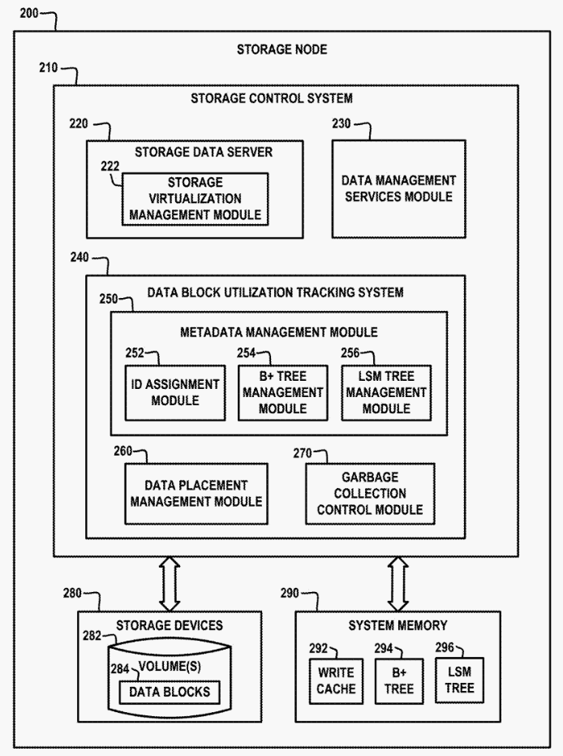

# 文件与文件目录的查找优化

# 1 背景

## 1.1 现有的FDD_TREE

迪备在文件查找中，使用了一个FDD_TREE的数据结构，用于存储文件目录树。FDD_TREE的定义如下：

```c
typedef struct TFDD_Entry {
    struct TFDD_Entry *parent;
    struct TFDD_Entry *next; /*!< next sibling entry */
    struct TFDD_Entry *first_child;
    struct TFDD_Entry *last_child;
    char *name;
    size_t name_len;
    ACE_UINT64 offset; /*!< current entry offset */
} TFDD_Entry;
```

FDD_TREE的根节点是一个空的TFDD_Entry，根节点的first_child指向第一个文件目录，根节点的last_child指向最后一个文件目录。每个文件目录节点的first_child指向第一个文件节点，last_child指向最后一个文件节点。每个文件节点的next指向下一个文件节点。

对比TFDD_Tree 处理目录的方式与 Ext2 文件系统有一些相似之处，：


|相似点||
|---|---|
|树结构|两者都使用树结构来表示目录和文件的层次关系。TFDD_Tree 使用多叉树，而 Ext2 使用的是多级索引结构。|
|节点表示|TFDD_Entry 结构体类似于 Ext2 文件系统中的 inode，包含了文件或目录的元数据（如名称、偏移量等）。|
|链表结构|TFDD_Tree 中的兄弟节点通过链表连接，类似于 Ext2 中目录项的链表结构。|


|不同点|TFDD_Tree|Ext2 文件系统|
|---|---|---|
|数据存储|主要存储元数据和指向子节点的指针|inode 直接存储文件数据的指针|
|平衡性|TFDD_Tree 没有自动平衡机制，可能导致树结构不平衡| Ext2 文件系统通过多级索引结构保持一定的平衡性。|
|访问|每个节点长度不固定，磁盘不友好，不适合持久化存储| 使用块进行管理，对磁盘存储进行优化|
|数据信息|不支持,只有文件或目录检索、权限、硬链接、用户等信息不支持| 支持全面的文件相关信息|
|实现|主要关注目录和文件的层次关系|Ext2 文件系统有更复杂的实现，包括块管理、文件权限、硬链接等，而 TFDD_Tree |

## 1.1.1 并发问题

参考fdd_tree_bulid函数，冲bulid_tree方法，是线性解析目录树，但是在解析目录树的过程中，对于的一个大型的catalog文件，构建时间会比较长。

## 1.1.2 存储优化

一般不管使用什么数据结构都是将索引放到内存中，以加快查找速度。但一般的数据库InnoDB、sqlite使用B+树作为索引的时候，内存中使用了page的管理，FDD使用大内存池的方法，这样会导致内存的浪费。另外，FDD使用的是链表结构，这样会导致内存的碎片化。

|内存管理|FDD_TREE的大内存池|数据库Page管理|
|---|---|---|
|优点|实现简单：大内存池管理的实现相对简单，只需要维护一个大的内存块和一个指针，指示当前的分配位置。分配速度快：大内存池管理的内存分配速度较快，因为只需要移动指针，不需要维护复杂的结构。|内存利用率高：Page 管理可以更好地利用内存，因为每个 Page 的大小是固定的，减少了内存碎片。缓存友好：Page 管理可以更好地利用 CPU 缓存，因为 Page 的大小通常与缓存行对齐，减少了缓存未命中率。易于分页和交换：在需要将部分数据交换到磁盘时，Page 管理更容易实现，因为每个 Page 是独立的，可以单独交换。灵活性：Page 管理可以根据需要动态分配和释放内存，适应不同的内存需求。|
|缺点|内存碎片：大内存池管理容易产生内存碎片，因为内存块的大小不固定，释放内存时可能会留下无法利用的小块。内存利用率低：由于内存碎片和固定增长策略，大内存池管理的内存利用率较低，可能会浪费大量内存。不易分页和交换：大内存池管理不容易将部分数据交换到磁盘，因为内存块是连续的，无法单独交换。不适合持久存储，磁盘IO效率低。| 管理开销：Page 管理需要维护 Page 表和空闲列表，增加了管理开销。复杂性：实现 Page 管理需要更多的代码和逻辑，增加了系统的复杂性。|

## 1.1.3 查询效率

* 单个目录或文件-点

TFDD_Tree的查询效率好情况O(1)和最坏情况O(n*d)相差较大。

Ext2文件系统的查询效率是目录O(logN)、文件O(N)的时间复杂度。

* 一个目录下的所有文件-范围

TFDD_Tree的查询效率由于包含了next指针，所以查询效率是O(n)，查询一个文件即可通过链表遍历，但不能并发，是个串行过程，NAS的一个目录下的海量文件仍可能存在瓶颈。

在 Ext2 文件系统中，目录项是以线性列表的形式存储的，每个目录项包含文件名和指向文件 inode 的指针。遍历目录时，需要逐个读取目录项。

* 通过通配符查询文件 - 随机、范围

在 FDD_Tree 中，目录和文件以树形结构存储，每个节点包含子节点的链表。匹配文件查询时，需要遍历子节点链表并进行匹配。由于子节点是以链表形式存储的，并行查询效率也不高。

对Ext2影响不大，可以并行查询。


## 1.1.4 适用场景

* FDD_TREE 适用于目录树结构简单，目录层次不深的场景，如小型文件系统等，同时一次创建、删除、查找文件的频率不高的场景。


## 1.2 ext2以及发展


虽然我们和Ext2对比了FDD的性能，但是Ext2也有自己的问题。目前，Ext2 文件系统是 Linux 系统中最传统、常用的文件系统之一，它是一个开源的文件系统，支持大多数 Linux 发行版。Ext2文件系统的设计目标之一是提供一个高性能、可靠的文件系统，同时保持简单和易于维护。

这种传统的Ext2采用顺序记录的方式组织目录文件，每个记录称作一个目录项，目录项包含文件的文件名和索引节点。由于文件名长度不固定，目录项采用变长记录以节省存储空间，另外目录项的位置并不根据某种方法排序，这导致在目录文件中搜索特定的目录项时，必须遍历整个目录的所有目录项进行对比。因此，当使用Ext2文件系统时，在大型目录中创建、删除和查找文件会非常慢。

Phillips在2001年提出一种类似于B+树的H树，用于解决Ext2在处理大目录时的瓶颈。该结构完全兼容ext2的目录索引结构，针对每个目录建立一棵Ｈ树，使用文件名的Hash值对存储目录项的目录块进行索引，而不是每个目录项都建立索引。在Linux2.6之后版本的内核中，Ext3模块都采用了这一改进，但为了保证与Ext2向前兼容，目录文件的块仍采用直接索引与间接索引相结合的方式，当目录文件增大时，多级索引仍然会带来一定的延时。

B树及其变种因具有O（lgN）的查找复杂度和在降低磁盘IO方面的出色性能，被许多现代文件系统用作数据组织的基础结构。Reiserfs文件系统使用单棵B+树组织文件系统的所有数据，包括目录，目录项由文件名Hash得到的32位关键字进行排序；文件系统元数据与文件数据由同一棵B+树进行索引，这不仅增加了结构维护的复杂度，而且文件数据增多时造成B+树的高度增长也会影响文件名的查找效率。Btrfs文件系统使用一种B+树的变种对目录项进行索引，目录项名称散列64位的关键字在B+树中排序。与Reiserfs一样，它的叶子节点之间没有连接指针，遍历相邻的叶子节点也必须逐个经历从根节点到叶子节点的分支索引过程。


# 2 B+树或跳表的选择

## 2.1 B+树

B+树是一种自平衡的树数据结构，它是一种多路搜索树，其中每个节点可以有多个子节点，但只有叶子节点才包含数据。B+树的主要特点如下：

* 所有叶子节点都在同一层，并且通过链表连接，这样可以方便地进行范围查询。
* 每个节点都有一个指向子节点的指针，这样可以方便地进行查找和遍历。
* 每个节点都有一个指向父节点的指针，这样可以方便地进行插入和删除操作。

以下是SQLite、Btrfs、Memcached和InnoDB在使用B+树进行数据检索时的设计和使用上的区别，以及它们各自的特点和性能差异的比较：

| 特性         | SQLite                  | Btrfs                        | InnoDB                                | Oracle                                |
|--------------|-------------------------|------------------------------|---------------------------------------|---------------------------------------|
| 用途         | 关系型数据库            | 文件系统                     | 关系型数据库                          | 关系型数据库                          |
| B+树用途     | 索引和数据存储          | 元数据和数据块索引           | 索引和数据存储                        | 索引和数据存储                        |
| 节点大小     | 可配置，通常为页面大小（默认4KB） | 可配置，通常为4KB或更大       | 可配置，通常为16KB                    | 可配置，通常为8KB或更大               |
| 叶子节点     | 存储实际数据            | 存储指向数据块的指针         | 存储实际数据                          | 存储实际数据                          |
| 非叶子节点   | 存储键和指向子节点的指针 | 存储键和指向子节点的指针     | 存储键和指向子节点的指针              | 存储键和指向子节点的指针              |
| 并发控制     | 使用锁和事务            | 使用CoW（写时复制）和事务    | 使用锁和MVCC（多版本并发控制）        | 使用锁和MVCC（多版本并发控制）        |
| 事务支持     | 支持ACID事务            | 支持ACID事务                 | 支持ACID事务                          | 支持ACID事务                          |
| 崩溃恢复     | 使用WAL（写前日志）     | 使用日志和快照               | 使用重做日志和撤销日志                | 使用重做日志和撤销日志                |
| 性能优化     | 支持索引优化和查询优化  | 支持延迟分配和压缩           | 支持索引优化、查询优化和缓冲池管理    | 支持索引优化、查询优化和缓冲池管理    |
| 适用场景     | 小型到中型应用程序的数据存储 | 大规模文件系统和存储         | 大型企业级应用程序的数据存储          | 大型企业级应用程序的数据存储          |


**性能差异**
* SQLite：适用于嵌入式系统和小型应用程序，性能较好，但在高并发场景下可能会有瓶颈。
* Btrfs：适用于大规模文件系统，支持快照和压缩，性能较好，但在极端高并发和大规模数据操作下可能会有性能开销。
* Memcached：主要用于高速缓存，性能极高，但不支持持久化和事务。
* InnoDB：适用于大型企业级应用程序，支持复杂查询和高并发，性能优越，但需要更多的内存和存储资源。

## 2.2 使用跳表的存储系统-Ceph

Ceph 并没有使用B+树进行数据的管理：
* OSDMap：用于管理和检索 OSD 信息，主要用于数据对象的分布和定位。使用跳表数据结构，依赖 CRUSH 算法实现数据的高可用性和负载均衡。
* MDS：用于管理和检索文件系统的元数据，主要用于文件系统的目录和文件操作。使用内存中的树结构，通过动态子树分区技术实现负载均衡和高可用性。

### 2.2.1 OSDMap

Ceph 的元数据管理器 OSDMap 使用跳表（Skip List）来存储和查找对象的位置信息。跳表是一种概率性数据结构，它通过在链表上增加多级索引来提高查找效率。跳表的时间复杂度为 O(log n)，与 B+ 树相当，但实现更简单。

跳表的主要特点如下：

* 跳表是一种概率性数据结构，它通过在链表上增加多级索引来提高查找效率。
* 跳表的时间复杂度为 O(log n)，与 B+ 树相当，但实现更简单。
* 跳表的空间复杂度为 O(n)，与 B+ 树相当。
* 跳表支持动态插入和删除操作，与 B+ 树相当。
* 跳表支持范围查询，与 B+ 树相当。
* 跳表支持并发访问，与 B+ 树相当。


跳表虽然简单且高效，但在实际应用中，B+ 树仍然更常用，主要原因如下：

* 磁盘访问效率：优化了磁盘 I/O 操作。
* 范围查询效率：叶子节点链表提高了范围查询效率。
* 成熟度和广泛应用：在数据库和文件系统中应用广泛且优化成熟。
* 内存使用：索引结构更紧凑，内存使用效率更高。
* 并发控制：天然支持并发，在高并发场景下性能和稳定性更有保障。

跳表一个明显的问题就是读放大问题，即查找一个元素时，需要访问的节点数可能远多于实际存储的元素数。在Ceph中，OSDMap的跳表结构主要用于存储和查找对象的位置信息，而不是存储实际的数据。因此，跳表的读放大问题在Ceph中并不明显，不会对性能产生太大的影响。

同时，Ceph通过其他方法优化读放大了这个问题：
* 优化跳表结构：通过调整跳表的层数和节点数量，减少不必要的读操作。
* 缓存机制：利用缓存来存储常用的数据，减少对底层存储的访问次数。
* 数据分区：通过将数据分区存储在不同的节点上，减少单个节点的负载，从而提高整体系统的读写性能。
* 并行处理：利用并行处理技术，提高数据读取的效率。

### 2.2.2 In-Memory Directory Tree

In-Memory Directory Tree 是 Ceph MDS 用来存储和查询文件系统元数据的数据结构。它是一种内存中的树形结构，用于表示文件系统的目录和文件。In-Memory Directory Tree 的主要特点如下：

* 内存中的树结构：是一种内存中的树形结构，用于表示文件系统的目录和文件。每个目录和文件都是树中的一个节点，节点之间的关系表示目录结构。
* 元数据存储：元数据（如文件名、权限、时间戳等）存储在树的节点中。MDS 将这些元数据存储在内存中，以便快速访问和修改。
* 分布式管理：在大型集群中，MDS 可以分布在多个节点上。Ceph 使用一种称为 动态子树分区（Dynamic Subtree Partitioning）的技术，将目录树动态分割并分配给不同的 MDS 节点，以实现负载均衡和高可用性。
* 一致性：使用一种称为 Raft 的分布式一致性算法来保证元数据的一致性。Raft 算法通过选举一个领导者节点来协调多个节点之间的操作，从而保证元数据的一致性。
* 缓存：使用缓存来提高查询效率。MDS 将常用的元数据存储在缓存中，以便快速访问。当缓存中的数据过期时，MDS 会从持久化存储中加载最新的元数据。
* 持久化：的元数据会定期持久化到磁盘上，以便在 MDS 重启或故障时能够恢复元数据。持久化操作通常使用日志或快照的方式。
* 查询优化：使用多种查询优化技术，如索引、预取和缓存，以提高查询效率。例如，MDS 可以使用 B+ 树索引来加速文件名的查找，或者使用预取技术来提前加载常用的元数据。（**用户自行优化实现**）
* 安全性：支持多种安全机制，如访问控制、加密和认证，以确保元数据的安全性。
* 扩展性：支持水平扩展，可以通过增加 MDS 节点来提高元数据的处理能力。
* 高可用性：支持高可用性，可以通过复制和故障转移技术来保证元数据的可用性。
* 兼容性：与 POSIX 文件系统兼容，可以与现有的文件系统工具和应用程序无缝集成。
* 性能：性能优于传统的文件系统元数据管理器，因为它使用内存中的树结构来存储和查询元数据，并且支持多种查询优化技术。


## 2.3 使用跳表的数据库系统-LevelDB、RocketDB

LevelDB 和 RocketDB 都没有使用 B+ 树进行数据的管理，而是使用了跳表（Skip List）和 LSM 树（Log-Structured Merge Tree）。

为了解决读放大问题，使用了缓存和过滤器来优化读性能。同时，通过批量写入和压缩来优化写性能。

参照：过滤器 https://github.com/darkking1112/filters/blob/main/beony_Bloom.md

## 2.4 专利比较

### 2.4.1 B+树的专利

#### 2.4.1.1 快照存档管理（Cohestiy 2023）

快照是系统在特定时间点的状态。系统的完整快照可以由大量数据（例如，太字节、拍字节等）组成。以频繁的间隔（例如，每小时、每天）执行系统的完整快照需要大量的存储来存储快照。为了减少所需的存储量，可以在完整快照之间执行系统的增量快照。增量快照包括自先前（完整或增量）快照以来系统已经发生的改变。然而，安装包括完整快照和若干增量快照的卷可能需要大量存储。

例如，假设在t=0处执行由1TB数据组成的系统的完整快照，并且在从t=1到t=10的每个t处执行100GB数据的增量快照。来自增量快照的一些数据可以重写来自完整快照和/或先前增量快照的数据。然而，为了在t=10处恢复和安装系统需要从t=0处的完整快照开始并将每个增量快照添加到系统，直到组合的快照再现t=10处的系统状态。在该示例中，需要2TB的存储来恢复在T=10处由1TB组成的系统。

虽然上述过程减少了存储数据所需的存储量，但是它增加了恢复数据所需的存储量。不仅减少存储数据所需的存储量，而且减少恢复数据所需的存储量将是有用的。


快照树

这个专利没有明确说明使用B+，但文中描述：“树数据结构的示例是快照树（例如，凝聚性快照树)，其可以基于B+树结构（或在其他实施方案中的其他类型的树结构）。树数据结构提供对应于备份的内容文件数据的视图。对应于备份的内容文件数据的视图包括快照树和多个文件树（例如，二进制大对象结构）。文件树是存储与内容文件相关联的文件元数据的元数据结构。”


#### 2.4.1.2 一种用于B+树数据结构的增强锁定机制 （VMware 2023）

将数据（例如，与数据中心的虚拟机（VMs）其他类型的虚拟计算实例（VCIs）相关）存储在提供低成本和高效率的一个或多个其他数据存储装置中越来越重要。

一些数据中心可以与定义对象的元数据分开地存储对象（例如，VM盘）。例如，可以使用将对象存储在一个数据存储装置中，而将元数据存储在另一个数据存储装置中。元数据（例如，对象的标识符）可以由若干计算节点（例如，元数据服务器）同时存储为键值数据结构，以允许可扩展的I/O操作。B+树经常用作用于存储元数据的数据结构。B+树通常是具有多个节点的多级数据结构，每个节点包含一个或多个关键字-值对，关键字-值对是包括关键字和与关键字相关联的值的元组。关键字是数据的标识符，并且值是数据本身或指向与标识符相关联的数据的位置（例如，在存储器中或磁盘上）的指针。更具体地，B+树的顶层通常包括树的根节点，其没有父节点。B+树的中间层包括具有父节点和子节点的分支节点。B+树的底层包括没有更多子节点的叶节点。在B+树中，根节点和中间节点中的值包括指向下一级节点或子节点的指针，而叶节点中的值包括真实数据或指向存储真实数据的指针。

可以根据元组的关键字对B+树进行排序，并且可以基于与数据相关联的关键字从树读取/写入数据。因为B+树包含排序的元组，所以对树的任何读/写操作都需要遍历树以基于对应的关键字找到期望的元组。由于有几个其它服务器同时在B+树的不同节点上执行读/写操作，因此总是存在至少一个其它服务器在其遍历路径上具有相同节点的可能性。这样，每个服务器（例如，读取器或写入器）可以实现用于在遍历树时锁定节点的锁定机制。锁耦合（或锁抓取）是一种流行的锁定机制，其中在遍历树期间的任何时间点，

两种类型的锁包括共享锁和独占锁。当节点在其上具有共享锁时，节点中的数据可以被若干服务器读取，但是它不能被任何服务器改变。相反，当服务器获取节点上的排他锁时，没有其他服务器可以读取或写入锁定节点中的数据。高度并发的环境中，多个竞争服务器可能被独占锁不必要地阻止。另外，如果服务器未能获得特定节点上的排他锁，则当前用于获得节点上的锁的重试机制不是高效的，并且可能降低服务器的整体性能。

#### 2.4.1.3 实现重做日志格式快照的本机快照 （VMware 2022）

COW技术在B+树中通过共享和延迟复制来提高性能和空间效率，而redo-log通过事务日志来确保数据的持久性和一致性。

#### 2.4.1.4 有序树数据结构的锁定和遍历方法 （Apple 2013）

相关专利：树型数据结构的并发访问方法 - Apple

使用B树管理复杂分层文件系统，并解决个并发访问可能存在特定问题。

#### 2.4.1.5 针对B+树数据结构可扩展性的插入优化 （SYMANTEC 2010）

在传统技术中，B+树数据结构的实现可以用于创建某种类型的索引。例如，较大的虚拟地址空间可以被映射到相对较小的物理地址空间。在这种情况下，B+树数据结构中的关键字-值对是虚拟到物理地址映射（或转换）。此外，这些转换以B+树格式存储，以便获得搜索效率并保持元数据（转换）大小与物理存储成比例。要求这样的B+树数据结构应满足ACID（原子性、一致性、隔离性、耐久性）属性。然而，在输入和输出（I/O）的数量以及它们对事务日志区域造成的争用方面，事务的性能是昂贵的。

#### 2.4.1.6 在树结构中执行操作 (IBM 2024)

提供了一种用于在树结构中执行操作的计算机实现的方法。在计算机实现的方法中，可以接收要在树结构中执行的操作。树结构可以包括多个非叶节点和多个叶节点。该操作可以与包括一对键和值的记录相关联。可以基于记录的关键字来确定非叶节点中的一个。然后，可以在所确定的非叶节点中执行操作。

#### 2.4.1.7 在实例化树数据结构时调整键空间 (VMware 2015)

提供了调整树数据结构实例的键空间的技术。在一个实施例中，计算机系统可以接收创建实例的请求，其中该请求包括指示实例要寻址的键值的预期范围的预期键空间值。计算机系统还可以基于所期望的密钥空间值来计算分配给实例的每个节点的每个密钥的比特数。然后，在实例化实例的每个节点时，计算机系统可以根据计算出的比特数为该节点分配密钥。

#### 2.4.1.8 使用B+树结构的文件系统索引记录级锁定 (IBM 2013)

B+树结构已经成为文件组织的某种标准。许多数据库系统（关系型或其他类型）和通用访问方法，如虚拟存储访问方法（VSAM），都是使用B+树结构设计的。VSAM相比其他典型的访问方法包括一些额外的功能，如键压缩。

目前，使用B+树结构的文件系统（包括VSAM）处理与B+树分裂相关的性能问题的已知解决方案通常在记录级别锁定数据记录的插入操作，如果发生分裂，还会在数据集级别获取锁。对分裂操作锁定整个数据集会造成极大的性能问题，因为它将所有分裂处理操作串行化到被锁定的数据集上。这迫使使用B+树结构的文件系统用户设计大量方案以最小化分裂，其中一些方案会导致其他不利的性能问题。

#### 2.4.1.9 B-ε树中节点的主动拆分和合并 (Vmware 2023)

文件系统通常保持在树数据结构中。例如，一种设计可以使用Bε-树数据结构维护以根在每个非叶节点处的子树为目标的消息插入的缓冲区。随着该缓冲器的大小增加，需要成比例地更多的存储器和磁盘带宽来将缓冲器带入工作存储器中，以确定特定的键/值对是否驻留在当前节点处的缓冲器中。

##### 2.4.1.10 日志截断的高效回写  (Vmware 2023)

相关： 使用b+树元数据存储库在日志结构化文件系统中进行无竞争且高效的分段清除的系统和方法（Vmware 2023）

 可恢复的写时复制（COW）B+树页删除 （VMware 2021）

逻辑映射B+树可以是写时复制B+树（也称为仅附加B+树）。当创建快照时，CoW技术通过仅复制关于存储原始数据的位置的元数据来提高性能并提供时间和空间高效的快照创建，而不是创建数据的物理副本。因此，当采用CoW方法并且要创建新的子快照时，代替复制父快照的整个逻辑映射B+树，子快照与父快照共享，并且在一些情况下与祖先快照共享，通过使子快照独占拥有的B+树索引节点指向共享的父和/或祖先B+树节点来共享一个或多个区间。对逻辑映射Cow B+树的更新可以记录在写入前向日志（write-ahead-log）中。对逻辑映射Cow B+树的改变可以保存在存储器中，直到它们被持久保存到存储装置。一旦Cow B+树操作被持久化到存储装置，就可以从WAL中移除对应的记录。

为了确保崩溃一致性，系统在从内存日志中截断记录之前将日志记录的效果保持在磁盘上。因为保持脏高速缓存条目的影响和从日志中删除条目具有输入/输出（I/O）成本，所以期望有效地写回脏页面以使I/O成本最小化。

因此，需要改进的技术来有效地识别用于日志截断的脏高速缓存条目。

#### 2.4.1.11 树型数据结构 (微软 2023)

在基于树的数据结构（如B树）中，平衡写入者和读取者之间的工作负载是理想的。例如，如果新条目只是按时间顺序添加而不按键排序，那么这对写入者来说非常快。然而，读取者在读取时必须对条目进行排序以执行单个读取或范围扫描（至少范围扫描需要排序——单个读取可以不排序，但为了简化实现，通常会使用排序来执行查找和范围扫描）。另一方面，如果写入者每次写入时都将所有新条目按顺序排序，这将使读取非常快，但会在写入时给写入者带来更大的负担。因此，提供这两种方法之间的折衷方案是理想的。

#### 2.4.1.12 用于复制元数据的方法、电子设备和计算机程序产品（EMC 2022）

元数据被复制。例如，响应于接收到将元数据复制到目标节点的请求，获得与元数据相关联的索引结构的信息。索引结构可以包括用于存储元数据的终端节点和用于存储终端节点的索引信息的索引节点。接下来，基于索引结构的信息提取来自终端节点的元数据。此外，生成要复制元数据的序列。要复制的序列包括元数据的项，并且基于与项相对应的关键字信息来确定要复制的序列中的项的位置。另外，元数据的项在要复制的序列中被复制到目标节点。以这种方式，仅复制索引结构中的元数据，从而减少复制的数据量。

#### 2.4.1.13 使用一组有序的B+树管理数据集的快照 (微软 2022)

据集由一组有序的B+树表示，数据集的每个快照由一个不可变的B+树表示。有序集合中B+树的排序将这些B+树逻辑地排列成层，表示数据集当前状态的可变B+树逻辑地排列为上层，表示数据集快照的不可变B+树逐步排列为下层，最早的快照为最底层。快照删除包括将快照对应的B+树与其最高的邻居B+树合并。

#### 2.4.1.14 粒度数据复制 （EMC 2023）

用于具有高效率的数据的粒度复制的实施例。将体现为标签的定义的元数据元素分配给每个文件。标签过滤用于将数据引导到适当的位置。可以选择具有不同标签的文件用于传输。实施例可以与定义的备份系统文件复制过程一起使用，例如存在于数据域文件系统中。通过使用快照，在复制进行的同时继续摄取传入的新数据，并同时保持数据一致性。这是通过结合对这些结构的叶页中存在的关键字的标签过滤对B+树快照执行操作来实现的。与通过文件的路径名逐个查找文件的先前方法相比，该方法有效地进行B+树的单遍遍历。

#### 2.4.1.15 分布式名称空间的全局快照备份 （EMC 2020）

通过在MTree中表示集群网络的名称空间、在一个或多个数据节点上存储以B+树格式组织的数据文件、在元节点中存储以B+树格式的数据文件的名称特定信息来实现集群网络的全局名称空间中的快照备份的实施例，其中元节点的B+树访问一个或多个数据节点中的每一个中的每个对应的B+树。该过程采用各个MTree分支的快照备份，并基于集群标识符和快照标识符将每个快照的分支链接到组中。

#### 2.4.1.16 计算机存储重复数据消除 （VMware 2019）

计算机系统中的分散式重复数据消除操作使用哈希索引，该索引是B+树的一种变体，既支持高效的顺序更新，也支持高效的随机更新。当不经常执行重复数据消除时（如以天为单位），选择顺序更新；当更频繁地执行重复数据消除时（如以秒为单位），选择随机更新。在创建大量临时重复数据，并且系统可能没有足够的存储空间来满足临时高峰需求的时期，更频繁的重复数据消除可能是有益的。

#### 2.4.1.17 多版本并发控制下B+树的增量bloom过滤器重建 （EMC 2017）

处理对搜索树的更新并更新统计信息，所述搜索树存储关于由相应对象键索引的一个或多个对象的信息；基于所述统计信息确定重建第一Bloom过滤器，所述第一Bloom过滤器与所述搜索树相关联；生成与所述搜索树相关联的第二布鲁姆滤波器；作为跟踪垃圾收集过程的一部分填充第二Bloom过滤器；以及用第二布卢姆过滤器替换第一bloom过滤器。

#### 2.4.1.18 在文件系统中使用缓存表的数据操作 （微软 2019）

用于在文件系统中提供减少延迟的数据操作的方法、系统和计算机存储介质。在操作中，接收执行与文件系统的B+表存储器相关联的数据操作的请求。文件系统支持使用用于访问B+表数据的B+树查找逻辑可访问的B+表存储，并支持使用用于访问缓存存储中的缓存数据的缓存表查找逻辑可访问的缓存存储。确定对B+表存储器中的位置的多个引用。B+表存储器中的位置与执行数据操作的请求相关联。基于确定对该位置的引用的数目，访问用于执行数据操作的高速缓存存储位置。缓存存储位置（使用缓存表）映射到B+表存储中的位置。

#### 2.4.1.19 使用原子多字更新操作的索引结构 （微软 2018）

接收更新存储在非易失性存储器（NVM）中的数据结构的多个请求，并对数据结构应用原子多字更新来仲裁对NVM的访问。

BZTree：BZTree 是一种基于 B+ 树的变体，专为持久内存（Persistent Memory, PM）设计。通过改进崩溃恢复和并发控制机制，提供了更高的性能和可靠性。

#### 2.4.1.20 国内专利

相关专利较少，除了部分高校有部分专利，企业相关专利较少。可能一方面B+树是一种经典的数据结构，同时，从复杂性、成熟度、应用场景和研究更偏向底层的设计，不是国内相关企业的热点，一般直接基于开源数据库开发，不会轻易进行优化。

同时另一方面，国内，对于rocksDB开源研究较多，因此，跳表专利更丰富一些。

### 2.4.2 跳表的专利

国内专利较多，国外相关专利较少。

#### 2.4.2.1  基于LSM的NoSQL存储的分层存储（IBM）

为了解决灵活数据模式和弹性方面的挑战，已经出现了处理列、键/值对、文档和图形的新的分布式数据存储，统称为NoSQL数据存储。NoSQL存储的类别基于LSM（日志结构合并）树。它针对写入进行了优化，但不一定具有针对点查询的优化技术。LSM存储传统上首先将数据放在动态随机存取存储器（DRAM）中，然后在分配的DRAM达到最大容量时将数据移动到硬盘驱动器（HDD）存储层级。当数据在HDD中时，读取访问相对较慢。虽然现有系统可以通过使用DRAM中的读取高速缓存缓冲器来补救缓慢的响应速率，但是高速缓存机制具有它们自己的一组复杂度，这有助于数据存储系统。

提出了一种为LSM存储提供例如存储设备的层级的多层刷新和压缩方法。“刷新”是指从较高存储层到较低存储层的数据移动。“压缩”是指在同一层中将不同版本的数据分类和合并到更少版本或单个版本。

#### 2.4.2.2 跟踪存储系统中数据块的利用(EMC 2022)



使用两种数据结构的原因

* 读写优化：B+树和LSM树各自擅长不同的操作。B+树擅长读操作，而LSM树擅长写操作。通过结合这两种数据结构，可以在系统中同时优化读和写的性能。
* 数据管理：B+树用于实现查找和映射功能，能够快速定位数据项。而LSM树用于处理写入操作，特别是删除和无效数据的处理，通过批量写入和合并操作提高写入效率。
* 元数据管理：尽管元数据结构包含用于存储系统中的每个数据项的条目，但是这些元数据结构（例如，B+树和LSM树）的大小相对较小，可以适配在持久性系统存储器中，从而提高系统的整体性能和可扩展性。


通过结合使用B+树和LSM树，系统能够在读写性能之间取得平衡，既能快速查找和映射数据，又能高效地处理写入操作，特别是删除和无效数据的处理。这种设计使得系统在处理大规模数据时更加高效和可扩展。

#### 2.4.2.3 存储系统中的重复数据删（EMC 2022）

数据去重是用于减少存储系统中的数据量的常用方法。通常，重复数据删除涉及发现和移除重复数据，其中当相同的数据块或文件被写入存储系统的多个位置时，发生重复数据删除操作。取决于实现方式，这样的位置可以是跨体积和/或跨节点的。移除重复数据的过程通常包括用对数据的单个实例的引用（例如，指针）替换重复数据，从而减少存储的数据量。存在各种类型的数据去重技术，其使用不同的算法来识别和消除冗余数据，所有这些都需要某种程度的开销来发现和去除重复数据，这可能影响存储系统性能。在这方面，数据去重应该以最小化这种开销的方式实现，从而最小化对存储系统性能的影响。


日志结构合并树数据结构，其被配置为实现持久重复数据删除数据


B-ε树数据结构，其被配置为实现持久重复数据删除数据库

B-ε树是一种写优化的树数据结构，结合了 B 树和缓冲树的特点。它通过在内部节点中引入缓冲区来批量处理插入和删除操作。特点：
* 通过批量写入和合并操作来提高写入性能。
* 适用于频繁的写操作。
* 查找操作的时间复杂度为 O(log n)，插入和删除操作的摊销时间复杂度为 O((log n) / B)，其中 B 是块大小。

#### 2.4.2.4 管理存储系统的元数据结构的插入操作（EMC 2022）

存储系统利用物理数据层的某种形式的内部布局，并且采用从逻辑层（如用户卷或文件所理解的）到用于存储数据的物理层的映射机制。存储控制器可以使用各种方法在物理层中排列数据，例如打包数据以节省容量、实现日志结构阵列、存储分层等。另外，存储系统需要各种类型的元数据来支持核心存储功能。这样的元数据包括例如用于将逻辑位置（文件或卷中的偏移量）映射到物理位置（以跟踪所存储的数据项的物理位置）的元数据、无效和垃圾收集相关的元数据、用于记帐、重复数据删除引用、快照生成和跟踪关系的元数据以及弹性相关的元数据（例如RAID）等。元数据必须对诸如设备或节点离线之类的故障具有弹性，因为没有元数据，所存储的数据变得不可访问并且关键功能中断。此外，持久化元数据的过程不应添加显著量的带宽或IOPS（每秒输入/输出操作)，这会降低系统性能并影响用于存储元数据的存储设备的耐久性。


插入流程

存储元数据结构包括第一树数据结构和第二树数据结构。第一树数据结构被配置为累积与新写入的数据项相关联的元数据条目，并按索引关键字对累积的元数据条目进行排序。第二树数据结构被配置为使用索引结构来组织元数据条目，该索引结构使得能够使用索引关键字随机访问元数据条目。存储控制系统执行合并过程以合并第一树数据结构的叶级和第二树数据结构的叶级中的元数据条目，并且执行树构造过程以通过用来自第一和第二树数据结构的叶级的合并的元数据条目填充第三树数据结构的叶级来构造第三树数据结构。存储控制系统更新存储元数据结构以包括第一树数据结构和代替第二树数据结构的第三树数据结构。

#### 2.4.2.5 日志结构合并（LSM）树上的可扩展I/O操 （VMware 2022）

全世界的数据量每年都在增长，因此需要更多的存储资源。此外，保护已经存储的数据（例如，在数据中心中）免受可能完全破坏业务操作的灾难性事件（诸如存储故障或网络攻击）对于每个企业是必不可少的。企业需要备份存储在一些其他存储设备处（例如，在云中）的其主数据存储装置中的数据，使得当原始数据损坏或丢失时，可以恢复（例如，通过灾难恢复过程）并使用备份的数据。因此，诸如以低成本和高效率将备份数据（例如，与主数据中心的虚拟机(VM)或其他类型的虚拟计算实例(VCI)相关）存储在一个或多个其他（例如，远程）数据存储装置中越来越重要，使得在灾难的情况下，数据恢复系统（例如，辅数据中心）可以在最短的可能时间内恢复备份的数据并运行（例如，主数据中心的虚拟机）。

某些现代数据库通常使用写优化日志结构合并树数据结构作为主要的索引结构来组织磁盘上的数据。LSM树是不可变的数据结构，这意味着新数据被顺序地写入LSM树。因此，使用LSM树数据结构存储数据显著减少了写入放大，诸如在用于存储数据的存储系统不允许数据重写的情况下。不允许数据重写的数据存储的示例包括亚马逊简单存储服务(S3)，其是通过web服务接口提供对象存储的云计算web服务。因此，为了实现高效率和低成本，使用LSM树将对象（或文件）和与对象相关联的元数据存储在具有最小写入放大的数据存储（诸如Amazon S3数据存储）中可能是非常期望的。然而，随着存储在数据存储中的数据量的增长，单个计算节点可能无法处理LSM树数据结构上的所有输入/输出（I/O）操作。

为了解决上述问题，现有的扩展解决方案可以结合LSM树利用无共享架构。然而，该架构具有若干缺点。例如，它通常需要LSM树的多个（例如，三个）副本以允许高可用性，这可能导致需要额外的空间并减慢I/O操作（例如，因为必须更新所有副本）。它还需要执行附加操作，诸如同步、日志记录和故障恢复，以保持LSM树的所有副本一致和最新。

#### 2.4.2.6 使用日志结构合并树的数据存储系统和方法 (Acronis 2016)

大型稀疏分段文件的问题的现有解决方案包括删除数据文件（例如，分段文件）内未使用扇区的稀疏操作10a）然而，稀疏算法具有局限性。例如，档案的文件系统可能不支持稀疏操作。此外，如果利用支持稀疏的文件系统将文件从档案传送到不支持稀疏操作的另一位置，则“稀疏”文件中的未使用区域用数字零填充。此外，即使在支持稀疏的文件系统（例如，新技术文件系统或“NTFS”）中，稀疏功能的使用也可能伴随有许多限制，使得并不总是实现稀疏的益处。因此，需要减少与搜索现有块和添加新块相关联的开销（例如，时间、系统资源等）。

提供了一种使用日志结构合并（LSM）树进行数据存储的系统和方法。

这里使用LSM解决稀疏文件增量备份的性能问题。

EMC 专利中对于增量备份的管理使用了Sparse Segment Metadata Tree (SMST)管理，这和本文讨论两种结构无关，所以不介绍。

#### 2.4.2.7 国内相关专利

 数据存储方法、系统、计算设备及存储介质 华为 2023

 LSM-tree 索引的优化方法和装置 百度 2015

 一种基于LSM树的延迟垃圾回收的键值分离存储方法及系统 浪潮 2021

 一种LSM树数据处理方法、系统、设备及计算机介质 浪潮 2020

 基于LSM树键值分离的时序数据存储方法及系统 浪潮 2022

 LSM树的建立方法、LSM树的数据读取方法和服务器 阿里 2017

 一种垃圾数据回收方法、装置、电子设备及可读存储介质 阿里 2022

 特征提取方法、装置、计算机设备和存储介质 腾讯 2023

国内存储公司研究较多，字节没有相关专利，但ByteKV（字节）、TiKV等都是基于rocketsDB的存储系统，所以可以认为字节也在研究相关技术。

 中山大学、浙江大学、华中科技大学、安徽大学、中国科技大学等也有相关专利。

 为什么中国大学喜欢申请专利，而美国大学不怎么申请专利？哈哈，这个问题留给大家思考。


# 3 优化设计与实现

比较Btrfs的设计，并结合备份恢复、事务支持、性能优化、适用场景等方面，一个存储系统的元数据管理。

这里可以发现，一般内存数据库使用跳表（随机IO较多），而磁盘数据库（需要持久化）一般使用B+树。但也没有明显的界限，比如，rocksDB的持久化也使用了跳表，MemSQL内存数据库使用了B+树。

至于文件系统，多看元数据管理选择的数据库，例如，Ceph（相关百度CFS）选择了rocksDB，而XFS、Btrfs高性能文件系统选择了B+树。

我们希望设计系统具有以下特点：
* 数据的多池管理：支持多个数据池，每个数据池可以独立管理元数据，面向分布式进行设计，分离式的元数据管理。
* 写性能：写是备份恢复的核心，需要支持高并发写，保证写性能。
* 读性能：伴随非结构化数据的重要性提升，增量备份、合成备份、数据同步等场景对读性能要求较高，同时，未来通过分析备份的数据，提供自主的备份策略等场景，也需要支持高并发读。
* 高效的缓存管理：支持LRU、LFU等缓存淘汰策略，提高元数据访问速度。
* 高效的内存管理：支持内存分页，提高内存利用率。
* 元数据管理：将数据管理服务和元数据进行分离，提高数据管理服务的性能。
* 快照支持：支持快照功能，方便数据恢复和备份。
* 针对Nvme SSD的优化：针对Nvme SSD的特性，进行读写优化，提高存储性能。
* 小文件支持：支持小文件存储，提高存储系统的灵活性。
* 并发控制：支持并发访问，通过降低锁的粒度，并根据具体操作语义（如读、写、修改）进一步细化锁的范围，来提高存储系统的并发性能。再小的锁也是不可避免的，当用户用户增加到一定的程度，IO瓶颈将很快出现，那么数据的放置策略就非常重要了。
* 数据回收机制：支持数据回收机制，提高存储系统的空间利用率。
* 分布式场景下一致性问题：基于某个开源项目实现Raft协议，保证分布式场景下的一致性和高可用的问题。


## 3.1 B+树的设计

